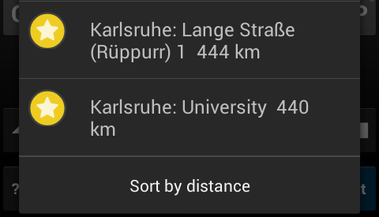
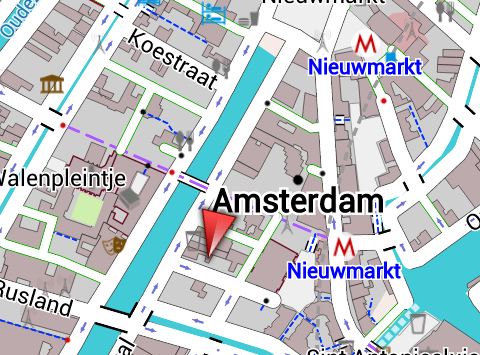
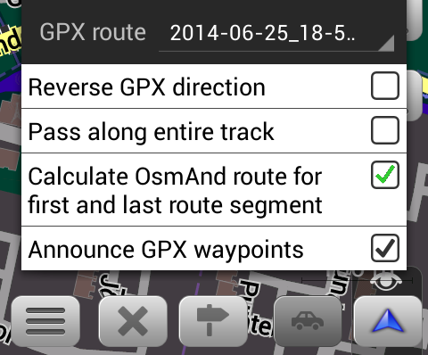

import AndroidStore from '@site/src/components/_buttonAndroidStore.mdx';
import Translate from '@site/src/components/Translate.js';

## OsMo Plugin

OSM Advanced Live Monitoring plugin provides variety of features. It could be compared with Google Latitude or with other live services. It helps to share your location with friends.

<!--truncate-->

## Favorites (my places)

* New Favorites actions (search, intermediates, share)

* Assign color and visibility per Favorite group

* Names of Favorites on the map

* Smart merge of "Favorites.gpx" file (no export/import is needed favorites are always in sync)

* New update Favorite dialog

	
## Maps

* Improved labels readability in night view

* New innovative and detailed rendering style UniRS + LightRS

* Track smoothness rendering in UniRS

## GPX (my places)

* Detailed stats for GPX track altitude difference/speed

* Split GPX route by km or by minute and check all stats
<table>
  <tr>
    <th></th>
    <th></th>
    </tr>
</table> 	
* Supports GPX/KML import (convert from KML to GPX)

## Navigation

* Special routing **by straight line**
* Calculate route between route points of GPX track (rtept)

* Start navigation immediately (click on top of bottom-right button * navigate )	

* Additional settings for navigation screen

## Usability

* Download maps: translated country names, search by local names
* "Configure" option is added to "Map Layers selection" for POI and GPX layer
* Zoom buttons on planning screen
* Errorenous button "Download" on the map is fixed

## Monitoring (UX changes)

* 'Monitoring Actions' top widget is deprecated. Widget 'Record GPX' is visible by default in all application modes, when the plugin is enabled.
* Widget 'Record GPX' includes following actions: 'Start/Stop gpx recording', 'Start new GPX segment', 'Enable/Disable Live recording' and 'Save current GPX track' (doesn't stop recording).
* Live recording now works only with enabled GPX recording.
* 'Log Track' Settings control tracks recording for specific profiles and can't be change by state of the widget (the track will be recorded even if the widget is disabled).
* 'Record GPX' widget controls track recording globally and independently from settings, starts background service if needed and restores state after application restart.
* 'Sleep mode functionality' (keep gps on with OsmAnd running in background or with screen off) is available only from Logging Settings. Many operations like Navigation or Record GPX start 'Keep gps on' automatically.

And remember that only together we can achieve the best results!
New features are coming SOON!

____________________________ 

OsmAnd at <a href="https://www.facebook.com/osmandapp/">Facebook</a>, <a href="https://www.twitter.com/osmandapp/">Twitter</a>, and <a href="https://www.reddit.com/r/OsmAnd/">Reddit</a>!

 
Join us at our groups of Telegram <a href="https://t.me/OsmAndMaps">(EN)</a>, <a href="https://t.me/itosmand">(IT)</a>,  <a href="https://t.me/frosmand">(FR)</a>, <a href="https://t.me/deosmand">(DE)</a>, <a href="https://t.me/ruosmand">(RU)</a>, <a href="https://t.me/uaosmand">(UA)</a>.

<AndroidStore/>