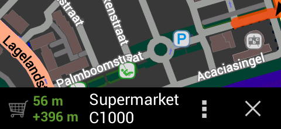

import AndroidStore from '@site/src/components/_buttonAndroidStore.mdx';
import LinksTelegram from '@site/src/components/_linksTelegram.mdx';
import Translate from '@site/src/components/Translate.js';

We are glad to announce the release of version 1.9! We proudly present some major improvements and new features, and hope you will enjoy them:

<!--truncate-->

## Navigation and routing

* Search POI along the route

* Get visual and audio notification by approaching to waypoint

* Mark road as impossible per session

* Support of turn lanes

* Longer route calculation up to 500km
* Special audio notifications in case you are back on the route
* Navigation takes into account traffic signals
* Traffic warnings can now be announced by type, like stop signs or speed bumps (TTS voices only).

## Maps

* Public transport map and Subway map
          
* New options like showing road access restrictions, the road surfaces, the road surface quality etc. have been implemented in many map styles.
* Increase map details level independently from map text size.

## OsMo plugin

* Login/Logoff functionality
* Automatically download groups and devices for registered users
* Better error handling

## Simplification of background trip recording and background navigation

* OsmAnd now automatically enables the GPS sleep mode service if navigation or trip recording has been activated, so that this continues to function while the device screen is off. Only if desired, the GPS sleep mode service can still be manually interrupted or configured via tapping the "GPS status" widget.
  

## User interface and other features

* Easier to download and update maps
* Support Android Wear
* Print itinerary and turn information

And remember that only together we can achieve the best results!
New features are coming SOON!

____________________________ 

OsmAnd at <a href="https://www.facebook.com/osmandapp/">Facebook</a>, <a href="https://www.twitter.com/osmandapp/">Twitter</a>, and <a href="https://www.reddit.com/r/OsmAnd/">Reddit</a>!

<LinksTelegram/>
<AndroidStore/>