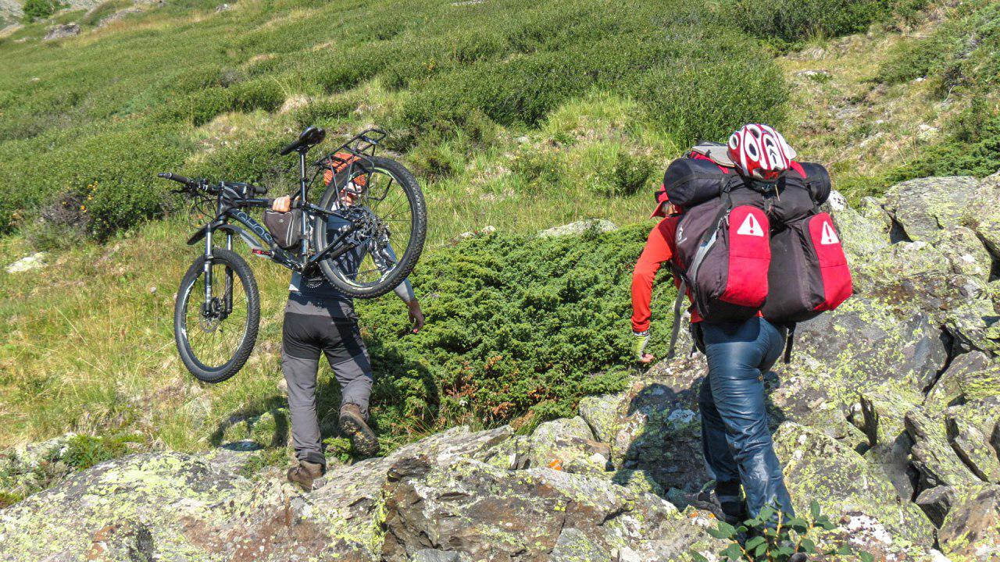

import LinksTelegram from '@site/src/components/_linksTelegram.mdx';
import AndroidStore from '@site/src/components/_buttonAndroidStore.mdx';
import AppleStore from '@site/src/components/_buttonAppleStore.mdx';

Hi!

Here comes our new interview! Surprisingly, we did not have to do much, because Pavel had prepared his own stories in advance. So, do You want to know more about his experiences? Let us begin.

<!--truncate-->

We asked Pavel about his travel preferences and experience. He said that since 2016, when he had graduated from <a href="http://www.rctc.ru/">“Russian Club of Cycling Trips”</a>, he had taken lots of biking tours. He added that OsmAnd was his first application for traveling and that before he had been using fitness trackers, such as Strava and Endomondo. The only similarity between these two apps and OsmAnd is <a href="https://osmand.net/features/trip-recording-plugin">the function that records one’s track</a>. Through Pavel’s <a href="https://play.google.com/store/apps/details?id=net.osmand">Google Pay account</a>, as he has mentioned, it is easy to track his payment for the full access to OsmAnd. It was in 2016 that he got it, right after having completed his final cycling trip at school. Three years have past, but Pavel is sure that he started using the app then.

_‘It was a fairly baffling time for using maps - I still was not sure which tool to use for traveling permanently. Before the trip, I had been assigned to be a navigator and had been given some GPX-files with our track. I was puzzled and did not know what to do with them. So, I had printed out the paper atlas of that region the night before the trip, using <a href="https://inkatlas.com/">inkatlas.com</a>. Not the best website, though. The first days of the trip were hard, I mean, I had to flick through a pile of papers every time I wanted to check our location. And every time our trip instructor would look at his navigator with a smirk.’_

_Only after the trip, did Pavel discover all the advantages of having <a href="https://osmand.net/features/start">OsmAnd installed</a> on one’s mobile. It is a much better solution than having a load of printouts! According to Pavel, it was during the time when maps were neglected, and, though, his teammates all had their phones, no one knew that they could use those devices for topographic mapping._

_‘Shortly afterwards, I recognized that taking advantage of my phone provided me with much more information than my instructor got using Garmin. His navigator had only a map with a track. Mine, on the other hand, had everything from forest pathways to highways. And I only used some <a href="https://osmand.net/features">basic functions of OsmAnd</a>! As a result, I have got rid of paper maps years ago. I have been using my phone ever since.’_

How does Pavel prepare the maps before a trip? He just uses OsmAnd <a href="https://osmand.net/features/start#Ways_to_download_maps">to download vector maps</a> for the right region. Pavel added that he prefers downloading some <a href="https://osmand.net/features/online-maps-plugin#Prepare_raster_maps">raster maps</a> for particularly unexplored places on his computer, using SAS Planet before turning to OsmAnd. <a href="https://support.smartptt.com/hc/en-us/articles/360000807934-How-to-create-Offline-Map?mobile_site=true">SAS Planet</a> allows him to choose the right file format that will be readable on his phone, as well as selecting a required area, which is extremely handy when it comes to getting rid of the excess of information to save some memory space on a device. GPX-tracks Pavel prepares himself using <a href="https://nakarte.me">nakarte</a> and <a href="https://www.gpsies.com">Gpsies</a>. In case of emergency he uses <a href="https://osmand.net/features/measure-distance">the ruler tool</a> in OsmAnd.

_‘Hardly can I imagine such a situation that will force me to use paper maps again! They are easily destroyed by rain or morning mist. In case the battery of my device dies I bring a spare device with OsmAnd and all the maps on it with me.’_

One of the most important functions for Pavel is <a href="https://osmand.net/features/trip-planning#Planning_trip_using_GPX_track">voice navigation</a> on a previously prepared track.

_‘I am a huge fan of this function! I use it even when I just need to get from the metro to my friends’ apartment using an unknown road - I combine a track while in metro, save it as GPX-file, and then, getting off the metro, I turn on <a href="https://osmand.net/features/navigation#Voice_guidance">the voice guidance</a> through that track. This function gives You so much freedom!’_

Each and every user of our app is able <a href="https://osmand.net/features/navigation#Navigation_services">to puzzle out their track</a> and the commands they may need that, afterwards, will be read out loud by <a href="https://osmand.net/features/navigation#Voice_guidance">the voice synthesizer</a>. Pavel has a whole story about his completing brevet applying this function.

_‘I have attended a course at a tourism school. I also can tell the difference between the feeling of  being guided, when You do not see far, and when You are the guide yourself. I don't really like the first option. I try to get some info on the track beforehand, so as to be prepared to all the difficulties I may face. Knowing the alternative pathways may come handy in case of emergency. That is why I rarely use the function of standard navigation, when one just types in the starting and finishing points of a trip. At the beginning of 2017,  OsmAnd separated the function of creating and completing a track. I welcomed the change with great delight. It gave the users an opportunity to use a computer prior to the app. So, the navigator only had to voice the tips that would guide You through the designed track. OsmAnd also got <a href="https://osmand.net/features/trip-planning#Route_from_Favorites">the function that would announce that a selected destination</a> was being approached. Its voice would also “read” out loud the name of that point. I am not sure whether I use this function appropriately, though. I apply it on some complex crossroads and turings. The majority can be dealt with by the simplest commands, such as “Turn left”, “After 75 meters turn right”. The only exceptions are the crossroads that have more than one turning option or levels. It is vital in such a situation to choose the right turn. Never have I seen a navigator that was able to cope with such a situation on the spot. But now, one can make those instruction themselves!_

_Brevet is a form a sporting event which basically means a velo marathon on a highway. You get a track and an identification card. Then, You just ride to the checkpoints with the card, marking it on the way. The track goes through an ordinary highway, which, accordingly to the traffic regulations, is not blocked or secured for that matter. We normally use the ones that are not too busy and have wide sideways. What is great about this competition is that the only person to compete with is yourself. Timing matters, so You either have to use the same amount of time or less than before. Those who got that, get the Randonner title and a chance to get a medal. There is also a highly complex system of rewards. So, for instance, if one has completed four maraphones on 200, 300, 400, and 600 km in a year, they will get the title of Super Randonner and another medal. This medal allows You to take part in a <a href="https://en.wikipedia.org/wiki/Paris%E2%80%93Brest%E2%80%93Paris">2500 km velo marathon Paris-Brest-Paris</a>, which is conducted once in four years in France. To go for over 300 km one needs to be a professional sportsman and have a specialised bicycle. I am an amature, so I do not need more than 200 km to keep me in good physical condition. I try to complete it in 12 or 13 hours time. One of the requirements is to have an average speed of 15 km/h._

_This time does not include emergency and rest stops. So, the average speed rises to 20 km per hour. Not that hard, isn’t it? Completing such a marathon leaves one with the rewarding feeling of self respect and importance. Here is my rather short story. I have completed a 200 km brevet without getting my navigator out of the pocket. I had earphones! We all had received the track in advance, so, I rewrote it using <a href="https://www.gpsies.com">GPSies website</a>. I hate using GPX-files made by others, because they may have an inconsistent track. Since once I had already faced such a problem, I decided to check it myself. I had also added customized names to <a href="https://osmand.net/features/trip-planning#Route_from_Favorites">the points</a> where the track was too complex. These were “take the second turn to the right”, “turn left before a bridge”, “turn left at the crossroads right after passing a park on your left”, etc. And it worked! I <a href="https://osmand.net/features/trip-planning#Planning_trip_using_GPX_track">mapped a track</a> and OsmAnd guided me through it. OK. I have looked at the screen a few times, but it was just to tell the time.’_

Haven’t we all faced some navigational problems at one point? Fortunately, OsmAnd will always be there for its users. Pavel is not an exception.

_‘As they say ‘there is always a place for a heroic deed, avoid it at all costs.’ I suppose that without OsmAnd I would have got myself in trouble on quite a few occasions. The main idea behind the app is to eliminate those occasions, which has been working for me so far!’_

At least once all of us had faced a problem of a “dead” battery. New phones have a worrying tendency to black out several times a day. Pavel has come up with a solution. He has never wanted to have a small cute smartphone, so he got himself a device with strong battery. He says that his phone works up to three days when used actively in the city. During a trip, though, Pavel turns on a flight mode to spare the battery percentage. He also takes a trustworthy power bank on 20000mah that he uses during stops. One power bank can lengthen the overall usage time to a week.

_‘Xiaomi phones are famous for their ability to keep battery longer. The problem is that this is achieved at a high cost of an automatic shutdown of all the programs. I had been coping with it for a long period of time, before <a href="https://dontkillmyapp.com"> working out a way of preventing it</a> from pausing my Strava app running. So, when I started using OsmAnd, I have already made peace with my phone! No problems with OsmAnd - lucky me!’_

Pavel also has some advice for us. He has his solutions on everything, from the interface and design of OsmAnd to the sorting of functions.

_‘It is not a secret that people tend to choose MapsMe over OsmAnd not because it is more sophisticated. In fact, it is not. It just looks better. OsmAnd has an issue with documentation for it is not always up to date. Something new is added every day, so it is hard to keep up! Many functions are not organized, which can be problematic. You may know just one half of an app, without recognising that there are other even more handy functions that are “lost” in that mess.”_

We thank Pavel and all of our users, who help us to develop and perfect the app by giving reasonable critique and advice. Remember that OsmAnd is created by You! We have been and will be doing our best to provide our users with the app that is flawless. We will rethink the old functions and come up with something new for You.

Check our blog for updates and new interesting stories.
See You soon!

_________________________________________________

<AndroidStore/>  <AppleStore/>

OsmAnd at <a href="https://www.facebook.com/osmandapp/">Facebook</a>, <a href="https://www.twitter.com/osmandapp/">Twitter</a>, and <a href="https://www.reddit.com/r/OsmAnd/">Reddit</a>!
 <LinksTelegram/>, <a href="https://t.me/osmand_es">(ES)</a>, <a href="https://t.me/osmand_pl">(PL)</a>.