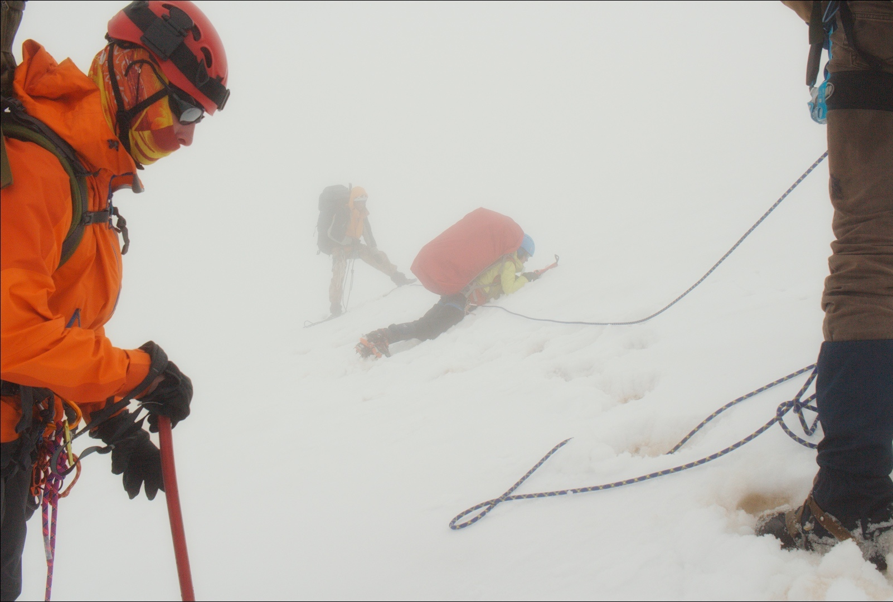

import LinksTelegram from '@site/src/components/_linksTelegram.mdx';
import LinksSocial from '@site/src/components/_linksSocialNetworks.mdx';
import AndroidStore from '@site/src/components/_buttonAndroidStore.mdx';
import AppleStore from '@site/src/components/_buttonAppleStore.mdx';

Knock knock.

Who’s there?

Today, Leonid will tell his story. 

<!--truncate-->

He answered our questions in a fast and precise manner - less words, more action! Leonid prefers bike tourism, enjoys canoeing and goes on walking trips. Leonid has been traveling by bike for 6 years. He has taken on canoeing and walking relatively recently. In no time did he recollect his first trip to The Crimea.

_‘I slept in a rented apartment in Sevastopol. Got round by bike in daytime. It took the longest amount of time to get to Mishor. Then, we traveled to Ai Petri using ropeway. We went back through Ternovka.’_

During that trip, Leonid had already been using Osmand. So, we asked him whether he had considered using other devices at some point.

_‘Since 2013 - only OsmAnd! I had had different versions of <a href="https://support.smartptt.com/hc/en-us/articles/360000807934-How-to-create-Offline-Map?mobile_site=true">SAS Planet</a> for Windows Mobile and for Android. Had tried Navitel.’_

Leonid added that there was no point in using any other app, for OsmAnd had already used <a href="https://osmand.net/features/online-maps-plugin">raster maps</a>, which had been prepared by him in advance. All <a href="https://osmand.net/features">the functions</a> the functions <a href="https://osmand.net/features/start#Ways_to_download_maps">vector maps</a> now.

_‘I just use <a href="https://josm.openstreetmap.de/">JOSM</a> redactor for detalizing data on  <a href="https://www.openstreetmap.org">OSM</a>. OsmAnd uses it afterwards.’_

When it comes to the functions, Leonid uses lots of them. The most relevant for him are <a href="https://osmand.net/features/start#Types_maps">viewing vector maps in different display styles</a> and using <a href="https://osmand.net/features/online-maps-plugin">raster maps</a> as a basis for vector ones. Leonid also mentioned the function of <a href="https://osmand.net/features/find-something-on-map#Find_Points_of_Interest">searching for POIs</a>. The function of <a href="https://osmand.net/features/trip-recording-plugin">track recording</a> was also relevant.

Traveling is a unique experience. It is practically impossible to have the same emotions and experience twice. Sun comes up and sets, seasons change. The weather is never the same. In our blog, we try to uncover the true stories, to share them, in a way - to experience them. Such amazing stories does Leonid tell! Just breathtaking!

_‘Once, during a trip, we we canoeing down a river. Suddenly, we started moving against the flow! Rivers on planes have lots of spirals. Sometimes they split, afterwards, rejoining the main stream at different peculiar angles. And, as a result, it can be unclear, where to swim to. I checked the maps and we were fine!_

_During another trip, I got caught in quite a storm! It was on [The North Demerdzhi (1359 meters)](https://en.wikipedia.org/wiki/Valley_of_Ghosts_(Crimea)), when I got right into a thundercloud. I saw only as near as 10 meters. It was so dark that it felt like night. It was raining hard with an accompaniment of strong wind. The lightning were striking at the proximity of 300 meters! I was trapped, so I used OsmAnd to find a safe place to wait for the storm to calm down. I found it. Went into a nearby forest, sit down and waited.’_

In some situations OsmAnd did not help just because the device battery was too low. Leonid uses Xiaomi Redmi Note 4X, which, according t him, has a very powerful battery that lasts for ages, when <a href="https://osmand.net/features/trip-recording-plugin">the function of tracking</a> is off. So sophisticated is the device, that if one uses OsmAnd just occasionally, it will work for a week or so.

_‘In our trip <a href="https://en.wikipedia.org/wiki/Mount_Elbrus">over Elbrus</a> region we got caught in a cloud, as a result, we lost all our navigational landmarks._

_OsmAnd could have saved us then. Unfortunately, our mobile’s battery died and there was no opportunity for us to power it up. I was not in charge of that expedition, so, it was not for me to decide what to do next. Our guide, though, had some old-fashioned paper maps and we used them to navigate. It caused us quite a few complications, for instance, we came out to the wrong passage. Then, when we were on the glaciers of <a href="https://en.wikipedia.org/wiki/Mount_Elbrus">Elbrus</a>, we had to get through hazardous fractures for several hours. It would be much better if only we were not surrounded by that thick cloud!_

_The following day, when the weather changed, we saw that had we had <a href="https://osmand.net/features/online-maps-plugin">a satellite pic</a> downloaded in OsmAnd, those fractures could have been avoided at ease!’_

Going on a trip, remember that the preparation is as vital as the actual process of travelling. It is much better to think over the details in advance than struggle afterwards. One can download and print maps just in case. OsmAnd, however, is the best option, for nothing bad can happen with Your maps, no possible damage.

Leonid, being our developer himself, uses and works on OsmAnd simultaneously. Not only is it more convenient to check in practice and then to integrate in the app, but it also helps him to come up with new features, when needed. If You are with us - help us to make OsmAnd a better app. If not - join us in our quest for coming up with the ultimate navigation application!

With OsmAnd adventures are right around the corner!

_________________________________________________

<AndroidStore/> <AppleStore/>

<LinksSocial/>
 <LinksTelegram/>, <a href="https://t.me/osmand_es">(ES)</a>, <a href="https://t.me/osmand_pl">(PL)</a>.