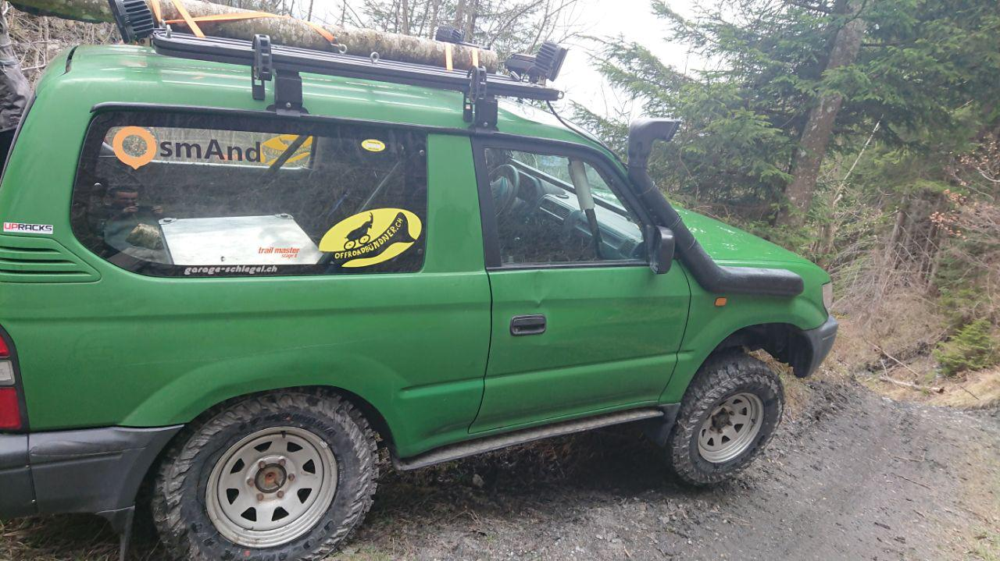

import LinksTelegram from '@site/src/components/_linksTelegram.mdx';
import LinksSocial from '@site/src/components/_linksSocialNetworks.mdx';
import AndroidStore from '@site/src/components/_buttonAndroidStore.mdx';
import AppleStore from '@site/src/components/_buttonAppleStore.mdx';

Hello!

What’s new?

This interview is new! Here, Remo will tell us about his experiences. He will share his thoughts on OsmAnd as well. Remo says that he enjoys traveling to the places that ordinary tourists are not keen on seeing, so, he and his group almost always navigate all over the world in their overland vehicle through the least popular roads.

<!--truncate-->

We are all attracted to the new experiences and emotions. Traveling and exploring can help us to achieve this goal. Unfortunately, things that we get without an effort are less relevant and memorable. Engaging ourselves fully, indeed, strengthens the feelings and make our memories more colorful or vivid. Remo is not an exception.

_‘We like to drive or navigate through challenging tracks and difficult terrain. Normally, we are traveling with our team, in which we are all like a family. We camp in forests and like to be out in the nature.’_

They started traveling in two different teams. The first one went to Italy to embrace the beauty of the nature there. The other team set out to Rumania. Not only was that brutal for their car, but another vehicle also got broken during that journey. Our explorer recollects his longest trip that took almost 3 months to accomplish.

_‘We traveled through nearly the whole North and East Europe. We navigated through Scandinavia, Baltic states, Poland, Slovenia, etc. We visited about 16 countries and drove 16’000 kilometers, mostly off road and through dirty roads.’_

OsmAnd is a unique application, for it is hard to believe that a program can be that integrated - all the users have the access to data, which means that they can improve the data, in some way being voluntary developers. That is why people stop searching for another navigational app after downloading OsmAnd. Remo started using the app several months ago.

_‘We haven’t used it for traveling until now. We have evaluated a number of different apps and devices, but, in the end, we decided that OsmAnd is the best for us. We have tested <a href="https://osmand.net/features">several functions</a> with the help of the developers and were really happy. We have planned our next trip with it and will set out to Croatia with <a href="https://osmand.net/features/trip-planning">tracks planned</a> in OsmAnd.’_

It is an essential part of our every interview to inquire about a preparatory process. Both experienced and beginner travelers try to do at least basic check up before the actual trip. So, does Remo do anything in advance? Yes, in fact, he does.

_‘We prepare the maps with our tracks. Sometimes we download tracks from <a href="https://www.wikiloc.com/">eg wikiloc</a> or we create our own. When we travel to places that don’t have any Internet connection, we download satellite images before the trip. This is one of our <a href="https://osmand.net/features/online-maps-plugin">most needed features</a> and a great advantage of OsmAnd. It is possible to download satellite images for a big area to use them offline.’_

OsmAnd provides its users with quite a variety of functions. However, everyone has their most favorite and helpful one.

_‘Like I have said above, I think that the most important function is the ability to use <a href="https://osmand.net/features/online-maps-plugin">satellite images offline</a>. This makes a big difference when comparing to other products. We also use the combination with <a href="https://osmand.net/features/tracker">OsmAnd Tracker</a>, so we can drive in a convoy and everyone will see where the other car is. The option to display a lot of different tracks at the same time on the map is also really helpful.’_

_‘OsmAnd makes our trips much easier. We can display all <a href="https://osmand.net/features/trip-recording-plugin">the tracks</a> on a tablet in the car, so, the driver with a co-driver will see the tracks. It’s a perfect off-road navigation system. And, even though, we have been using OsmAnd for only a short amount of time, I already think that it will be a perfect accompaniment to our main navigation system. In future, when everything is working, we would also like to use it for driving rallies.’_

OsmAnd is always open for Your opinion and advice, so, we asked Remo to give us some feedback.

_‘I work as CTO (Chief Technical Officer) for a software company and see a lot of software growing. So, my advice would be: The app should not have every feature, the implemented ones, though, must be functioning really smoothly. And, it is worth mentioning that I, personally, think it works really well at the moment. We don’t use the app directly for road navigation. For that it’s more like a second opinion in comparison with other road navigation devices. However, for off-road and track navigation, it’s the best application that we have found.’_

It is always pleasant to hear that the application is appreciated by the users. And, even though, this interview is not a long one, it is, definitely, sincere. We would like to finish on a positive note, with a phrase that Remo said at the end of the interview:

_‘Great work OsmAnd team!’_

_________________________________________________

<AndroidStore/>  <AppleStore/>

<LinksSocial/>
 <LinksTelegram/>, <a href="https://t.me/osmand_es">(ES)</a>, <a href="https://t.me/osmand_pl">(PL)</a>.