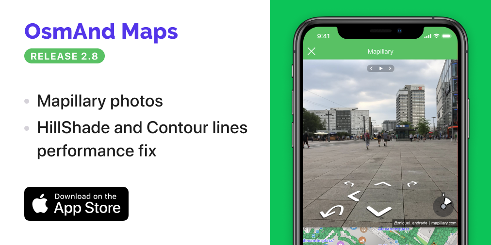

<a href="https://itunes.apple.com/us/app/osmand-maps-travel-navigate/id934850257">OsmAnd 2.80 is now available!</a>

<!--truncate-->

## Mapillary

We continue to follow our <a href="https://osmand.net/blog/2019-ny-resolutions">New Year’s resolutions</a>, where we have promised to catch the iOS version of OsmAnd up with the one on Android, and we are getting there.

We're proud to have collaborated with Mapillary for the new release. Now you can view the street-level imagery in your location or anywhere in the world using the Mapillary in OsmAnd for iOS.

<table>
  <tr>
    <th></th>
    <th></th>
    <th></th>
    <th></th>
    </tr>
</table> 

Using the widget on the map, you'll be able to view images or videos and even add your own. To view the images and videos, you'll have to go to 'Configure screen' menu and enable the 'Mapillary' layer.

<table>
  <tr>
    <th></th>
    <th></th>
    <th></th>
    <th></th>
    </tr>
</table> 

Now you have access to an extensive database created by volunteers. To view media attached to a certain point on the map, just make a long tap there and open the context menu. You'll be able to scroll through images of the location easily.

Zoom in closer to view the images even more conveniently in a Mapillary window over your map. You can also press the white arrows to 'move' along the streets. To contribute to Mapillary, just press on the widget and take a picture.

<table>
  <tr>
    <th></th>
    <th></th>
    </tr>
</table> 

## What's more in the latest version of 2.80?

- Fixed city and postal code search.
- Improved performance of Hillshade and Contour Lines map rendering.
- Added Turkish TTS.

And remember that only together we can achieve the best results!
New features are coming SOON!
____________________________ 

OsmAnd at <a href="https://www.facebook.com/osmandapp/">Facebook</a>, <a href="https://www.twitter.com/osmandapp/">Twitter</a>, and <a href="https://www.reddit.com/r/OsmAnd/">Reddit</a>!

 
Join us at our groups of Telegram <a href="https://t.me/OsmAndMaps">(EN)</a>, <a href="https://t.me/itosmand">(IT)</a>,  <a href="https://t.me/frosmand">(FR)</a>, <a href="https://t.me/deosmand">(DE)</a>, <a href="https://t.me/ruosmand">(RU)</a>, <a href="https://t.me/uaosmand">(UA)</a>.

