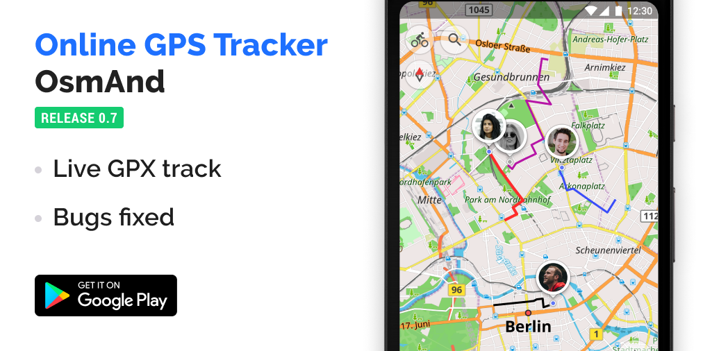

import AndroidStore from '@site/src/components/_buttonAndroidStore.mdx';
import AppleStore from '@site/src/components/_buttonAppleStore.mdx';
import LinksTelegram from '@site/src/components/_linksTelegram.mdx';
import LinksSocial from '@site/src/components/_linksSocialNetworks.mdx';
import Translate from '@site/src/components/Translate.js';

Hi!
The new version of our OsmAnd Tracker is ready!
We prepared new feature for you!

<!--truncate-->

### Live track

Now you can see the online moving of your contacts on the map of OsmAnd with online GPS-track. For this, you should switch on "Live" at your contact in "Timeline menu". If there are many sharing contacts at this moment OsmAnd app chooses the color of tracks by random.

<table class="blogimage">
  <tr>
    <th></th>
    <th></th>
    <th></th>
    <th></th>
    </tr>
</table> 

When you click "Show in OsmAnd" or mini-map you can choose special settings for GPX-track your contact in OsmAnd app and see it live moving with track on OsmAnd map.

<table class="blogimage">
  <tr>
    <th></th>
    <th></th>
    </tr>
</table> 

### "Timeline" modified

We added information to "Timeline" screen if you don't have data collected in the selected day. You can go to select the nearest date with one click.

<table class="blogimage">
  <tr>
    <th></th>
    </tr>
</table> 

Further instructions and helpful advice can be found <a href="https://osmand.net/features/tracker">here</a>.

Get OsmAnd Tracker today from <a href="https://play.google.com/store/apps/details?id=net.osmand.telegram&hl">Google play</a>.

_________________________________________________

<LinksSocial/>
<LinksTelegram/>

