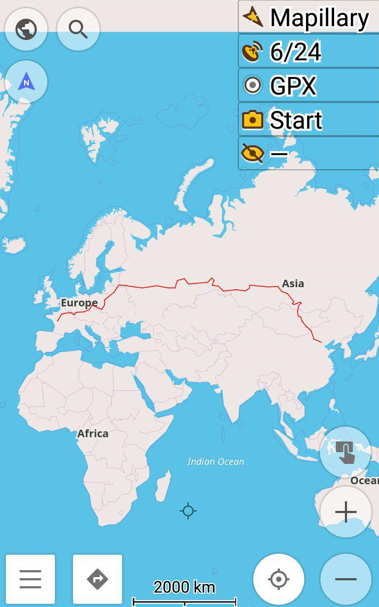
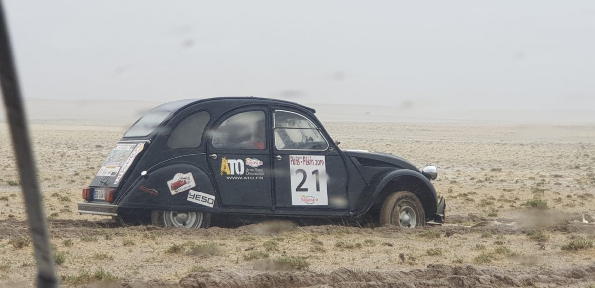

import LinksTelegram from '@site/src/components/_linksTelegram.mdx';
import LinksSocial from '@site/src/components/_linksSocialNetworks.mdx';
import AndroidStore from '@site/src/components/buttons/AndroidStore.mdx';
import AppleStore from '@site/src/components/buttons/AppleStore.mdx';

Hello!

Have you ever wondered why we travel. We do our best to enrich our lives to make all the experiences unforgettable. Life would be so boring if we wasted it standing still, wouldn’t it? Do you have a second to talk about an unordinary event that took place this summer?

Today we will talk about more than just a hobby, we will talk about a way of living one’s best life, combining more than just one passion, and finding people who would love to do the same. We will talk about a trophy. Sorry, not just a trophy! We will have a closer look at <a href="http://www.trophee-paris-pekin.fr/le-trophee-2019.html">The Trophy from Paris to Beijing</a>. Here comes Bruno, the person to tell us about that marvelous travel!

<!--truncate-->

There were thirty-two retro cars that joined the Trophy. These cars were assembled at least a quarter of a century ago! Owners of vintage cars manufactured between 1941 and 1994 came together this summer to drive 12 000 km in 35 days!

_'The oldest was a Cadillac from 1941 and a Renault Colorale from 1953!'_

We are extremely proud that <a href="https://osmand.net/">OsmAnd</a> had been chosen to be the app of this rally!

_'Osmand Team managed to give us a link to be able to download the map between Paris and Beijing! And we had a global GPX file of 12.000 km that the drivers had to follow to reach, step by step, China and Beijing (via East Europe, Russia and Mongolia). The global track was divided into around 30 tracks corresponding to all the steps we had on the way.'_

We asked Bruno why they chose <a href="https://osmand.net/">OsmAnd</a> and whether there was any other app that they had considered.

_'This is the most practical app to use <a href="https://osmand.net/features/trip-planning">to read GPX files</a>. Contrary to normal GPS (like Garmin), <a href="https://osmand.net/">OsmAnd</a> doesn't try to make a new route with our GPX files. It just reads the files and gives our customers the right way (we make the GPX tracks during our inspection visits).'_

The app turned out to be more than just helpful. There were two navigation systems used during the trip, OsmAnd, and Garmin. <a href="https://osmand.net/">OsmAnd</a> was used with Wiko phones.

_'At the end of the trip, everybody agreed that it was <a href="https://osmand.net/">OsmAnd</a> that had provided trustworthy GPX tracks. Garmin GPS got lost several times. Participants referred to <a href="https://osmand.net/">OsmAnd</a> tracks as ‘trails of breadcrumbs.'_

Trail of breadcrumbs sounds poetic and is taken from the story of Hansel and Gretel. And as the siblings found their way back from the forest, so did the participants of this Trophy. It is the fourth time that <a href="https://osmand.net/">OsmAnd</a> had been used as the navigation system of the Trophy.

_'For the first time, <a href="https://osmand.net/">OsmAnd</a> appeared at the end of 2017 for a rally with vintage cars in Argentina, Chile, Peru, Bolivia. For the second time, in April of 2018 for The Green Expedition with electric vehicles in Argentina. Finally, for the third time in Paris in February of 2019. And each time, our performance depended on this app. So we will, for sure, go on organizing our rallyes with <a href="https://osmand.net/">OsmAnd</a>, a great app!'_

It does not matter whether You use <a href="https://osmand.net/">OsmAnd</a> for a road trip or for a rally, as long as you choose us we will do our best ensure Your convenience and happiness!

Thank You for being with us!

_________________________________________________

<LinksSocial/>
<LinksTelegram/>

<AndroidStore/>
<AppleStore/>