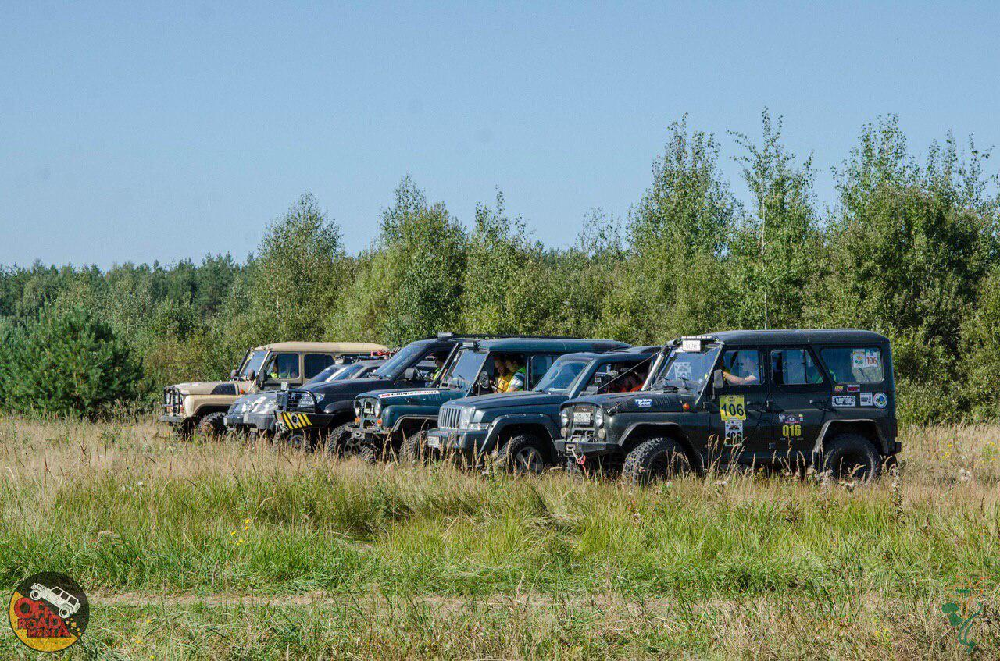
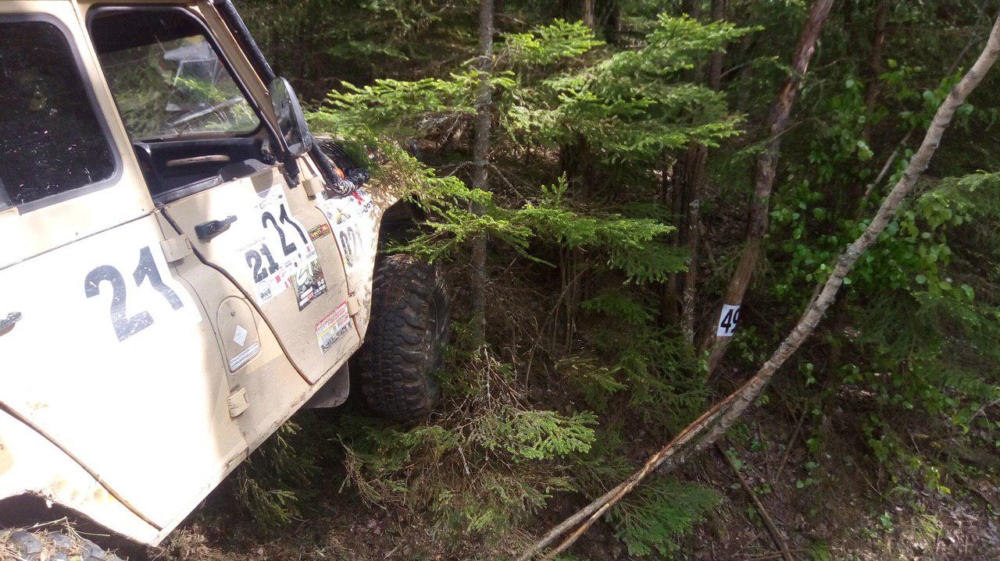

import LinksTelegram from '@site/src/components/_linksTelegram.mdx';
import LinksSocial from '@site/src/components/_linksSocialNetworks.mdx';
import AndroidStore from '@site/src/components/buttons/AndroidStore.mdx';
import AppleStore from '@site/src/components/buttons/AppleStore.mdx';

Hi, Dear subscribers!

There is no such thing as bad weather in a sense; furthermore, this fall gives us no reason for sadness - the weather is more than just satisfying - it is marvelous! The harmony of colorful leaves and the blue sky is, definitely, the masterpiece of nature. We should not bother ourselves with winter coldness and stillness yet.

Today we will talk to Seraphima, who will tell us about her vision of travelling with <a href="https://osmand.net/">OsmAnd</a>. Seraphima is not the person to sit in when the weather is that excellent. She cannot stand even thinking about it. She will rush outside seeking for a new adventure. Even when she says ‘family time’ what she really means is a family trip. What can be better than a new adventure on a sunny day with the people You care about?

<!--truncate-->

_“Family time for me means many things, it can be picking mushrooms in the forest, a ride with friends on a SUV, or - the best of them all - participating in a trophy orienting event. Trophy orienting is a multiple task activity, in which one has to find the location of a number of coordinates using GPS, having a limited amount of time. All tracks involve off-road driving and require specialized vehicles with well organized teams.”_

Eighteen months ago Seraphima and her husband took up trophy orienting. In orienting one will need reliable source of information, which is a detailed and marked map of the location. The problem for Seraphima and her husband was to find an app -  either free or paid - that would serve that purpose in the most precise way, <a href="https://test.osmand.net/ru/features/navigation">navigating</a> off-road even without any GSM signal.

_“We have tried almost every app available, a few were rather expensive. Then, just by chance, I’ve stumbled across <a href="https://osmand.net/">OsmAnd</a>. I, literally, fell in love! Smart interface, the number of <a href="https://test.osmand.net/features">functions</a>… I loved all of it! Additionally, there is an easy access to everything. So, I’ve been using the app for a year now.”_

All the interviews we have already posted have the question about one’s routine <a href="https://test.osmand.net/features/trip-planning">preparing the maps</a>. The users, however, see the issue from different perspectives, for some it is an opportunity to start traveling before actually going anywhere, to test the route, to find the alternatives; while for others it is just a waste of time.

_“We do not do any special preparation of a map. I download the map and alter the settings so as to have the right souce of the map, layerings, and, finally, <a href="https://test.osmand.net/features/map-viewing">the style of it</a>.”_

Seraphima says that OsmAnd has already helped her and her husband in a few difficult situations. Especially, during tournaments, when every second counts.

_“The app gets an enormous variety of satellite signals in no time. As a result, I do not have to worry about getting my coordinates wrong or with a delay.”_

It is always important to mention the device one uses. In <a href="https://test.osmand.net/blog/
">OsmAnd blog</a> You can read an honest review of them. The opinions are always based on Your colleagues’ experience and are never sponsored. It might come handy if You decide to choose a new smartphone or tablet.

_“I have an Android smartphone. It takes about 8 hours of constantly checking the route to use up to 40 per cent of the battery power. I always have a power bank and a car to plug it in, just in case, you know.”_

Every day we are cooperating and collaborating with You over the app. And the deeper we go into it, the harder it gets. But the complexness is what makes OsmAnd different, in a way superior to other apps.

_“I wish the <a href="https://osmand.net/">OsmAnd</a> team inspiration, success, more new users, and to never give up!”_

We would like to thank Seraphima for giving us a chance to know her and her ways of traveling better.

Thank You, Dear users, as well!

See You in no time!
_________________________________________________

<LinksSocial/>
<LinksTelegram/>

<AndroidStore/>
<AppleStore/>