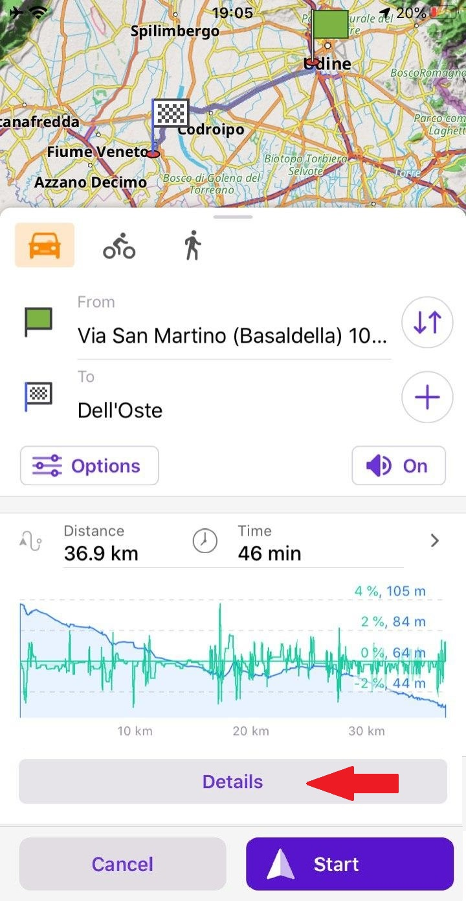
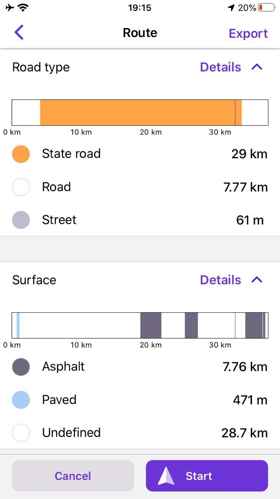
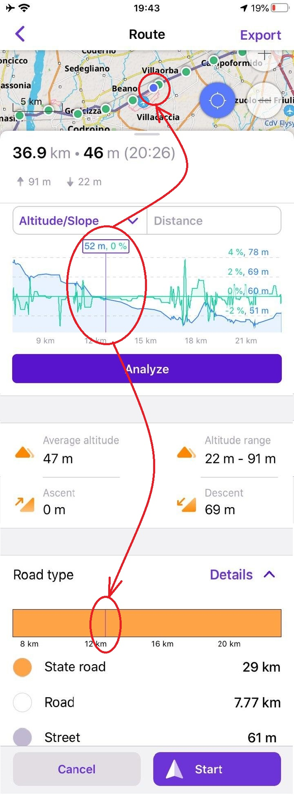

import AppleStore from '@site/src/components/buttons/AppleStore.mdx';
import LinksTelegram from '@site/src/components/_linksTelegram.mdx';
import LinksSocial from '@site/src/components/_linksSocialNetworks.mdx';
import Translate from '@site/src/components/Translate.js';

Great news for iOS OsmAnd users!
We're glad to announce the new <a href="https://itunes.apple.com/us/app/osmand-maps-travel-navigate/id934850257">OsmAnd version for iOS</a>.
Update your OsmAnd, check out all the new features and let us know if you like everything!
We promise to continue improving the OsmAnd app and make it even more useful for trips and everyday rides to make your life set.

<!--truncate-->

### Added Route details screen with the altitude and slope profiles, provides additional data about route surface, steepness, road types and smoothness.

In <a href="https://osmand.net/blog/osmand-ios-3-10-released">release 3.10</a> we added the altitude/slope graph.

Now you can click the *Details* button to get more information about your route. This feature has been in OsmAnd on Android for a long time. You can visualize information about route surface, steepness, road types and smoothness in each point of your route.

Сlick on *Details* of route surface, steepness, road types and smoothness, you'll get a meaning for each color.

### Added ability to display currently selected graph point on the map

Now you can see all of the information for each point of your route. For this, you can click on the graph or *Details* button of the Route screen. You can zoom the graph and choose any point for viewing needed information.

### Added ability to share a calculated route or save it as a trip

After you calculate a route, you can save or share it like a GPX-track. To do this, first click on the *Details* button, then click on *Export* in the top-right corner.

<table class="blogimage">
  <tr>
    <th></th>
    <th></th>
    <th></th>
    <th></th>
    </tr>
</table> 

### Added nautical maps with depth contours

In this release, we added a full list of Nautical maps like in the Android version. You should go to <a href="https://osmand.net/docs/user/plugins/nautical-charts">*menu-> Maps & Resources-> Nautical maps*</a> for downloading maps. Within this list, you can find Nautical depth contours for many regions of the world. For viewing depth contours on the map you should go to *App menu-> Map-> Map style (Details)->Depth contours*. Note: you must buy <a href="https://osmand.net/docs/user/purchases/ios">a special in-app</a> or subscribe to <a href="https://osmand.net/docs/user/purchases/ios">OsmAnd Live</a> to use this feature.

<table class="blogimage">
  <tr>
    <th></th>
    <th></th>
    </tr>
</table> 

### Added the map of Antarctica

The map of Antarctica is available now in our application. You can find the Map of Antarctica and Wikipedia files in *Maps & Resources*.

<table class="blogimage">
  <tr>
    <th></th>
    <th></th>
    </tr>
</table> 

### Added ability to Edit online map sources and add them via a special link

You can clean the cache of tiles, edit or delete online maps. To do this, you can go to *General menu-> Maps & Resources-> Installed-> Map Creator*.
Now online maps can be added with a special link. After that, you can go to *General menu-> Maps & Resources-> Installed-> Online maps* to clean the cache of tiles, edit or delete the online maps.
All of these online maps you can choose in *General menu-> Map-> Map type-> Online maps*.

<table class="blogimage">
  <tr>
    <th></th>
    <th></th>
    </tr>
</table> 

### What else is in this release?

* Fixed a map rendering issue that caused freezes on the latest devices
* Fixed the algorithm for moving time calculation in the recorded Trips screen
* Fixed the crash with automatic track recording during navigation

And remember that only together we can achieve the best results!
New features are coming SOON!

<LinksTelegram/>
<AppleStore/>
