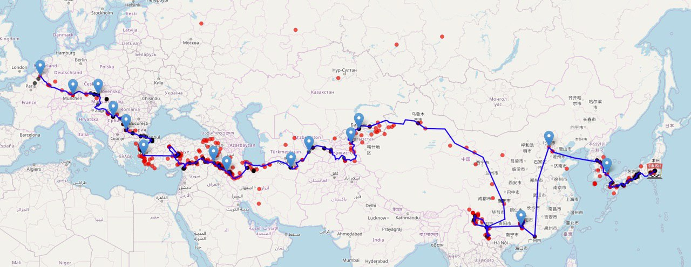

import LinksTelegram from '@site/src/components/_linksTelegram.mdx';
import LinksSocial from '@site/src/components/_linksSocialNetworks.mdx';
import AndroidStore from '@site/src/components/buttons/AndroidStore.mdx';
import AppleStore from '@site/src/components/buttons/AppleStore.mdx';

What do You see in the window? Bet the sky is blue, early flowers are sprinkled over young green grass. Everything seems peaceful and joyful, spring is all around us. Unfortunately, now many of us cannot fully enjoy this gorgeous state of nature. We chose to stay at home for the sake of our friends, families, and, finally, ourselves. These times are hard for everybody, we are immobilized, locked down for our own safety. Therefore, it is even harder to imagine how travelers feel right now. They are always going places, taking trips, searching for new experiences. As for now, the only traveling one gets is to a supermarket and back, for some even this is a luxury. But travelers have one important feature in common, we will never give up! We will work from homes if possible; spend time with our families either physically or virtually; plan new trips and think about our past adventures, learning and reminiscing.

<!--truncate-->

Here is a new interview You can read that is worth a while. We will talk to Dries. He has an amazing traveling <a href="https://roadtotherisingsun.be/blog.html"> blog</a> with his partner Manon.

Dries enjoys traveling by foot or bicycle. He always tries to spend some extra time to observe surroundings and to connect with people. Dries says that it is his way of being a part of a landscape and getting deeper understanding of a culture.

For Manon and Dries last year was more than just successful, for they undertook a long trip. And by saying long, they really mean it!

_“I cycled with my partner 13,500 km from Brussels to Tokyo. It took us 11 months in total. We started early February in Belgium and cycled across Europe, the Middle East, Central Asia and finished in Northern Asia at the end of December. It was a very rich and intense experience with plenty of new encounters, discoveries and knowledge.”_

You can check <a href="http://roadtotherisingsun.be"> their website</a> to see the full itinerary! So long a trip is demanding both physically and mentally. Venturing on it without having enough experience is nearly impossible! Dries has started long distance traveling when he was 19.

_“One night with a friend, I decided to spend summer on a bike and cycled from Belgium to the Pyrenees. The freedom I experienced during that ride made me fall in love with bicycle touring.”_

Some of us enjoy reading paper books, so-called “real” ones. However, the variety and accessibility of digital copies make them more appealing to the audience. The case with paper maps is similar. Even though it is still nice to feel them in one’s hands, any app version has the advantage of the variety of functions and compactness. Dries had been using real maps until he got <a href="https://osmand.net/">OsmAnd</a>.

_“It became my default <a href="https://osmand.net/features/navigation"> navigation</a> app a few years ago. While <a href="https://osmand.net/features/trip-planning"> preparing for a new trip</a> (being it in my own region or a country on the other side of the world), I spend some evenings doing <a href="https://osmand.net/features/find-something-on-map#Find_Points_of_Interest_A"> research on the different POIs</a> to visit in this region. After that, I tend to open the cycle map layer on <a href="https://www.openstreetmap.org/"> OpenStreetMap</a> to see if there are any cycling routes nearby. If I can't find any, I try to find alternatives on other websites. If there are cycling trails, I use <a href="https://osmand.net/features/navigation-profiles#create_brouter"> the BRouter</a> web app to create a GPX, which I then use in <a href="https://osmand.net/">OsmAnd</a> during my ride.”_

From the vast variety of <a href="https://osmand.net/features">functions</a> Dries regularly uses just three. He adds GPX files to a map, applies <a href="https://osmand.net/features/osm-editing-plugin"> OSM edits</a> to make POI changes, and creates <a href="https://osmand.net/features/favourites"> favorites</a> for all the places to remember.

_“Last year during my long bicycle tour I created <a href="https://osmand.net/features/favourites"> favorites</a> for all places we' had slept in, all recommendations received from locals, and our highlights. Furthermore, I also added my notes and changes on, among others, the new border crossing between Kazakhstan & China, one of the very few hotels in the Xinjiang province in China, and a crazy underground bicycle parking in Japan to <a href="https://www.openstreetmap.org/">OpenStreetMap</a>.”_

Dries’ device holds battery up to one day. It might need charging if the app is constantly on, though.

_“That was the case in several long-stretched Japanese cities with many small streets. At the beginning of our journey I also wanted to use <a href="https://osmand.net/features/trip-recording-plugin"> trip recording</a>. That was a bit too battery-consuming on a daily basis, because i knew that I wouldn’t always be able to charge my battery in the evening while camping.”_

How often do You ask for directions? How often are You asked to give them? Do You always know what to answer? All of us have been at some point in the middle of nowhere, turning for guidance to strangers.

_“It happens from time to time. In one of our biking trips, some locals came to us and asked where we were heading to. While showing them our itinerary on <a href="https://osmand.net/">OsmAnd</a>, I noticed and found it very funny that many of them didn't seem to recognize their own neighborhoods on the map. That made me wonder how difficult it should be to travel and find your way without either decent digital or printed maps! I have nothing but gratitude for making such a great app as <a href="https://osmand.net/">OsmAnd</a> - many thanks to the whole team!”_

We thank Dries and wish You and Your families strong health and faith in a better tomorrow. These hardships remind us the true value of life and freedom. We are sure that it will get better. We know that we will return to our normal lifestyles. We are in this together no matter where we are, no matter what we do.

Be mindful and stay safe!
_________________________________________________

<LinksSocial/>
<LinksTelegram/>

<AndroidStore/>
<AppleStore/>