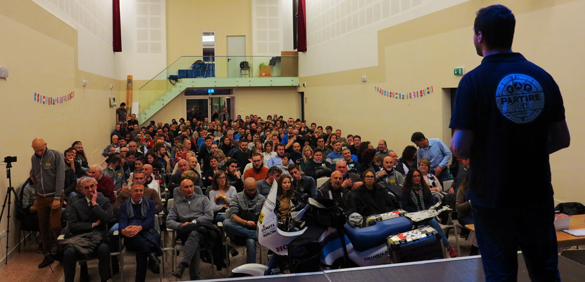

import LinksTelegram from '@site/src/components/_linksTelegram.mdx';
import LinksSocial from '@site/src/components/_linksSocialNetworks.mdx';
import AndroidStore from '@site/src/components/buttons/AndroidStore.mdx';
import AppleStore from '@site/src/components/buttons/AppleStore.mdx';

Some of us travel by car, others by bike. But what is as fast as a car but has only two wheels like a bike? Yes! A motorcycle. This fascinating means of traveling, even though risky, is highly romanticised. Imagine this picture, You are on a mountain road on your motorcycle, enjoying the vivid colors of the the sunset. Gionata is a professional motorcycle adventure traveler, so who, if not he, is able to fully describe and share the experience of motorcycle traveling?

<!--truncate-->

_“I have been traveling since 2001. And even though my first trip was probably not with a motorcycle, in 2005 I left home to do a world tour on it which lasted 8 years.”_

Can You imagine leaving home for 8 years? Some of OsmAnd users have probably even done that, which does not make it more achievable. The amount of hard work behind such a long trip is tremendous. To secure the safety of the trip use <a href="https://osmand.net/">OsmAnd</a>! The app will help You avoid troubles on Your way and will definitely save You a few extra hours of preparation.

_“Generally, I don’t prepare maps beforehand. Since I own a paid version and I have unlimited access to maps I just download all the maps for the trip I am taking and I make sure I have all of them because the main reason of using <a href="https://osmand.net/">OsmAnd</a> is to <a href="https://osmand.net/features/trip-recording-plugin">record my trip</a> in a GPX file.”_

<a href="https://osmand.net/">OsmAnd</a> is the app suitable for various means of traveling, as a result, it is rapidly developing. The more people use the app, the more detailed the maps become.

_“I started using <a href="https://osmand.net/">OsmAnd</a> in 2016. A friend of mine told me about it. He was into hiking and said that I could probably benefit from using OsmAnd. I had never tried to use a navigational application, as a matter of fact, I was against applications such as Garmin and TomTom. I did not use any of those, but as soon as I started using OsmAnd I fell in love with it…I fell in love with the concept of it and I never left the app since then.”_

Gionata uses the app both for himself and for his business. Not only does he use the function of recording, he also shares his tracks with his clients. With <a href="https://osmand.net/">OsmAnd</a> You can easily record, share, and show GPX files on a map.

_“I own <a href="https://www.partireper.it/"> an adventure motorcycle blog</a> and a <a href="https://www.ridetrueadv.com">motorcycle tour operator </a> and in both cases we provide .gpx track created with OsmAnd for our customers to follow our GPX in order to reach trails, waypoints and hotels  we have booked for them in order to follow the best routes available in each country they are visiting. The route that I was able to save using the app allowed me to recreate its design on Google Maps and then I printed it <a href="https://www.partireper.it/categoria-prodotto/libri/">in my books</a>, so now the people who read my books can see exactly where I went.”_

<a href="https://osmand.net/features/trip-planning"> Planning Your track</a> ahead is a great habit which makes traveling more safe and pleasurable. Nevertheless, some unpredicted complications may happen. One cannot simply estimate all the factors, because there is no control over weather, traffic, accidents or, in the worst case scenario, disasters. An application such as <a href="https://osmand.net/">OsmAnd</a> will optimize Your on-the-spot decisions.

_“Definitely, yes. The app has made my trips easier several times, when I decide last minute to make hotel reservations or if I need to find a spot to camp, or if I need a gas station; and many times, <a href="https://osmand.net/">OsmAnd</a> has brought me to the correct destination and that made my trip easier for sure.”_

If You still have not settled down on a device to use while traveling, Gionata’s experience might help You! He has always been taking battery consumption of the app under consideration.

_“I started with a Wiko Fever, which was not that good, it always went into protection, then it crushed, so I switched onto an Asus ZenFone which was quite all right with <a href="https://osmand.net/">OsmAnd</a>. Afterwards, I had a Samsung Galaxy S7. Now I have Samsung Note 10. Actually, all of the devices have great battery but I must say that, unfortunately, OsmAnd reduces battery life more than Google Maps does.”_

Our today’s guest points out that for some members of the motorcycling community it might cause inconvenience, but overall it is not that big of an issue.

_“My advice would be, if it is possible, to make OsmAnd less battery consuming, which would be great. So, the battery will last for the whole day and users will have the chance to use the device for any other activities, such as web browsing, emails, phone calls, and WhatsApp.  And another thing, potentially interesting to develop, is to allow OsmAnd to interact with phone settings in order to activate more sensitive screen, so that we would be able to use it with gloves on.”_

As always, at the end of our interview, we would like to thank Gionata and all of You for being with us today.git 
We sincerely hope that the world is slowly but steady is returning to normal.

See You!

<a href="https://www.youtube.com/user/partireperit">PARTIREper - Gionata Nencini</a> YouTube chanel.
<a href="https://www.partireper.it">Website</a>.
_________________________________________________

<LinksSocial/>
<LinksTelegram/>

<AndroidStore/>
<AppleStore/>