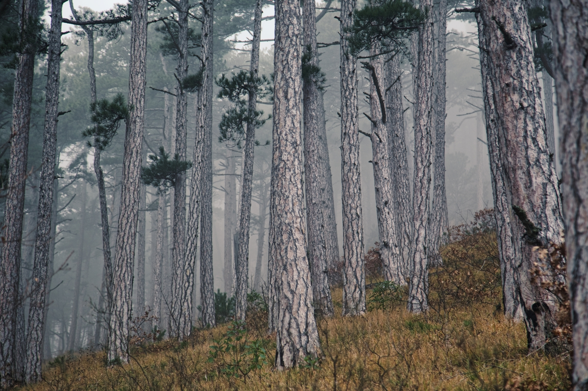
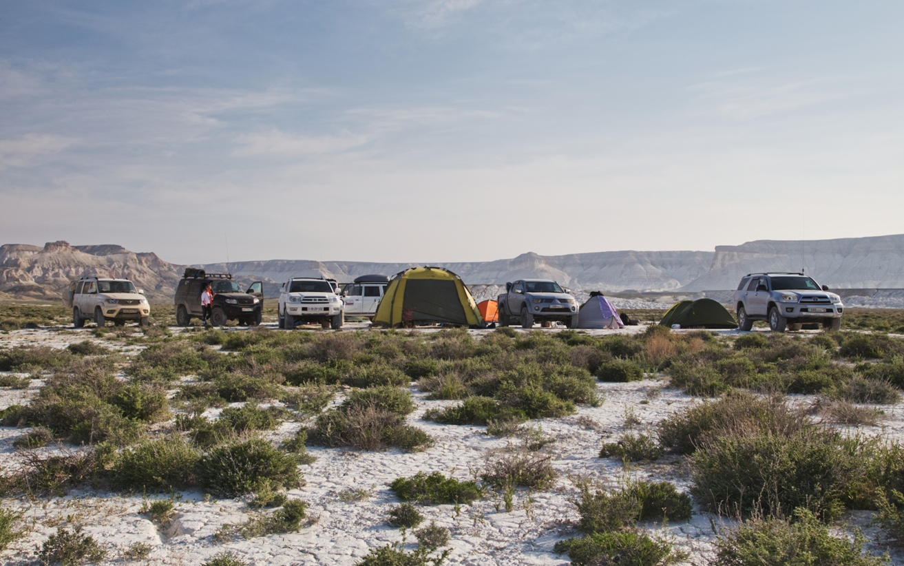

import LinksTelegram from '@site/src/components/_linksTelegram.mdx';
import LinksSocial from '@site/src/components/_linksSocialNetworks.mdx';
import AndroidStore from '@site/src/components/buttons/AndroidStore.mdx';
import AppleStore from '@site/src/components/buttons/AppleStore.mdx';

Would you like to see something marvelous? If yes, then today’s interview is just what you need! Not only does Arseniy have lots of amazing stories to tell, but he also has pictures that are so beautiful that they are a great example of the sublime. For more pictures check out his instagram <a href="https://www.instagram.com/comportal_/">here.</a>
Just like one spark starts the fire so does the passion for traveling appear. Arseniy has been traveling since childhood. The means he choses for it depends on distance. On shorter trips he goes by bike, while the longer ones require either a car or a train.

<!--truncate-->

_“In the beginning, I went on short trips to the nearby areas. I chose travel alternatives over popular destinations. For instance, I checked out abandoned villages, factories, churches. I enjoyed outstanding architecture and the beauty of landscapes._ 
_Some time ago, my friend and I had an ambitious plan to circumnavigate the Great Ring of the Moscow Railway by train in just 24 hours. We managed to complete the task on the fourth try. In 2006, I set out for the Altai Republic by suburban trains.”_

_“Finally, I chose traveling by car over other means. Heavy SUVs, mountains and steppes, tundra and taiga, these are the things I love more than anything else. I set my camps in places that are hard to reach and I go on trips without equipment on foot.”_

Arseniy is an experienced traveler; nevertheless, as many of us, he started with simple paper maps.

_“I’ve been traveling since childhood. I remember going to the Altai Republic by train with a paper railway map on hands! Then, I found my way to the world of GPS navigation through Windows Mobile, Navitel. I went to the Republic of Bashkortostan with a laptop running Garmin Mobile PC. I found OpenStreetMaps while using SasPlanet app on my computer; and, finally in 2014 I got the chance to acquaint myself with <a href="https://osmand.net/">OsmAnd</a>.”_

We are free to decide whether to prepare maps beforehand or venture for an adventure unprepared. <a href="https://osmand.net/">OsmAnd</a> helps you to get maps done faster or minimizes the risk of getting lost without proper guidance. Arseniy choses the first option, hence, he digs in his maps before each trip.

_“At home I use <a href="https://osmand.net/docs/user/plugins/online-map#sasplanet">SasPlanet</a>, where I create tracks. I upload required raster maps and satellite images there as well. There is a number of countries that I visit more often than others, so <a href="https://osmand.net/docs/user/map/vector-maps">the vector maps</a> of my favorites are already downloaded to OsmAnd. If needed, I also upload prepared on a computer files with raster maps. Another project that I use is <a href="https://anygis.ru/Web/Html/Osmand_en">AnyGIS</a>. This one is for additional online map sources, in order to save certain areas in cache.”_

_“When I had been preparing to my first trip to Mangyshlak Peninsula, I used <a href="https://osmand.net/docs/user/plugins/online-map#sasplanet">SasPlanet</a> - which used to be a habit of mine - for downloading the required areas from the Yandex Satellite. The trip went well until the moment that I decided to go for Boszhira, which was the dried bottom of the ancient Tethys Ocean. It was surrounded by chalky mountains and limestone and appeared to be completely white. It actually could hurt your eyes unless you had sunglasses. As a result of this natural phenomenon, Yandex had huge white spots on the map. I noticed them while having an internet connection, which is why I was able to use OsmAnd to download <a href="https://osmand.net/docs/user/plugins/online-map">Bing satellite images</a> that had taken into account that natural phenomenon and provided maps with distinctive roads.”_

Arseniy often uses <a href="https://osmand.net/docs/user/plugins/online-map">the layer function</a>. According to him, this ‘trick’ allows you to combine old maps and tracks from OSM in just a few clicks. Arseniy also applies <a href="https://osmand.net/docs/user/widgets/radius-ruler#distance-by-tap-tool">the measuring distance</a>, where you can set the nodes and automatically get the distance between them.

_“<a href="https://osmand.net/docs/user/plugins/trip-recording">GPX recording</a> and further track layout on the basis of these files are the functions that make OsmAnd even more awesome. <a href="https://osmand.net/docs/user/personal/favorites">Easy organization of Favorites with available options of import and export</a> from other apps is the greatest advantage of OsmAnd navigation!”_

Once when Arseniy was mapping a road from one village to another in the mountain, <a href="https://osmand.net/docs/user/navigation/">OsmAnd suggested a route</a> with ravines and fords as an alternative to the official road.

_“I was eager to take that risk and chose the track that appeared more adventurous. It was equally hard to ascend and descend. Deep and muddy tracks, trovants, and, finally, I faced a boom gate and behind it just 200 meters away was the road… and a restricted area...but on the other side of it!”_

More often than not traveling is unpredictable. Consequently Arseniy had to re-map his track during some trips. On one such occasion he bought a tablet Teclast X98 Air.

_“It is a Chinese tablet with a high definition display, on which it is easy and convenient to read OsmAnd maps. The best it’s feature, however, is dualboot, which means that you can exchange any file among Android and ОС Windows. Then, with the help of SasPlanet, Arseniy creates new maps for our OsmAnd. The tablet is constantly being charged during car rides, so the battery life is not a problem. I set out for short trips or rafting with my everyday gadget Xiaomi MI8 in a sealed case and 20 Ah power banks. The equipment provides a few days of navigation without any inconsistency.”_

This June we celebrated our 10-year anniversary. In just one decade our project has become an app that is popular on the market and considered trustworthy by the users. That’s one giant leap for OsmAnd! And do you know what made it possible? Your support and input! Together we will continue developing the app and making traveling more pleasurable and convenient. Arseniy has something to say to OsmAnd as well.

_“OsmAnd has given me a helping hand in the north of taiga and in the busy centre of modern Dublin. These 10 years made OsmAnd popular among a number of famous travelers. As for me, OsmAnd is legitimately in top 10 apps that I use, recommend, and download on new devices. I hope that it is just the start of this highly promising project - OsmAnd - the most convenient and functionally developed app for travelers. Thank you, Team OsmAnd, for those unbelievable places I have seen and for those I am yet to see.”_

We thank Arseniy for his honest and kind feedback and for the pictures that can easily take anyone’s breath away! 

Stay strong and healthy!

_________________________________________________

<LinksSocial/>
<LinksTelegram/>

<AndroidStore/>
<AppleStore/>