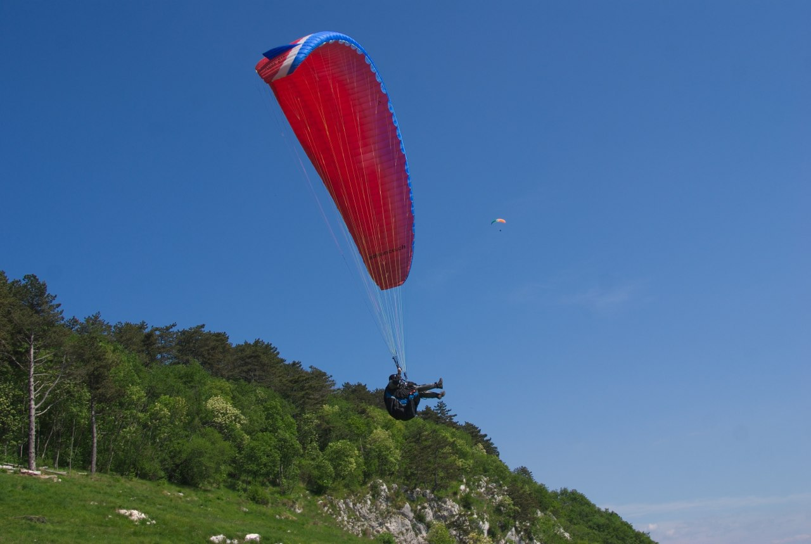
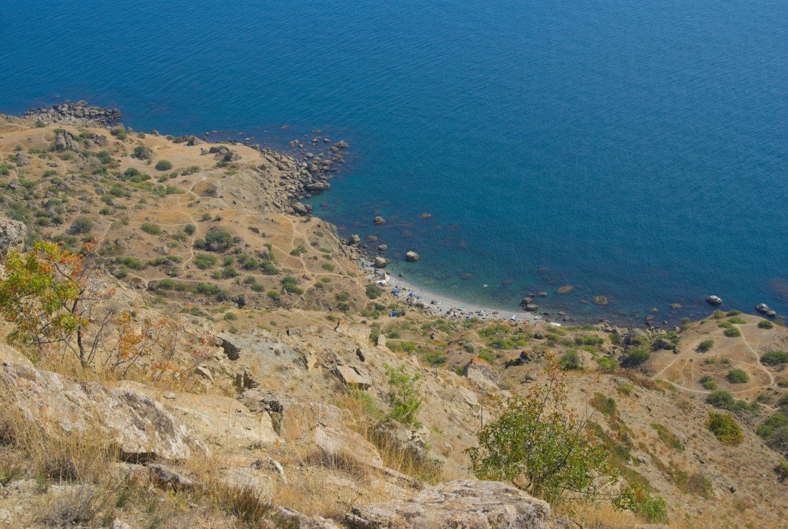
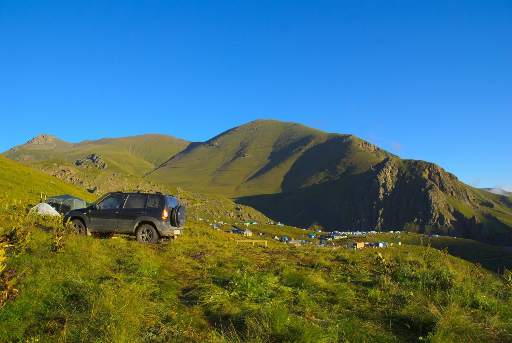
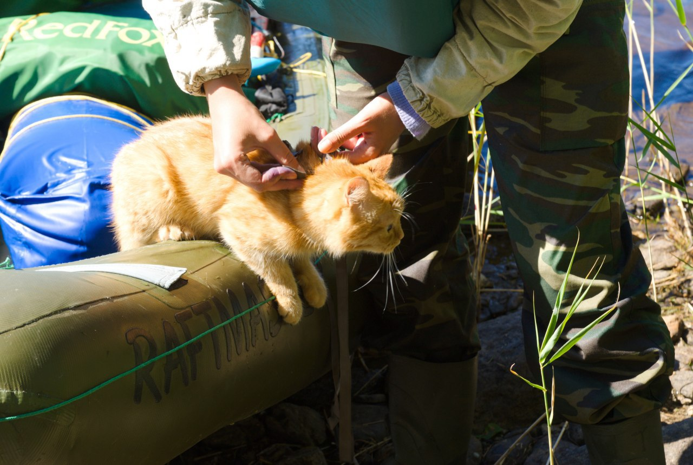
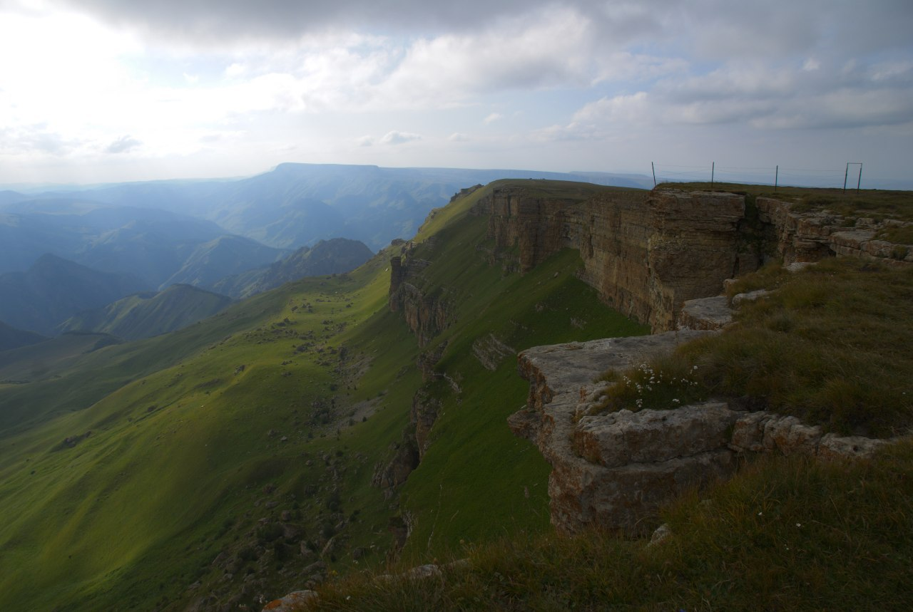

import LinksTelegram from '@site/src/components/_linksTelegram.mdx';
import LinksSocial from '@site/src/components/_linksSocialNetworks.mdx';
import AndroidStore from '@site/src/components/buttons/AndroidStore.mdx';
import AppleStore from '@site/src/components/buttons/AppleStore.mdx';

This summer is ending and we basically see the fall on the horizon. Even though this summer was far from ideal, we will miss its hot and long days. 2020 is definitely one of the hardest years for travelers in the last two decades. Some of us got lucky enough to fulfil the plans they had made beforehand, others have found a suitable alternative. Who said that domestic tourism cannot be fun? Nevertheless, we all miss that world of freedom and openness, which we now remember as a bittersweet memory…

<!--truncate-->

Photos and stories help us bring back the past traveling experience. Once you add a bit of imagination, you see them as if you were there yourselves, breathe in the air and see the fields, mountains and seas. Mikhail, our today’s guest, has come forward to share the stories from his adventures. Not only are those stories interesting and inspiring, there are also amazing photos of his that everyone will enjoy.

When we asked Mikhail which type of traveling he prefered, he smiled. 

_“Every kind. Not fanatically though, I am in fact a lazy person by nature.”_  

However, having heard the list of his traveling achievements, you would definitely doubt his self-critical statement. Some time ago, Mikhail went backpacking to the Crimea, visited Nepal with a friend, and drove through Europe.

_“With a group of friends I went rafting on catamarans in the Republic of Karelia. On Chevrolet Niva I drove to the Crimea, to the Caucasus, and then traveled up the Volga until I reached Kazan. My final destination was Nizhny Novgorod. I call it a trip à la the ancient trading route from the Varangians to the Greeks but reversed.”_

For many people traveling starts as a family tradition, but not in the case of Mikhail. Not until he finished the university did Mikhail begin traveling for pleasure. In 2004 he went on trips with other people. By 2011 he had got enough experience to lead a group himself.

_“My first entirely independent trip happened in 2016. It coincided with my transition to working remotely, which allowed me to manage my free time and vacation. For instance, I am able to leave for a week or even a month and still be doing my job. Being tied by a schedule to an office, you won’t be able to go away for 4-5 months!”_

Mikhail like many of us started with paper maps and long monotonous preparations before a trip.

_“Once upon a time when computers were too heavy to carry, and the apps on them were too simple to help with planning, we ventured into unexplored territory with paper maps and atlases. Our main task was to find the route and try to guess where we were according to it. However captivating it might seem now, more often than not it was a waste of our precious time. In the summer of 2011 my friend and I were driving to the Crimea. Finally it happened that I set off not in a huge company and not by train, like I was used to. Just two of us and the car. He was driving while I was navigating. In Kiev, I bought my first android gadget - ASUS Transformer TF101 full package and with a keyboard. I uploaded Navitel, which then was a popular GPS, and activated a free trial to have full access to the functions. You know, I am yet to hear GPS saying that we had lost the route more times than then!”_

With a subtle smile Mikhail stressed that he does not consider Navitel as bad. Among the pros, he saw the track calculating pace and frequently updated maps of middle-sized and large roads. On the other hand, Mikhail did not like the interface, which was peculiar according to him. Navitel was just ignoring the keyboard of the device completely.

_“Every time we drove off the road to set a camp overnight, GPS was there to tell us that we had lost the track and as a proof it showed us a green screen. In Kiev, choosing a road that was not asphalted left us with the same result. The green screen… When we returned home, it became obvious that we had to change something. So that was how I started my search for another system in 2011.”_

It did not take long for Mikhail to find our app. He said that it just popped out of nowhere and stayed for good.

_“I spotted <a href="https://osmand.net/">OsmAnd</a> almost immediately and it was a sign! Global maps and no limits based on subscription or location. I love the interface! All those features and settings with their complexity are a gift to a computer geek. And maps. No, the maps! Maybe I got lucky but by the time I started using the app, Belarus had already been well marked. Not once have I seen such a precise app. Through it I have learned about <a href="https://www.openstreetmap.org/">OSM</a>. I do enjoy ambitious projects. I was more than just glad and immediately <a href="https://osmand.net/features/osmand_purchases">bought the full version</a>. I think that the developers who have put thoughts and hard work into the project have to be rewarded.”_

The only thing that troubled Mikhail was the low speed of the <a href="https://osmand.net/features/trip-planning">track calculation</a>. Navitel had an advantage here only because the maps in <a href="https://osmand.net/">OsmAnd</a> had much more details and were harder to process. Our team always listens to your suggestions and tries to do our best to solve all the issues as fast as possible!

_“The developers promised to deal with it... And they definitely did a great job!”_

<a href="https://osmand.net/">OsmAnd</a> makes it noticeably easier to prepare the maps, because it happens automatically. Can you guess how Mikhail downloads massive areas of the maps from Belarus to the Ural? He just downloads them overnight. As easy as pie.

_“I use SAS-Planet for raster maps, I download similar maps but with a bigger scale on Yandex satellite. Together it makes about 2-3 GB of the map. Then, I upload it to SQLite and download on the tablet. Afterwards, I apply <a href="https://osmand.net/">OsmAnd</a> to search for more detailed maps of the regions I will need. The size of my average file in SQLite is 15 GB. In addition there are the ‘general staff’ of BSSR files, a few tracks from other people, and a sufficient number of POIs in <a href="https://osmand.net/features/trip-recording-plugin">GPX</a>, these are all evenly distributed between the folders and can be found in OsmAnd/tracks/ on my laptop.”_

Mikhail uses <a href="https://osmand.net/features/online-maps-plugin">vector and satellite maps</a>. <a href="https://osmand.net/features/contour-lines-plugin">Contour lines (height)</a> in a vector format come extremely helpful on highlands. He says that the function helps to estimate whether you should go ahead or avoid trouble and do like ‘ordinary heroes’ do and go around. Mikhail calculates car routes with the help of prepared in advance XML files that have different «heuristic coefficients» and profiles to go with them, including those for a city and for short, long or extremely long routes (several thousands of km). He also values the function of <a href="https://osmand.net/features/trip-recording-plugin">track recording</a>.

_“While mapping I always <a href="https://osmand.net/features/navigation#How_to_add_remove_waypoints">assign lots of POIs</a>. Not only do they help me in choosing a more suitable route, but they also are there to remind me which places to visit. I substitute the ruler function by a bigger HC profile with transitional nodes. I am used to creating a track by setting a destination. Only afterwards will I concentrate on bits and pieces. I am sure that you can find <a href="https://osmand.net/features">all these functions</a> in other programs, but never all in one...I mean, I cannot recall any other app combining all of them at once. There is also a unique feature of <a href="https://osmand.net/features/map-viewing">customizing rendering of a map</a> and a router to cater your personal goals. The functionality of the app is really huge. Sometimes when something pops up I wonder whether this is a new feature or simply a bug. Whatever it is, I will use it!”_

Dead end situations have never bothered Mikhail, and with the help of <a href="https://osmand.net/">OsmAnd</a>, they will not be a problem in future. Mikhail decided to tell us a story about his trip to Europe in 2011. His friend and he were trying to run away from the cold weather:

_“In the dead of night we were crossing some country the name of which I cannot recall now. Surrounded by mountains we decided to stop and find something to bite into. We saw a 24/7 street food truck on the map slightly to the right. We drove there and saw a place that looked like a shawarma place. But definitely a nice one with music and other travelers sharing stories or just talking to each other. We took our food and joined the conversation. Such a delight it is to meet other people who are as crazy about traveling as you.”_

Once in Rome, Mikhail tried to find ancient thermae. <a href="https://osmand.net/features/find-something-on-map">He located the facilities on the map</a> and immediately went there. So disappointed was he when he saw only the ruins that he exclaimed: “Enjoy your bath!”

For all of us here Mikhail has a life hack:

_“The app always helps in finding a place to set your camp. Pay attention to all those smaller tropes, lakes, and springs. Look for them and you will see that there are tiny fields in the forest or near lakes. I always search for them and as a result find great places to stay overnight.”_

Mikhail has already told us about ASUS Transformer TF101, which was his first device.  According to him, it has a big screen and is convenient for a navigator. The device is powered by two batteries that allows you to use it for at least a day without thinking about a powerbank. Then Mikhail bought a Motorola Atrix 2, which he took only in bicycle trips. With Philips Xenium W6500, which on airplane mode functioned for a week without recharging, he went to the Republic of Karelia. During that trip, Mikhail did not use <a href="https://osmand.net/">OsmAnd</a> too often, for then he went river rafting. 

_“Now, I always have a Sony Z1 compact in my backpack andа a Lenovo Tab 4 in the car. The phone is 5 years old and requires recharging every day, while the tablet is only 2 and he is constantly connected to the car.”_ 

To be so devoted to Sonya (that is how he calls it) is not the easiest task in the world of people and mobile phones, if you know what I mean! Not only Mikhail is a faithful person, but he is also a great companion that has a sense of humor.

He wished <a href="https://osmand.net/">OsmAnd</a> to have more creative and active users and added:

_“Please, do not simplify the interface of the up just for the purpose of simplification! <a href="https://osmand.net/">OsmAnd</a> is a unique application! There is nothing like it!”_

We thank you, dear users, for not only choosing and developing the app but also for reading this blog.

See you soon!

_________________________________________________

<LinksSocial/>
<LinksTelegram/>

<AndroidStore/>
<AppleStore/>