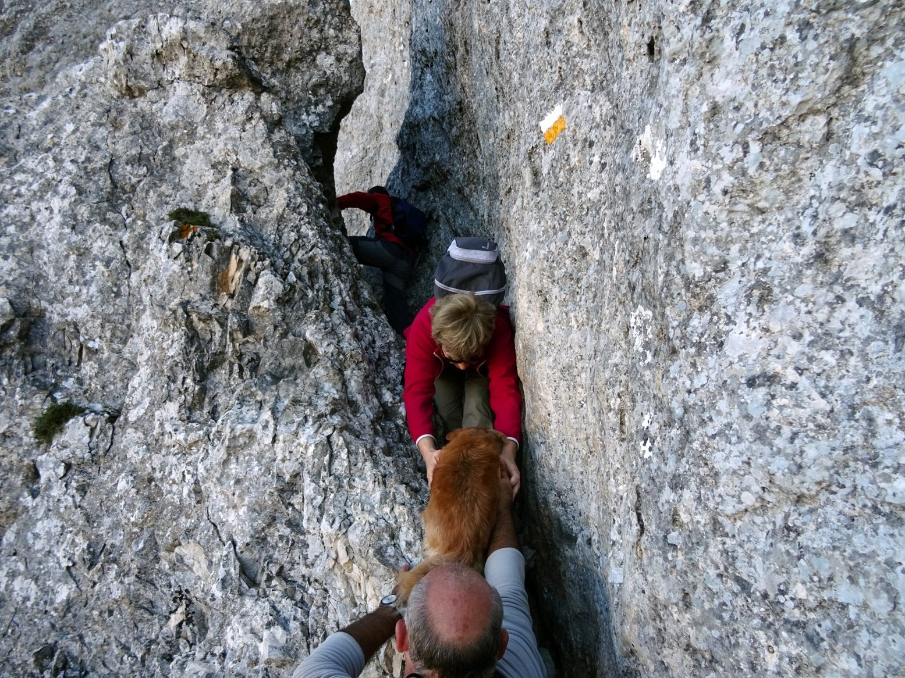

import LinksTelegram from '@site/src/components/_linksTelegram.mdx';
import LinksSocial from '@site/src/components/_linksSocialNetworks.mdx';
import AndroidStore from '@site/src/components/_buttonAndroidStore.mdx';
import AppleStore from '@site/src/components/_buttonAppleStore.mdx';

It is September already. This month is usually not too cold or rainy. Once outside we can still feel the summer warmth on our faces. Not for long though. Fall has its own rules, not all of us appreciate it and call this season melancolic. Others, however, find joy in rain and mild temperatures it brings.

<!--truncate-->

Here comes Olivier, who is our guest today. He mainly travels by car; however, occasionally he will take the train or plane.

“Otherwise, I do a lot of hiking around my home in Spain within a radius of a hundred kilometres, and also when I go to my parents' house in France with my family.”

Olivier says that he has been traveling forever! All started in his childhood, when his parents took their son with them. When Olivier was 18 he started discovering the world on his own. He has been traveling ever since from time to time bringing friends or his girlfriend along.

_“I started using <a href="https://osmand.net/">OsmAnd</a> about 5 years ago, but only as a GPS for the car. HERE was the first location platform I used but then I opened my eyes to the importance of free open source software. After having searched for a while I discovered <a href="https://osmand.net/">OsmAnd</a>. Since this summer, I have been using it also for hiking. Before, I used Oruxmaps to have topographic maps and aerial views of the region in addition to the <a href="https://www.openstreetmap.org/">OSM</a> maps downloaded from OpenAndroMaps. I have been using the <a href="https://www.openstreetmap.org/">OSM</a> maps for a long time and have been actively collaborating on this project for a year and a half. I have already replaced Oruxmaps with <a href="https://osmand.net/">OsmAnd</a> because this summer I discovered <a href="https://osmand.net/features/online-maps-plugin">how to add topographic maps and aerial views</a> directly to <a href="https://osmand.net/">OsmAnd</a>. This discovery made me very happy!”_

When we ask Olivier whether he prepares his maps before traveling, he says that he does. Downloading the <a href="https://www.openstreetmap.org/">OSM</a> maps is enough for car trips. However, for hiking he does a bit more.

_“I create atlases in OSMAND SQLITE format of the places I go to thanks to MOBAC, one for the aerial photos and another for the topographic map. In <a href="https://osmand.net/">OsmAnd</a>, I put the <a href="https://www.openstreetmap.org/">OSM</a> main layer, the aerial photos as an underlayer and the topographic map as an overlayer. This allows me to switch between the two with the cursor at the bottom of the screen, which I find very practical.”_

There are three functions that Olievier appreciates the most. The first one is the ability to <a href="https://osmand.net/features/online-maps-plugin">import maps</a> from not only <a href="https://www.openstreetmap.org/">OSM</a> but from other sources as well. He gives examples of French and Spanish IGN (Institut Geographique National) from WMTS servers that he uses as an underlayer or overlayer with an ability to easily switch from one to another. The second feature is the flexibility of means one can use in <a href="https://osmand.net/">OsmAnd</a>. The program takes into account <a href="https://osmand.net/features/navigation-profiles"> the mode you choose</a> and applies various characteristics based on that choice. And the third one is the ability to follow and <a href="https://osmand.net/features/trip-recording-plugin">record a track</a>.

_“I often go hiking in groups and we go in several cars. Almost all people use Gmaps and many times they cannot find the start of the hiking trip, or they make big detours to get there, or they are just totally lost. The first time it happened I was in the car that was following. Suddenly everyone stopped. "We're lost," said the driver of the first car. So I got out of the car and said: "I know you’re lost. But don't you have a GPS?" And he said "Yes, but it shows me a road that doesn't exist, there has been some road construction done recently and it's changed everything. Look at this!". So I said "Don’t worry, just follow me." When we reached our destination they asked me "How did you do that?" And I said "I simply have a magical app!" Now they trust me and <a href="https://osmand.net/">OsmAnd</a> more than their phone with Gmaps. But they don't know how to use their phone properly, so they don't want to install <a href="https://osmand.net/">OsmAnd</a>, which to them seems like a monster. That’s a pity! Furthermore, they all use the Wikiloc application for hiking, which is a pity as well! One day I will definitely give them a class on how to use <a href="https://osmand.net/">OsmAnd</a>, at least to those who are more comfortable with their smartphones.”_

It is not a secret that it is much easier to control the battery on your device or recharge it if needed while traveling by car.

_“For long car journeys I have to plug my phone into the socket as the screen stays on all the time. I don't find it particularly convenient. For hiking, I switch the screen on and off manually, so there is no problem. The battery holds well.”_

Olivier suggested a few improvements to the app. He would like the display to turn off and on automatically. For instance, it will not be active on a motorway, but will light up once there is something to report. Another issue is the width of the GPX track drawn on the map, which he would like to be able to change. The last thing Olivier would like to improve a bit is the screen. In particular, he would like to see the number of kilometres til the location of the next two rest areas on it.
  

We thank Olivier and other users, who choose <a href="https://osmand.net/">OsmAnd</a> for traveling, who put their efforts into developing the Open Street Map, and those who read <a href="https://osmand.net/blog">our blog</a>!
Enjoy those rare warm days of the fall and share the warmth with others.

Never give up.
Bye!

_________________________________________________

<LinksSocial/>
<LinksTelegram/>

<AndroidStore/>
<AppleStore/>