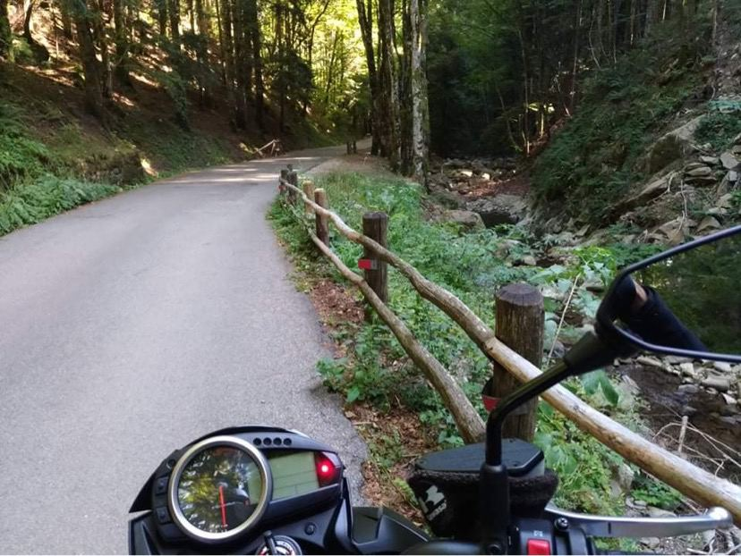
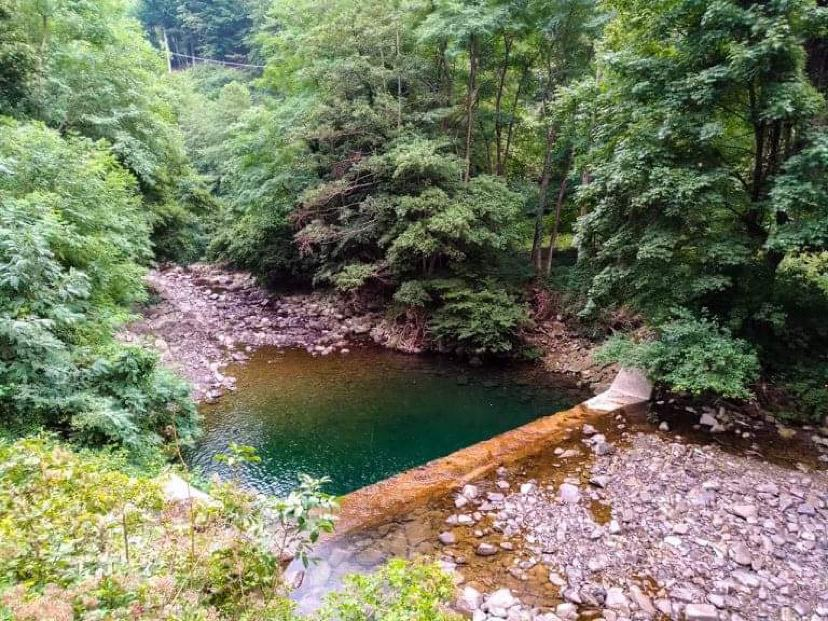
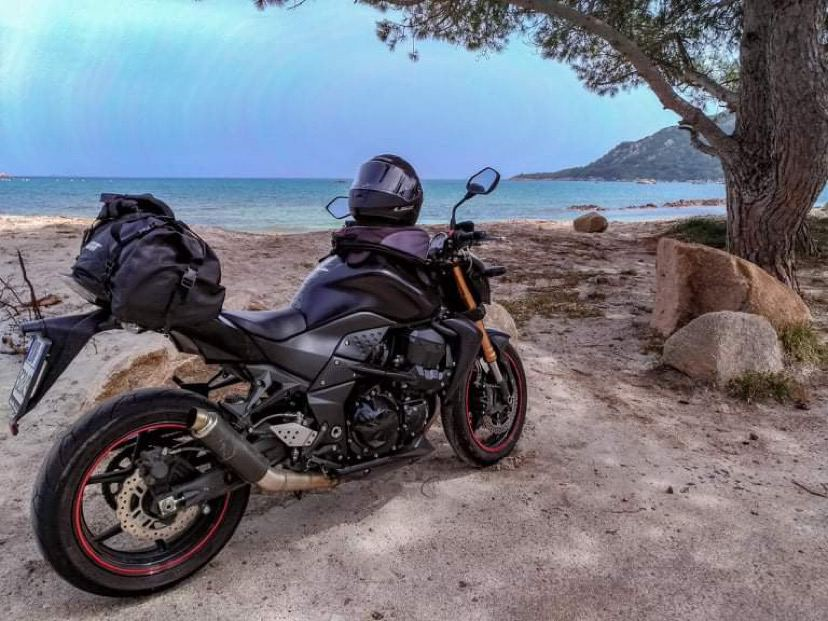

import LinksTelegram from '@site/src/components/_linksTelegram.mdx';
import LinksSocial from '@site/src/components/_linksSocialNetworks.mdx';
import AndroidStore from '@site/src/components/_buttonAndroidStore.mdx';
import AppleStore from '@site/src/components/_buttonAppleStore.mdx';

Most of the time a biker for us is a heavy man with a beard in an old leather jacket on his freshly polished Harley, and that is a bit stereotypical. Now, our today’s guest is, indeed, a biker. However, this time the image is a bit different. Today we will chat with Jessica, who is as far from a “heavy man with a beard” as a strong confident woman on a motorbike can be!

_“I love to travel with my bike Kawasaki Z570R. I have done a lot of trips to see the beauty of Italian landscapes, people, and traditions; to taste the delicious foods. Sometimes, you just pick up a backpack and go … no matter where!”_

<!--truncate-->

Traveling is, in a way addictive, the more you have seen, the stronger desire you will have to discover and experience. Italy with picturesque old towns, mild weather, and hospitable people is an amazing place to discover.

In 2018, Jessica got her driving license. It was then that she bought her very first bike Ducati Monster 620 and ventured on her very first adventure.

_“I had just broken up with my boyfriend and was severely depressed, couldn’t eat… Some friends of mine were organizing a trip to Central Italy and I went for it. It was wonderful! During those 5 days I was so happy, I felt alive again. Such an emotional trip!”_

Jessica started using OsmAnd just a few months ago, when she bought a new dual-sport motorcycle. It is legal for on and off-road use, so she needed the right street to try it out and searched for it in the app.

Jessica uses Google maps to search for some interesting spots and places to visit, there she finds b&bs as well. However, she mentioned that she had in fact had some nasty surprises from Google Maps during her trips.

<a href="https://osmand.net/">OsmAnd</a>, in contrast, is a trustworthy companion in all your trips that will not baffle you. If you have tried the application, you know that it can easily substitute other apps on your device. Online and offline maps, <a href="https://osmand.net/features/trip-recording-plugin">tracking</a>, and <a href="https://osmand.net/features/trip-planning">mapping</a> these are just a few features <a href="https://osmand.net/">OsmAnd</a> has to offer. <a href="https://osmand.net/features/find-something-on-map#Find_Points_of_Interest_A">POI</a> is another exceptional feature that allows you to find the right restaurant, hotel, store, petrol station or even a hospital in a matter of seconds.

_“The most important function is <a href="https://osmand.net/features/trip-recording-plugin">tracking</a>; I also <a href="https://osmand.net/features/find-something-on-map">search for streets</a> I will be easily able to ride on my Kawasaki KLX250. Not only do I need to find one, but I also have to check where exactly it begins and goes.”_

One must be particularly careful when they have a dual bike. Even though this is popular among bikers, not all the roads are appropriate for the vehicle. Because of its size, there is a limitation of their off-road capability.

_“I like the app a lot, but I struggle to find any legend on it. I want to always know what road I am currently at and, unfortunately, I cannot find this info. I am not always sure what a specific symbol means and, therefore, find it difficult to plan a trip this way. Nevertheless, when I see an interesting street on the map, I check its characteristics on the Internet. It is vital for me to find out whether it is large, private, white, muddy, gravel, appropriate for a dual bike and other specific <a href="https://osmand.net/features">features</a>.”_

 
In order to become better, we want to hear all your comments and advice, this is how the progress works. We listen to you and learn more about the app.

Thank you, Dear Travelers, for using and developing OsmAnd.

You make the difference and your opinion matters!

See you soon!

 
_________________________________________________

<LinksSocial/>
<LinksTelegram/>

<AndroidStore/>
<AppleStore/>