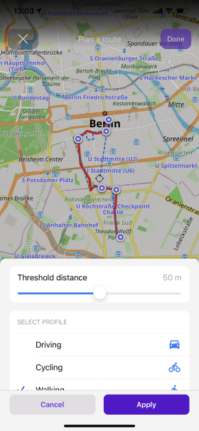

import AppleStore from '@site/src/components/_buttonAppleStore.mdx';
import Translate from '@site/src/components/Translate.js';

Hi, Everybody!
Great news for iOS OsmAnd users! We're glad to announce the new <a href="https://itunes.apple.com/us/app/osmand-maps-travel-navigate/id934850257">OsmAnd version for iOS</a>. Update OsmAnd to check out all new features and let us know if you like them!

<!--truncate-->

This is a short list of many changes happened in 4.0 release:
* Add favorite" with custom icon and shape you like.
* Coordinates widget to always display coordinates on the map.
* Attach track to the roads * attach any recorded track to the roads to get proper voice directions with turns only on road intersections and to see  road attributes such as slope, surface, smoothness.
* Full import/export of your settings / data / maps between Android and iOS devices.
* 3rd party plugins * take advantage of 3rd party plugins with special profiles, maps and settings.
* Distance by tap * use it as a separate feature on the map (used to be connected with Radius ruler).
* CarPlay improvements * fixed freezing issues.
* Plugins * separate menu to manage enabled / disabled plugins.
* Custom routing and rendering files * tweak the routhing and how the map displayed on your own.
* What else is in this release?

## New "Add favorite" screen

New "Add favorite" screen with options to select the custom icon, color, and shape. Now you can add your <a href="https://docs.osmand.net/en/main@latest/osmand/personal/favorites#favorite-point">Favorites</a> and Waypoints with custom style.

<table>
  <tr>
    <th></th>
    <th></th>
    </tr>
</table> 

## Coordinates widget

Added new <a href="https://docs.osmand.net/en/main@latest/osmand/widgets/info-widgets#coordinates-widget">"Coordinates widget"</a> with coordinates of the current location:
**Menu → Configure screen → Coordinates widget**

## Attach track to the roads

Attach any recorded track to the roads to get proper voice directions with turns only on road intersections 
 and to see  road attributes such as slope, surface, smoothness

## Custom plugin

Added ability to import <a href="https://osmand.net/features/custom-package">custom user-defined plugins</a>. Now, each user can create own plugin for OsmAnd.
**Menu → Plugins →  Custom plugins**

<table>
  <tr>
    <th></th>
    <th></th>
    </tr>
</table> 

## Extended the import/export functionality

Significantly extended the import/export functionality of <a href="https://osmand.net/features/navigation-profiles#navprof_ios">Application profile</a>. Complete data import / export compatible with other devices.

<table>
  <tr>
    <th></th>
    <th></th>
    </tr>
</table> 

## 'Distance by tap' tool moved from the Radius ruler

<a href="https://docs.osmand.net/en/main@latest/osmand/widgets/radius-ruler#distance-by-tap-tool">'Distance by tap'</a> tool moved from the Radius ruler into a separate option:
**Menu → Configure screen → Distance by tap**

<table>
  <tr>
    <th></th>
    <th></th>
    </tr>
</table> 

## Car Play

Fixed CarPlay app freezes when iPhone screen is turned off.
Choosing app profile that will be used while connected to CarPlay: **Menu → Settings → OsmAnd Settings → CarPlay profile**

## Plugins menu

Plugins screen has been moved from the 'Maps & Resources' to the main menu: **Menu → Plugins**

<table>
  <tr>
    <th></th>
    <th></th>
    </tr>
</table> 

## Added support for custom routing and rendering files

Added support for custom <a href="https://github.com/osmandapp/OsmAnd-resources/tree/master/routing">routing</a> and <a href="https://docs.osmand.net/ru/main@latest/development/osmand-file-formats/osmand-rendering-style">rendering</a> files.

## What else is in this release?

* Fixed UI in landscape orientation for “Plan a route” screen.
* Fixed performance of Map markers direction line.
* Fixed issue with importing GPX files with uppercase extensions.
* Fixed issue with "Follow track" menu.
* Fixed import of OBF-files.

And remember that only together we can achieve the best results!
New features are coming SOON!

<AppleStore/>
