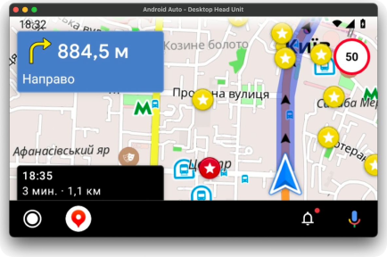

import AndroidStore from '@site/src/components/_buttonAndroidStore.mdx';
import Translate from '@site/src/components/Translate.js';

Great news for Android users! OsmAnd 4.1 is here! Here are some of the most important updates. [Update your OsmAnd](https://play.google.com/store/apps/details?id=net.osmand), check out all the new features and let us know if you like everything!

:::tip Note

This release of OsmAnd 4.1 is **not available** for Android below 6.0.

:::

<!--truncate-->

This is a short list of many changes happened in 4.1 release:

* Added initial support for Android Auto
* Elevation widget
* GPS filter
* User interface update for UTM coordinate search
* Favorites: added ability to view recently used icons
* Route planning: will use the selected profile after launch
* Fixed Mapillary layer, the plugin is now disabled by default
* Added screen to manage all the history in the app
* App shortcuts
* What else is in this release?

## Added initial support for Android Auto

OsmAnd is available for <a href="https://www.android.com/auto/">Android Auto</a> function in your vehicle. Now, you can use your media screen for navigation by OsmAnd.

**Note:**Paid feature is available for <a href="https://docs.osmand.net/en/main@latest/osmand/purchases/android#free-and-paid-features">OsmAnd Paid users (Maps+ and subscribers)</a>.

## Added Elevation widget for trip

At this release, you find the new Pro Feature for your active trips * "Elevation widget". Now, you see the elevation profile of your trip on the bottom side of the screen. You can see downhills and uphills on your trip. Just switch on "Elevation widget" for your profile, start navigation mode, and see current elevation info on your screen:

Menu → choose your profile → Configure screen → Elevation profile

**Note:**Pro feature is available for <a href="https://docs.osmand.net/en/main@latest/osmand/purchases/android#free-and-paid-features">OsmAnd Pro subscribers</a>.

## GPS filter

We added new <a href="https://docs.osmand.net/en/main@latest/osmand/map/track-context-menu#options">Options</a> for GPX tracks * "GPS filter". Now, you can filter points of your GPX track by Smoothing, Speed, Altitude, Min GPS Precision:

Open <a href="https://docs.osmand.net/en/main@latest/osmand/map/track-context-menu">Tracks Context menu</a> → Options → GPS filter

<h3>User interface update for UTM coordinate search</h3>

Adding <a href="https://en.wikipedia.org/wiki/Universal_Transverse_Mercator_coordinate_system">UTM format</a> for Adding <a href="https://docs.osmand.net/en/main@latest/osmand/search/search-address#coordinates-search">Coordinates searching function</a>.

Search menu → Address → <a href="https://docs.osmand.net/en/main@latest/osmand/search/search-address#coordinates-search">Coordinates search</a> 

## Favorites: added ability to view recently used icons

Adding <a href="https://docs.osmand.net/en/main@latest/osmand/personal/favorites#create">recently used category</a> for Favorite icon.

## Route planning: will use the selected profile after launch

Improving of <a href="https://docs.osmand.net/en/main@latest/osmand/plan-route/create-route">Plan route tool</a>. Now, you can start planning your route with <a href="https://docs.osmand.net/en/main@latest/osmand/widgets/map-buttons#configure-map">the current app profile</a> (for Browse map profile  *  navigation type "Straight line").

## Fixed Mapillary layer, the plugin is now disabled by default

In this release we fixed Mapillary layer, the plugin is now disabled by default. Enable / Disable the plugin:

Menu → Plugins → Mapillary

Read more about Mapillary plugin <a href="https://docs.osmand.net/en/main@latest/osmand/plugins/mapillary">here</a>.

## Added screen to manage all the history in the app

Now, you can disable history logging individually for each history type. One more option, you can export history into a file (Back up as file).

Menu → Settings → OsmAnd settings → Privacy and security: History

## App shortcuts

<a href="https://support.google.com/android/answer/9450271">App shortcuts</a> are available for the OsmAnd icon. Just long tap the OsmAnd icon on your device screen to open App shortcuts menu.

Here, you can click short tap for choosing next actions: Navigate to Home, Navigate to Work, Start Recording, Search, My places, Navigate to. Long tap one of the actions allows you to add new action icon to your device screen.

Tapping to the action icon allows starting this action immediately.

 

## What else is in this release?

* Now, this release OsmAnd 4.1 is not available for Android below 6.0
* Improved SRTM height marker rendering
* Fixed Arabic display on the map
* Fixed different routing issues
* Map orientation is not reset after restarting the app

_________________________________________________

<AndroidStore/>