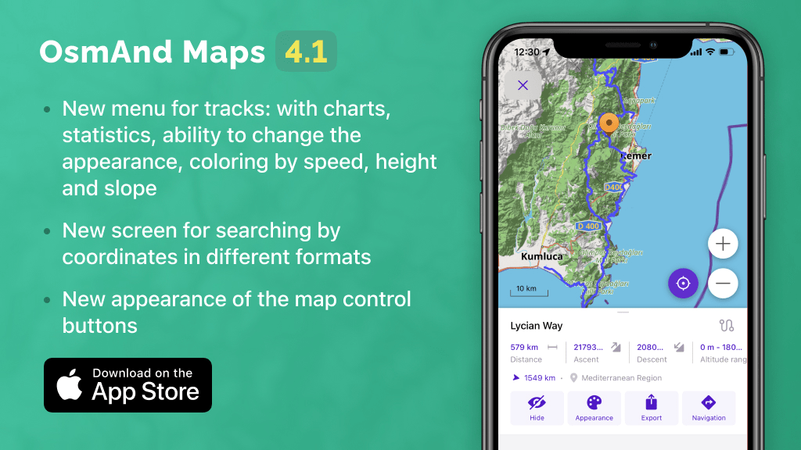

import AppleStore from '@site/src/components/_buttonAppleStore.mdx';
import LinksTelegram from '@site/src/components/_linksTelegram.mdx';
import LinksSocial from '@site/src/components/_linksSocialNetworks.mdx';
import Translate from '@site/src/components/Translate.js';

Hi, Everybody!

Great news for iOS OsmAnd users! We're glad to announce the new [OsmAnd version for iOS](https://itunes.apple.com/us/app/osmand-maps-travel-navigate/id934850257). Update OsmAnd to check out all new features and let us know if you like them!

<!--truncate-->

This is a short list of many changes happened in 4.1 release:

* Completely redesigned interaction with tracks
* New screen for searching by coordinates in different formats
* Improved coordinate search in OLC format
* New user-friendly menu for choosing languages to display Wikipedia articles on the map
* Added ability to easily load maps of all regions of the country with a couple of clicks
* Added contour lines in feet (You need to re-download files)
* Downloading maps by clicking to the map
* New appearance of buttons on the map and added ability to change map zoom by double-tapping and swiping
* Route visibility control is moved to a higher level in the "Configure map" menu with the option of flexible settings

## Completely redesigned interaction with tracks

Completely redesigned interaction with tracks: a new menu with charts, statistics, ability to change the appearance, coloring by speed, height and slope, and track selection on the map.

Just click on chosen track on the map or open it by <a href="https://docs.osmand.net/en/main@latest/osmand/personal/myplaces">"My Places"</a> menu to enable<a href="https://docs.osmand.net/en/main@latest/osmand/map/track-context-menu">"Track context menu"</a>.

<table class="blogimage">
  <tr>
    <td></td>
    <td></td>
    <td></td>
  </tr>
</table> 

## New screen for searching by coordinates in different formats

We will add the new screen for <a href="https://docs.osmand.net/en/main@latest/osmand/search/search-address#coordinates-search">coordinates search menu</a>.

<table class="blogimage">
  <tr>
    <td></td>
  </tr>
</table> 

## Improved coordinate search in OLC format

Upgraded coordinates search in <a href="https://docs.osmand.net/en/main@latest/osmand/search/search-address#coordinates-search">OLC format</a>.

<table class="blogimage">
  <tr>
    <td></td>
  </tr>
</table> 

## New user-friendly menu for choosing languages to display Wikipedia articles on the map

Changed the Configure map menu for choosing languages for <a href="https://docs.osmand.net/en/main@latest/osmand/plugins/wikipedia">wiki articles</a>.
<table class="blogimage">
  <tr>
    <td></td>
  </tr>
</table> 

## Added ability to easily load maps of all regions of the country with a couple of clicks

Now, you can download region maps of any country <a href="https://docs.osmand.net/en/main@latest/osmand/start-with/download-maps">by the bundle</a>.

<table class="blogimage">
  <tr>
    <td></td>
  </tr>
</table> 

## Added contour lines in feet (You need to re-download files)

We added <a href="https://docs.osmand.net/en/main@latest/osmand/plugins/contour-lines">contour lines maps</a> in feet.

<table class="blogimage">
  <tr>
    <td></td>
  </tr>
</table> 

## Downloading maps by clicking to the map

Added ability <a href="https://docs.osmand.net/en/main@latest/osmand/start-with/download-maps#download--manage---world-map">to download maps by selecting</a> the desired region or country on the map, as well as adding a dialog box with the suggestion to load the map if the region is viewed without a map.

<table class="blogimage">
  <tr>
    <td></td>
    <td></td>
  </tr>
</table>

## New appearance of buttons on the map and added ability to change map zoom by double-tapping and swiping

<a href="https://docs.osmand.net/en/main@latest/osmand/map/interact-with-map">New buttons and new gestures</a> on the general screen.

<table class="blogimage">
  <tr>
    <td></td>
  </tr>
</table>

## Route visibility control is moved to a higher level in the "Configure map" menu with the option of flexible settings

<a href="https://docs.osmand.net/en/main@latest/osmand/map/vector-maps#routes">New routes menu</a> in Configure map menu.

<table class="blogimage">
  <tr>
    <td></td>
  </tr>
</table>

And remember that only together we can achieve the best results! 
New features are coming SOON!

<LinksSocial/>
<LinksTelegram/>
<AppleStore/>