Happy New 2022 Year!

At the end of each year, we sum up the results of the passing year and write our plans for the next one. This tradition started 5 years ago and we continue doing it each year. Sometimes our ambitions are not nearly completed, sometimes we overshoot the plan.

<!--truncate-->

2021 was another difficult year for most of us, so it was for OsmAnd as well. Though we wish that 2 COVID years are over and we finally can go back to our normal traveling life with Maps. In our <a href="https://osmand.net/blog/ny-resolutions-2021">2021 New Year resolutions</a> we anticipated the difficulties and wrote a rather simple for our team list which we consider as 90% completed.

One of the biggest achievements of 2021 is that we’ve managed to double our Team up to 20 people and this Team delivers features with quite an incredible pace.

## <a href="https://www.reddit.com/r/OsmAnd/comments/rt1a2b/2022_new_year_resolutions/">2022 New Year Resolutions</a>

We will start with the list for 2022 and below you can double-check how a similar list was crushed in 2021 😉

## OsmAnd Pro

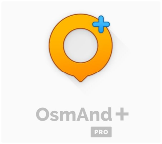

* Introduce OsmAnd Pro features to ***iOS*** and make unified multi-platform synchronization, make the synchronization work automagically.
* Develop richer variety of valuable features.
* Promote OsmAnd Pro features to Paid and later to Free version.

**Note:** our vision is that after 1-2 years OsmAnd Pro features that don’t require cost per user will become available for Lifetime payment.

## OpenGL / 3D * Fast Maps

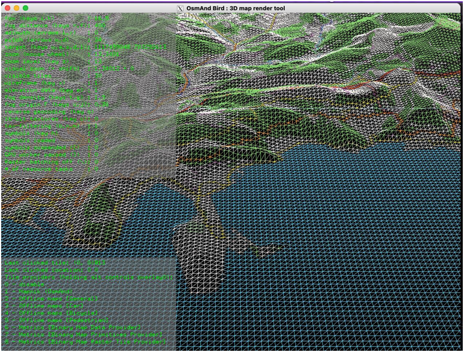 

* **Android**: we plan to introduce the new fast OpenGL rendering engine and unify our iOS / Android experience.
* We plan to significantly improve features of 3D rendering and fix our long term issues.

## Documentation
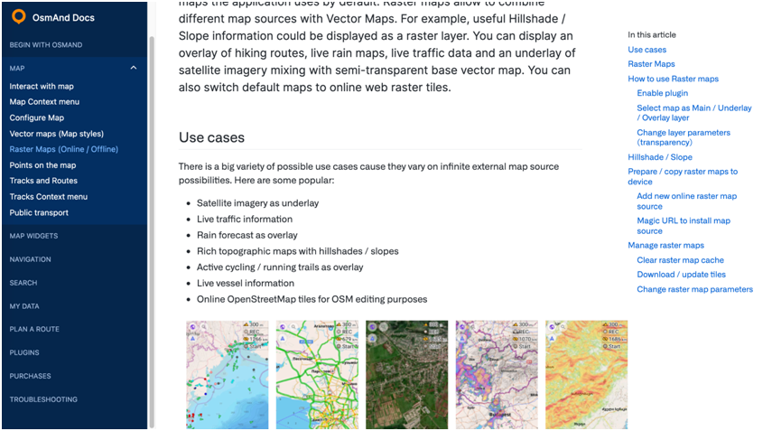 
**Android / iOS / Web:** we plan to finally update our features website and introduce documentation, so we can synchronize it with all platforms and probably introduce a few translations.

## Weather
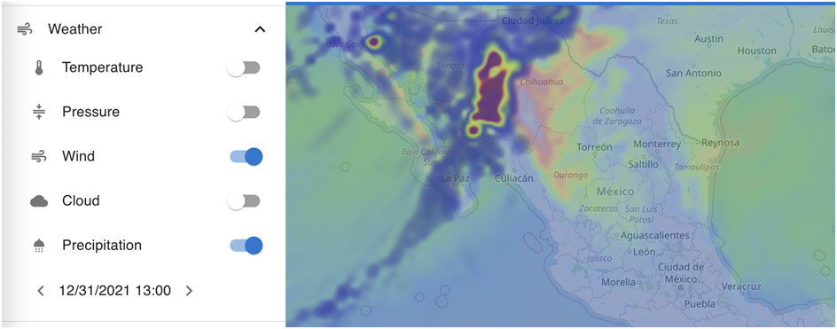 

**Android / iOS / Web:** let’s bring the weather forecast to OsmAnd and as usual make it a very powerful tool for offline travelers.

## Plan Route

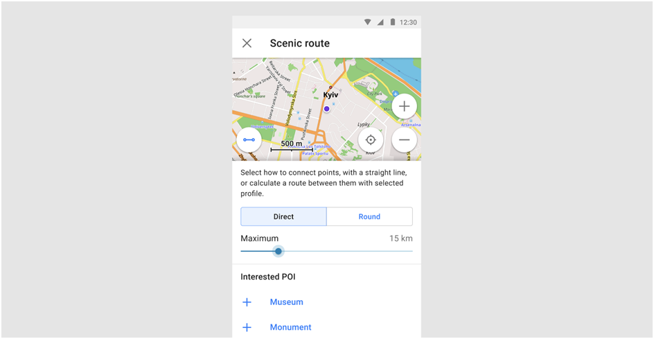 

**Android / iOS / Web:** even though many features were released in 2021, we still have some plans for 2022.

* Build User Interface so we can plan a route by picking up points from an existing node network.
* Easily select OSM routes from the map and include their segments to our new route.
* Configure roundabout trips with a given distance, features list and our preferences.

## Widgets

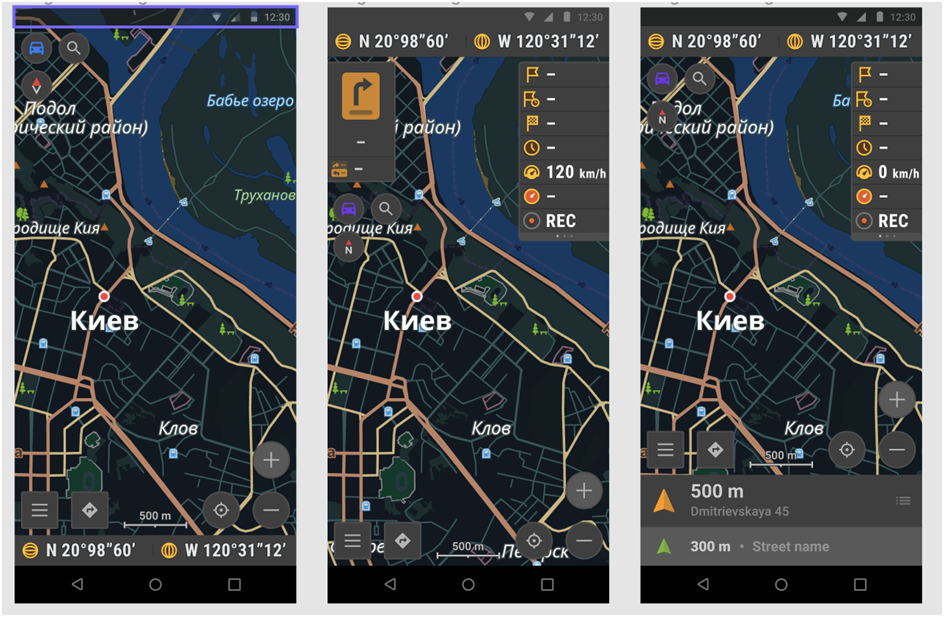  
**Android / iOS:** introduce more powerful widgets and make it easier to access a bigger variety of them on the map.

## Tracks
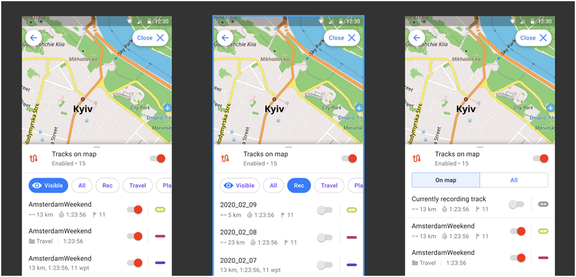 

**Android / iOS / Web:** redesign how we search, store, enable tracks on the map and provide the heatmap for our existing tracks.

## Quick actions / Customization
**iOS:** bring customization to the same level as we have in Android, so we can configure Drawer / Context Menu etc for our selected profiles.

**Android / iOS:** introduce a more powerful concept of Quick actions, so users can configure more than 1 quickly accessible button on the map.

## Routing

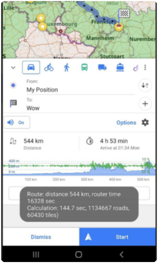 

   

In 2021 we’ve implemented the possibility to use custom Online Routing and switch to offline once it’s not available. In 2022 we finally plan to take care of our existing bidirectional A*-routing and to improve it with Contraction Hierarchies ideas.

## 2021 Achievements

Let’s first take a look at what was in the original 2021 resolutions list which nearly doesn’t cover all features implemented in 2021 by 3 major releases * <a href="https://osmand.net/blog/osmand-ios-3-90-released">3.9</a>, <a href="https://osmand.net/blog/osmand-ios-4-0-released">4.0</a>, <a href="https://osmand.net/blog/osmand-ios-4-1-released">4.1</a> (iOS); <a href="https://osmand.net/blog/osmand-android-3-9-released">3.9</a>, <a href="https://osmand.net/blog/osmand-android-4-0-released">4.0</a>, <a href="https://osmand.net/blog/osmand-android-4-1-released">4.1</a> (Android).

<a href="https://osmand.net/blog/ny-resolutions-2021">Resolutions 2021:</a>

* 🚧 Travel and Track Collections (Android & iOS) * available with custom Travel.obf files.
* ✔️ Full export / import (Android / iOS)
* ✔️ Online Backup (Android) [🚧 iOS]
* ✔️ Improve Tracks UI & Navigation with Altitude Graph (Android & iOS)
* ✔️ Plan Route with Track Approximation (iOS)
* ✔️ Custom user icons for Favorites (iOS)
* ✔️ Plugins & 🚧 UI Customization (iOS)
* 🚧 Quick Action Panel 

## iOS

OsmAnd iOS got 3 major releases with more than <a href="https://github.com/osmandapp/OsmAnd-iOS/milestones?state=closed">200 public features and issues</a> closed on Github.

<a href="https://osmand.net/blog/osmand-ios-3-90-released">3.9</a> * January 30, 2021

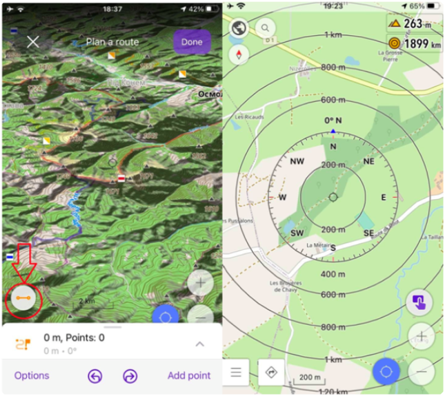 

* <a href="https://osmand.net/blog/osmand-ios-3-90-released#introduced-plan-a-route-tool">Plan Route</a>
* <a href="https://osmand.net/blog/osmand-ios-3-90-released#compass-for-the-radius-ruler-tool">Compass & Radius-Ruler widget</a>
* <a href="https://osmand.net/blog/osmand-ios-3-90-released#added-text-labels-for-favorites-gpx-waypoints-markers">Text labels for POI’s, markers & gpx waypoints</a>
* <a href="https://osmand.net/blog/osmand-ios-3-90-released#added-snowmobile-map-type">Snowmobile map type</a>

<a href="https://osmand.net/blog/osmand-ios-4-0-released">4.0</a> * July 19, 2021

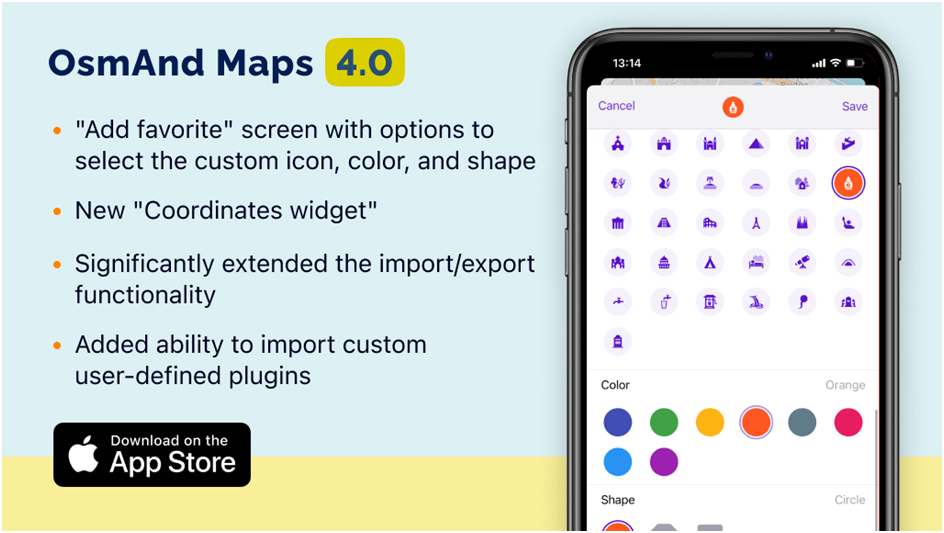  
    
* <a href="https://osmand.net/blog/osmand-ios-4-0-released#car-play">Car Play!</a>
* <a href="https://osmand.net/blog/osmand-ios-4-0-released#new-add-favorite-screen">Add favorites with custom icons & shape</a>
* <a href="https://osmand.net/blog/osmand-ios-4-0-released#coordinates-widget">Coordinates widget</a>
* <a href="https://osmand.net/blog/osmand-ios-4-0-released#extended-the-importexport-functionality">Full Import / Export</a>
* <a href="https://osmand.net/blog/osmand-ios-4-0-released#attach-track-to-the-roads">Attach track to the roads</a>
* <a href="https://osmand.net/blog/osmand-ios-4-0-released#custom-plugin">3rd party plugins</a>
* <a href="https://osmand.net/blog/osmand-ios-4-0-released#distance-by-tap-tool-moved-from-the-radius-ruler">Distance by tap</a>
* <a href="https://osmand.net/blog/osmand-ios-4-0-released#added-support-for-custom-routing-and-rendering-files">Custom routing & rendering files</a>

<a href="https://osmand.net/blog/osmand-ios-4-1-released">4.1</a> * December 28, 2021

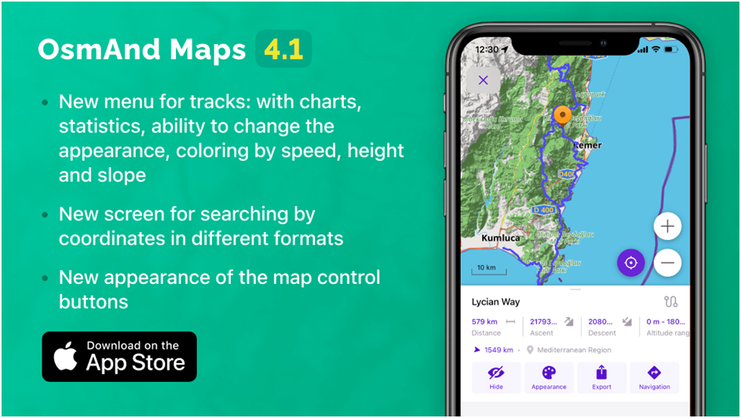         
      
        
* <a href="https://osmand.net/blog/osmand-ios-4-1-released#completely-redesigned-interaction-with-tracks">Track context menu, configure track appearance & new interactions</a>
* <a href="https://osmand.net/blog/osmand-ios-4-1-released#added-contour-lines-in-feet-you-need-to-re-download-files">Contour lines in feet</a>
* <a href="https://osmand.net/blog/osmand-ios-4-1-released#improved-coordinate-search-in-olc-format">Improved Coordinates search</a>
* <a href="https://osmand.net/blog/osmand-ios-4-1-released#route-visibility-control-is-moved-to-a-higher-level-in-the-configure-map-menu-with-the-option-of-flexible-settings">Improved OSM Routes visibility</a>
* <a href="https://osmand.net/blog/osmand-ios-4-1-released#added-ability-to-easily-load-maps-of-all-regions-of-the-country-with-a-couple-of-clicks">Download maps by clicking on the map</a>
* <a href="https://osmand.net/blog/osmand-ios-4-1-released#added-contour-lines-in-feet-you-need-to-re-download-files">Wikipedia by language * layer control</a>

## Android

OsmAnd Android got 3 major releases (3.9, 4.0, 4.1) with more than <a href="https://github.com/osmandapp/Osmand/milestones?state=closed">800 public features and issues</a> closed on Github.
        
* <a href="https://osmand.net/blog/osmand-android-3-9-released">3.9</a> * February 4, 2021
       
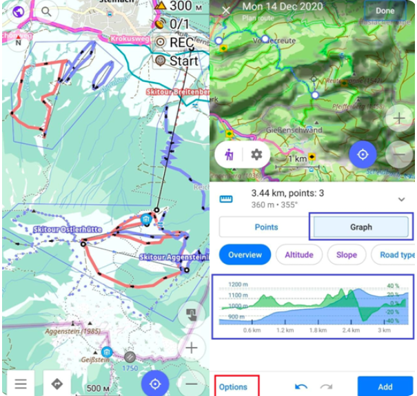          
      
* <a href="https://osmand.net/blog/osmand-android-3-9-released#option-exportimport">Export / Import all data</a>
* <a href="https://osmand.net/blog/osmand-android-3-9-released#improved-plan-a-route-tool">Plan route with graphs</a>
* <a href="https://osmand.net/blog/osmand-android-3-9-released#favorites-and-track-waypoints-custom-color">Custom colors for favourites and waypoints</a>
<a href="https://osmand.net/blog/osmand-android-4-0-released">4.0</a> * August 7, 2021
        
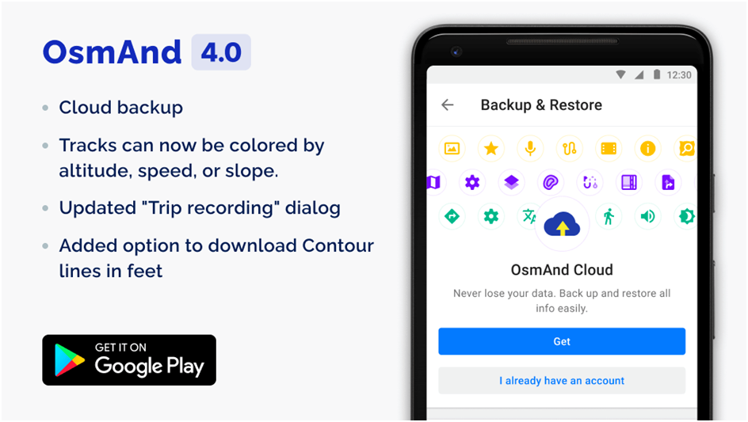
          
* <a href="https://osmand.net/blog/osmand-android-4-0-released#cloud-backup-and-restore">Cloud backup and restore</a>
* <a href="https://osmand.net/blog/osmand-android-4-0-released#moved-osmand-live-updates-menu">OsmAnd Live free for contributors</a>
* <a href="https://osmand.net/blog/osmand-android-4-0-released#added-online-routing-for-navigation-type">Online routing as navigation type</a>
* <a href="https://osmand.net/blog/osmand-android-4-0-released#tracks-can-now-be-colored-by-altitude-speed-or-slope">Tracks can be colored by distance / slope / altitude</a>
* <a href="https://osmand.net/blog/osmand-android-4-0-released#added-option-to-change-the-route-line-appearance">Route line can be colored as well</a>
* <a href="https://osmand.net/blog/osmand-android-4-0-released#added-option-to-download-contour-lines-in-feet">Contour lines in feet</a>
* <a href="https://osmand.net/blog/osmand-android-4-0-released#updated-trip-recording-dialog">Trip recording dialog with graphs and extra information</a>

* <a href="https://osmand.net/blog/osmand-android-4-1-released">4.1</a> * December 10, 2021
      
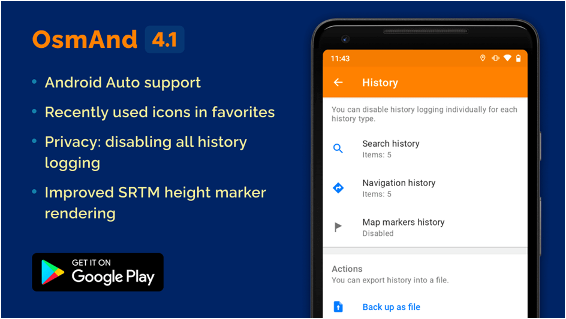
       
        
* <a href="https://osmand.net/blog/osmand-android-4-1-released#added-initial-support-for-android-auto">Android Auto</a>
* <a href="https://osmand.net/blog/osmand-android-4-1-released#added-elevation-widget-for-trip">Elevation widget during navigation</a>
 * <a href="https://osmand.net/blog/osmand-android-4-1-released#gps-filter">Easily configurable GPS Filter for tracks</a>
* <a href="https://osmand.net/blog/osmand-android-4-1-released#favorites-added-ability-to-view-recently-used-icons">Favorites: easy to use recent icons</a>
* <a href="https://osmand.net/blog/osmand-android-4-1-released#app-shortcuts">App shortcuts</a>
* <a href="https://osmand.net/blog/osmand-android-4-1-released#added-screen-to-manage-all-the-history-in-the-app">Manage search, navigation, and other history</a>

        

## Summary

We are starting the new 2022 year with 12 Software engineers fully equipped and motivated to bring OsmAnd to the next level. Though we are sticking to our mission to build ***the most powerful open source cartographic tool for Travels*** *(Offline & Online)*.

Thank you (our lovely users) for being with us during these difficult years for travels, we feel your support and we hope to meet your expectations. We wish all the best in 2022!

**Happy 2022!**

**Victor Shcherb & OsmAnd Team**
