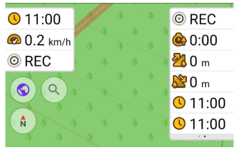
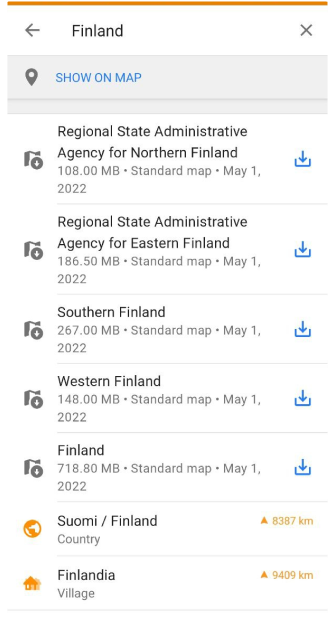

import Tabs from '@theme/Tabs';
import TabItem from '@theme/TabItem';
import AndroidStore from '@site/src/components/buttons/AndroidStore.mdx';
import AppleStore from '@site/src/components/buttons/AppleStore.mdx';
import LinksTelegram from '@site/src/components/_linksTelegram.mdx';
import LinksSocial from '@site/src/components/_linksSocialNetworks.mdx';
import Translate from '@site/src/components/Translate.js';
import InfoIncompleteArticle from '@site/src/components/_infoIncompleteArticle.mdx';
import ProFeature from '@site/src/components/buttons/ProFeature.mdx';

Hi, Everybody! 

After a long pause, we are happy to announce the new 4.2 OsmAnd release for Android devices. You already can update the application and check out the following long-awaited improvements in the new app version.

<!--truncate-->

## Widgtes

We've done a lot of work on widgets and [the Configure screen](https://osmand.net/docs/user/widgets/configure-screen) interface:
* We redesigned the Configure screen, separating the widgets from the buttons, separating the different widget panels more clearly.
* Added pages for widgets.
* Duplicates.
* Combined widgets from left and right panel, now any widget that was previously only available on the left panel can be added to the right panel.

### Pages

Widgets in <Translate android="true" id="map_widget_left" /> and <Translate android="true" id="map_widget_right" /> can be grouped in pages.

_OsmAnd menu → Configure screen → Widgets (Left / Right panel) → Change order → Add pages_

 
 

### Duplicates

You can show the same widget for right / left panels at one time, and for each widget page.

_OsmAnd menu → Configure screen → Widgets (Left / Right panel) → Change order → "+" chosen widget_

## New widgets

Added new widgets: True bearing, Average speed, Trip recording widgets.

### True bearing

Added new widget for the "<Translate android="true" id="shared_string_bearing" />". Now **Bearing** has 3 separate widgets:

_[Menu → Configure screen → Widgets → Left / Right panel → Bearing](https://osmand.net/docs/user/widgets/nav-widgets#bearing)_

* **Relative bearing** refers to the angle between your forward direction and the target point.
* **Magnetic bearing** is the clockwise (horizontal) angle between magnetic north and the target point observed from your location. 
* **_True bearing_** expressed as a horizontal angle between a geographic meridian and a line on the Earth; esp. a horizontal angle measured clockwise from true north.

 

### Average speed

The new Average speed widget shows the average speed of the current ride:

_Menu → Configure screen → Widgets → Left / Right panel → Average speed_

The average speed is calculated for a specified time interval. Click to "Settings" button of the Average speed widget for choosing the time interval for which the average speed will be measured:

_Menu → Configure screen → Widgets → Left / Right panel → Average speed_ → ⚙️

### Trip reconding widgets

Added new widgets for the "<Translate android="true" id="shared_string_trip_recording" />". Now **Trip recording** has 4 separate widgets:

_[Menu → Configure screen → Widgets → Left / Right panel → Trip recording](https://osmand.net/docs/user/widgets/info-widgets#-trip-recording-widgets)_

* **Distance/Start-Stop**: starts or stops trip recording and shows distance of the currently recorded trip. Clickable widget.
* **Duration**: shows the duration in minutes/hours of the currently recorded trip. 
* **Uphill**: shows the sum of all the climbs of the currently recorded trip. 
* **Downhill**: shows the sum of all the descents of the currently recorded trip. 

 

## Default appearance for favorites

It is now possible to set a default appearance for new points in a favourites group or to change the existing appearance for all favourites at once.

The appearance can be set when creating a new group or changed for an existing one in _<Translate android="true" ids="shared_string_menu,shared_string_my_places,favorites_item" /> → &#8285; → Change default appearance_.

<table class="blogimage">
    <tr>
        <td></td>
        <td></td>
    </tr>
</table> 

## Routes

### Hiking

[Hiking / Cycling / Travel routes](http://osmand.net/docs/user/map/vector-maps#routes): tap on the route symbol, get full information about the route and download GPX file of chosen route.

Routes are marked by [OSMC symbols](https://wiki.openstreetmap.org/wiki/Key:osmc:symbol) on the map. In OsmAnd you can show OSMC symbols and routes in [Configure map menu](http://osmand.net/docs/user/map/vector-maps#routes).

 

### Other

* Added display of [Fitness trails and running routes](http://osmand.net/docs/user/map/vector-maps#routes) to the map. Can be enabled in _<Translate android="yes" ids="configure_map,rendering_category_routes" />_.
Data for these routes are taken from [OpenStreetMap project](https://openstreetmap.org/):
- The tag [route=fitness_trail](https://wiki.openstreetmap.org/wiki/Tag:route%3Dfitness_trail)
- The tag [route=running](https://wiki.openstreetmap.org/wiki/Tag:route%3Drunning)

 

* Add horse_scale=*
* Fix piste:grooming option in skimap style #1073

## Online SRTM

:::note
<ProFeature/> Online SRTM feature you can use only with Pro feature <a href="https://osmand.net/docs/user/purchases/android#free-and-paid-features">OsmAnd Pro subscribers</a>.
:::

This feature allows to calculate Elevation profile for GPX track online by OsmAnd server:

_[Track Context menu](http://osmand.net/docs/user/map/track-context-menu) → Track → Altitude → Calculate online_

<table class="blogimage">
    <tr>
        <td></td>
        <td></td>
        <td></td>
    </tr>
</table> 

## Tracks

### Context menu
[Track context menu](http://osmand.net/docs/user/map/track-context-menu) now shows country or region for the track and track waypoints. [Overview tab](http://osmand.net/docs/user/map/track-context-menu#overview) now has an "Info" card with details about track location and size.

<table class="blogimage">
    <tr>
        <td></td>
        <td></td>
    </tr>
</table> 

### Import Multitrack

Split multitrack file into separate tracks during import GPX-track. You need to select tracks for improting. Tracks will be in _My Places → Tracks_.

 

## Other

### Map download

Suggesting to download map in [Search menu](http://osmand.net/docs/user/search/).

### Coordinates

* Added support for SwissGrid CH1903 / CH1903+ coordinates system, thanks for that to our contributor [koenigle](https://github.com/koenigle).  
Coordinate format for profile can be changed in _<Translate android="true" ids="shared_string_menu,shared_string_settings,configure_profile,general_settings_2,coordinates_format" />_.

<table class="blogimage">
  <tr>
    <td></td>
    <td></td>
    </tr>
</table> 

* Fixed UTM Zone. Display [UTM Zone coordinates](http://osmand.net/docs/user/search/search-address#coordinates-search) as 31T instead of 31N.

### Graph of track

* [Analyze on map](http://osmand.net/docs/user/map/tracks-on-map#analyze-track-on-map-android): show data from two axes and UI.
* Align graph lines.

### New parameter for Route line appearance

Added the option to display or hide turns arrow in [the Route line settings](http://osmand.net/docs/user/navigation/route-navigation#route-line-appearance).

<table class="blogimage">
  <tr>
    <td></td>
    <td></td>
    </tr>
</table> 

### Location source

Location source now can be switched to "Android API". This can be useful for devices without Google Play services, or in cases of inaccurate location or altitude data while recording tracks. You can switch **<Translate android="true" id="location_source" />** in _<Translate android="true" ids="shared_string_menu,shared_string_settings,osmand_settings" />_.

### Use elevation data

Three parameters were added to [**<Translate android="true" id="routing_attr_height_obstacles_name" />**](http://osmand.net/docs/user/personal/profiles#navigation-settings) option to adjust preferred terrain on the route: _flat, less hilly_, and _hilly_. Previously it was available only for Bicycle navigation.

## Quick action

* Added ["Plan route"](http://osmand.net/docs/user/plan-route/create-route) tool to the [Quick action menu](http://osmand.net/docs/user/widgets/quick-action).
* [Overaly/Underlay](http://osmand.net/docs/user/map/raster-maps#select-map-as-main--underlay--overlay-layer) changes with arrows.

Switched off a layer: &#10148;"Layer name"

Switched on a layer: "Layer name"&#10148;

 

## Map style

"Mapnik" map style was replaced with the new "OSM-Carto" style. It was done because at the time when "Mapnik" was added to OsmAnd it was identical to map style on [OpenStreetMap.org](OpenStreetMap.org) but we didn't have recourse to keep it up to date, so over time, it was lost the similarity with OSM map style.

If you use "Mapnik" it will be available after the update but as a custom map style. After fresh or new installation you will need to manually import it to use. You can do it by downloading it from [GitHub](https://github.com/osmandapp/OsmAnd-resources/tree/master/rendering_styles).

<Tabs groupId="map-style">
<TabItem value="mapnik" label="Mapnik">

<table class="blogimage">
    <tr>
        <td></td>
        <td></td>
    </tr>
</table>

</TabItem>

<TabItem value="android" label="OSM-Carto">

<table class="blogimage">
    <tr>
        <td></td>
        <td></td>
    </tr>
</table>

</TabItem>
</Tabs>

## New POI

New [POI and objects](http://osmand.net/docs/user/map/point-layers-on-map#points-of-interest-poi) was added to offline maps.

> `Note: they will be availabe with maps from May 1`

* Add carriage=*, Add natural=anthill , Add shop=wool, Add shop=motorcycle_parts , Add shop=rice, Add shop=water_sports, Add shop=printer_ink, Add shop=fuel, Add shop=hairdresser_supply, Add shop=tiles, Add shop=collector 
* Add landuse=greenery, Add natural=blowhole
* Add support "flow_rate" tag 

## OpenStreetMap Editing

* All OpenStreetMap-related items in [Configure Map](http://osmand.net/docs/user/map/configure-map-menu) was combined into one group.  "OSM Mapper assistant" option was spited into separate options: <Translate android="true" id="rendering_attr_OSMMapperAssistantFixme_name"/>, <Translate android="true" id="rendering_attr_OSMMapperAssistantNote_name"/>, <Translate android="true" id="rendering_attr_OSMMapperAssistantIconsLowZooms_name"/>, <Translate android="true" id="rendering_attr_OSMMapperAssistantWaterwayTunnels_name"/>.

* Fixed tag autocomplete in "Modify POI" mode.

* Fixed incorrect link to the OpenStreetMap object in context menu. 

## Online maps
* Fixed: automatic update of online tile maps.
* Updated UI for [dowloading online tile maps](http://osmand.net/docs/user/map/raster-maps#download--update-tiles).

<table class="blogimage">
    <tr>
        <td></td>
        <td></td>
    </tr>
</table> 

## Fixed

* [Hebrew Wikipedia](http://osmand.net/docs/user/plugins/wikipedia) - no images for Wikipedia articles.

_________________________________________________

<LinksSocial/>
<LinksTelegram/>
<AndroidStore/>
