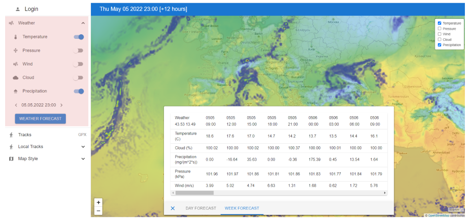

import AndroidStore from '@site/src/components/buttons/AndroidStore.mdx';
import LinksTelegram from '@site/src/components/_linksTelegram.mdx';
import LinksSocial from '@site/src/components/_linksSocialNetworks.mdx';
import Translate from '@site/src/components/Translate.js';
import Tabs from '@theme/Tabs';
import TabItem from '@theme/TabItem';

Hi! <br />
We're glad to announce [the new version of the website](https://osmand.net/). While it's the demo version but we work each day with it. OsmAnd website code on [GitHub](https://github.com/osmandapp/web/tree/main/main). <br />
What you can find new on our website.


<!--truncate-->

## Search function

We added search function in the website. Now, you can find needed article quickly.

<table class="blogimage">
    <tr>
        <td></td>
    </tr>
</table> 

## OsmAnd docs

The section is still under active development and content. Anyone can also join checking and writing articles on our [Github page](https://github.com/osmandapp/web/tree/main/main).

We added **demo version** of next sections:
- [User guide](../docs/user)
- [Map Legend](../docs/user/map-legend)
- [Technical documentation](../docs/technical)

### User guide

[This section](../docs/user) contains articles on how to use the application and what features the application includes.

<table class="blogimage">
    <tr>
        <td></td>
    </tr>
</table> 

### Map legend

[Map Legend](../docs/user/map-legend) has opportunity comparing day/night mode. While it's a demo version, in the nearest future we will upgrade Map legend for the full version.

<table class="blogimage">
    <tr>
        <td></td>
    </tr>
</table> 

### Technical documentation

[In this section](../docs/technical), we are collecting articles for advanced users. There is info about how to build OsmAnd app, create maps and etc.

<table class="blogimage">
    <tr>
        <td></td>
    </tr>
</table> 


<!--
## World map

[World Map](https://osmand.net/map) is our browser version of main features of OsmAnd. Now, it has next featutes:
- **Login** - Here you can log your [OsmAnd Pro](../docs/user/purchases/) for synchronizing your tracks on the OsmAnd application with the browser version here in "Tracks".

> ```You can login to the website only if you have OsmAnd Pro subscription.```

- **Weather parameters** - Choose the needed weather layers and show its on the map. Here you can choose data for a weather forecast.




- **Tracks** - You can synchronize your tracks from OsmAnd application if you have [OsmAnd Pro subscription](user/purchases/), show tracks on the map, and look at any parameters and graph.
- **Local tracks** - Upload tracks and show its on the map.
- **OsmAnd rendering** - You can choose [Map style](../docs/user/map/vector-maps#default-map-styles) for the World map. Here there are [rendering settings](../docs/user/map/vector-maps#configure-map-style) (gear button).
- **OsmAnd routing** - You need to click on the map by the right mouse button for choosing [Start-Finish points](../docs/user/navigation/route-navigation). 

-->

____________________________ 

<LinksSocial/>

<LinksTelegram/>

