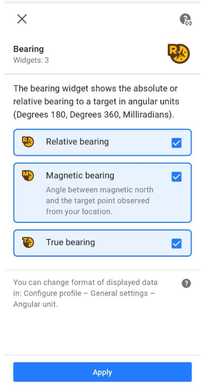
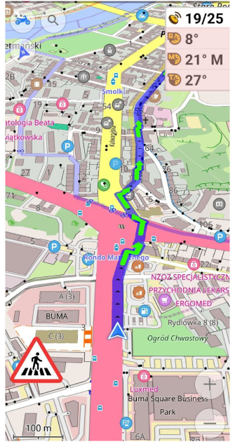
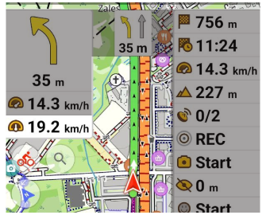
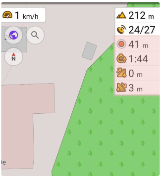
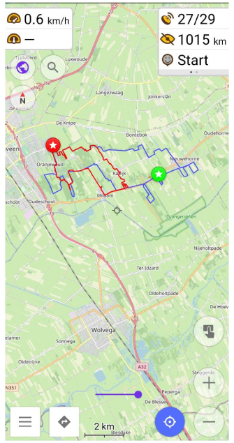

import Tabs from '@theme/Tabs';
import TabItem from '@theme/TabItem';
import AndroidStore from '@site/src/components/buttons/AndroidStore.mdx';
import AppleStore from '@site/src/components/buttons/AppleStore.mdx';
import LinksTelegram from '@site/src/components/_linksTelegram.mdx';
import LinksSocial from '@site/src/components/_linksSocialNetworks.mdx';
import Translate from '@site/src/components/Translate.js';
import InfoIncompleteArticle from '@site/src/components/_infoIncompleteArticle.mdx';
import ProFeature from '@site/src/components/buttons/ProFeature.mdx';

Hi, Everybody! 

After a long break, we are happy to announce the release of the new version 4.2 OsmAnd app for Android devices. You can already update the app and check out the following long-awaited improvements in this new version of the app.

<!--truncate-->

## New in OsmAnd Widgets 

We've done a lot of work on the widgets and interface of [the Configure screen](https://osmand.net/docs/user/widgets/configure-screen):
* We redesigned the Configure screen, separating the widgets from the buttons, and spacing the different widget panels more clearly.
* Added pages for widgets.
* Duplicates.
* Combined the widgets from the left and right panels: now any widget that was previously only available in the left panel can be added to the right panel.

### Pages and Duplicates for widgets

Widgets in the <Translate android="true" id="map_widget_left" /> and <Translate android="true" id="map_widget_right" /> can be grouped into **Pages**.  
_OsmAnd menu → Configure screen → Widgets (Left / Right panel) → Change order → Add pages_

 
 

You can show **Duplicates** for the right/left panels at the same time, as well as for each page of widgets.  
_OsmAnd menu → Configure screen → Widgets (Left / Right panel) → Change order → "+" chosen widget_

### True bearing widget

Added new widgets for "<Translate android="true" id="shared_string_bearing" />". **Bearing** now has 3 separate widgets:

_[Menu → Configure screen → Widgets → Left / Right panel → Bearing](https://osmand.net/docs/user/widgets/nav-widgets#bearing)_

* **Relative bearing** is the angle between your forward movement direction and the target point.
* **Magnetic bearing** is the clockwise (horizontal) angle between the magnetic north and the target point observed from your location. 
* **True bearing** is expressed as the horizontal angle between the geographic meridian and a line on Earth. Specifically, true point bearing is the angle measured in degrees clockwise from the True North line.

 

### Average speed widget

The new Average speed widget shows the average speed of the current ride:

_Menu → Configure screen → Widgets → Left / Right panel → Average speed_

The average speed is calculated for the specified time interval. Click on the "Settings" button of the Average Speed widget to select the time interval for which the average speed will be measured:

_Menu → Configure screen → Widgets → Left / Right panel → Average speed_ → ⚙️

### Trip recording widgets

Added new widgets for "<Translate android="true" id="shared_string_trip_recording" />". **Trip recording** now consists of 4 separate widgets:

_[Menu → Configure screen → Widgets → Left / Right panel → Trip recording](https://osmand.net/docs/user/widgets/info-widgets#-trip-recording-widgets)_

* **Distance/Start-Stop**: starts or stops trip recording and shows distance of the currently recorded trip. Clickable widget.
* **Duration**: shows the duration in minutes/hours of the currently recorded trip. 
* **Uphill**: shows the sum of all climbs of the current recorded trip. 
* **Downhill**: shows the sum of all descents of the current recorded trip. 

 

## Location provider

You can choose which Google Play or "Android API" services OsmAnd will use to determine your location. This can be useful for devices without Google Play services or in case of inaccurate location or altitude data when recording tracks.  
OsmAnd takes data from the resources *Google's Fused Location Providers* and *Android GPS and Network Providers*.  
You can switch **<Translate android="true" id="location_source" />** in: _[<Translate android="true" ids="shared_string_menu,shared_string_settings,osmand_settings" />](https://osmand.net/docs/user/personal/global-settings)_.

## 2.5D view for testing  

:::note
  
View 2.5D is a beta version. It is still in the testing phase.  

::: 

We've added 2.5D view to OsmAnd for Android. Enable OpenGL rendering to run 2.5D view for the device: _OsmAnd menu → Plugins → OsmAnd development → Settings → Use OpenGL rendering_. 

2.5D rendering has squares rendering type.

["Tilt"gesture](https://osmand.net/docs/user/map/interact-with-map/#gestures) makes 2.5D view.

 

## Default appearance for favorites

You can now set the default appearance for new points in [Favorites group](http://osmand.net/docs/user/personal/favorites) or change the existing appearance for all favorites points at once.

The appearance can be set when creating a new group or changed for an existing one:  
 _<Translate android="true" ids="shared_string_menu,shared_string_my_places,favorites_item" /> → &#8285; → Change default appearance_.

<table class="blogimage">
    <tr>
        <td></td>
        <td></td>
    </tr>
</table> 

## Routes on the map

### Selecting a route on the map

[Hiking / Cycling / Travel routes](http://osmand.net/docs/user/map/vector-maps#routes): tap the route symbol, get full route information and download the GPX file for the selected route.

Routes are marked on the map with [OSMC symbols](https://wiki.openstreetmap.org/wiki/Key:osmc:symbol). In OsmAnd you can show OSMC symbols and routes in [Configure map menu](http://osmand.net/docs/user/map/vector-maps#routes).

 

### New types of routes

Added display of [Fitness trails and running routes](http://osmand.net/docs/user/map/vector-maps#routes) to the map. Can be enabled in _<Translate android="yes" ids="configure_map,rendering_category_routes" />_.
Data for these routes are taken from the [OpenStreetMap project](https://openstreetmap.org/):
- The tag [route=fitness_trail](https://wiki.openstreetmap.org/wiki/Tag:route%3Dfitness_trail)
- The tag [route=running](https://wiki.openstreetmap.org/wiki/Tag:route%3Drunning)

 

## Online Elevation profile

:::note
<ProFeature/> Online SRTM feature you can use only with Pro feature <a href="https://osmand.net/docs/user/purchases/android#free-and-paid-features">OsmAnd Pro subscribers</a>.
:::

This feature allows to calculate Elevation profile for GPX track online by the OsmAnd server:

_[Track Context menu](http://osmand.net/docs/user/map/track-context-menu) → Track → Altitude → Calculate online_

<table class="blogimage">
    <tr>
        <td></td>
        <td></td>
        <td></td>
    </tr>
</table> 

## New actions for GPX tracks

### Update Track Context Menu
[Track context menu](http://osmand.net/docs/user/map/track-context-menu) now shows country or region for the track and track waypoints. [Overview tab](http://osmand.net/docs/user/map/track-context-menu#overview) now has an "Info" card with detailed information about the location and file size of the track.

<table class="blogimage">
    <tr>
        <td></td>
        <td></td>
    </tr>
</table> 

### Import Multitrack

Splitting the multitrack file into individual tracks when importing a GPX track. You need to select the tracks to import. The tracks will then be available in:  
 _My Places → Tracks_.

 

## New items for "Quick action"

1. Added ["Plan route"](http://osmand.net/docs/user/plan-route/create-route) tool to the [Quick action menu](http://osmand.net/docs/user/widgets/quick-action).
2. [Overaly/Underlay](http://osmand.net/docs/user/map/raster-maps#select-map-as-main--underlay--overlay-layer) changes with arrows:

- Switched off a layer: &#10148;"Layer name"

- Switched on a layer: "Layer name"&#10148;

 

## New "Map style"

The Map style "Mapnik" has been replaced by the new style "OSM-Carto". This was done because when "Mapnik" was added to OsmAnd, it was identical to the map style on OpenStreetMap.org, but we had no way to keep it up to date, so over time it lost similarity to the OSM map style.

Using "Mapnik" will be available after the upgrade but as a custom map style. After a fresh or new installation, you will need to import it for use manually. You can do this by downloading it from [GitHub](https://github.com/osmandapp/OsmAnd-resources/tree/master/rendering_styles).

<Tabs groupId="map-style">

<TabItem value="android" label="OSM-Carto">

<table class="blogimage">
    <tr>
        <td></td>
        <td></td>
    </tr>
</table>

</TabItem>

<TabItem value="mapnik" label="Mapnik">

<table class="blogimage">
    <tr>
        <td></td>
        <td></td>
    </tr>
</table>

</TabItem>

</Tabs>

## New POIs

New [POIs and objects](http://osmand.net/docs/user/map/point-layers-on-map#points-of-interest-poi) have been added to offline maps in 4.2.
*  Added new [shops](https://wiki.openstreetmap.org/wiki/Key:shop): wool, motorcycle_parts , rice, water_sports, printer_ink, fuel, hairdresser_supply, tiles, collector. 
* Added: [landuse=greenery](https://wiki.openstreetmap.org/wiki/Tag:landuse%3Dgreenery), [natural=blowhole](https://wiki.openstreetmap.org/wiki/Tag:natural%3Dblowhole), [natural=anthill](https://wiki.openstreetmap.org/wiki/Tag:natural%3Danthill), [carriage=](https://wiki.openstreetmap.org/wiki/Key:carriage).
* Support ["flow_rate"](https://wiki.openstreetmap.org/wiki/Key:flow_rate) tag.
* Added new [clubs](https://wiki.openstreetmap.org/wiki/Key:club): club_automobile, club_fishing, club_sailing, club_shooting, club_veterans. 

## OpenStreetMap Editing menu

* All OpenStreetMap-related items in [Configure Map](http://osmand.net/docs/user/map/configure-map-menu) have been combined into one single group. The "OSM Mapper assistant" option has been split into four separate options: _<Translate android="true" id="rendering_attr_OSMMapperAssistantFixme_name"/>, <Translate android="true" id="rendering_attr_OSMMapperAssistantNote_name"/>, <Translate android="true" id="rendering_attr_OSMMapperAssistantIconsLowZooms_name"/>, <Translate android="true" id="rendering_attr_OSMMapperAssistantWaterwayTunnels_name"/>_.

* Fixed tag autocomplete in "Modify POI" mode.

* Fixed incorrect link to the OpenStreetMap object in the context menu.

(no screenshot available)

## Online maps fixes

* Fixed: automatic update of online tile maps.
* Updated UI for [dowloading online tile maps](http://osmand.net/docs/user/map/raster-maps#download--update-tiles).

<table class="blogimage">
    <tr>
        <td></td>
        <td></td>
    </tr>
</table> 

## Other changes

### Download map redesign

Suggesting to download map in the [Search menu](http://osmand.net/docs/user/search/).

### New Coordinate format

Added support for SwissGrid CH1903 / CH1903+ coordinates system, thanks to our co-author [koenigle](https://github.com/koenigle).  
You can change the coordinate format for the profile in:   
_<Translate android="true" ids="shared_string_menu,shared_string_settings,configure_profile,general_settings_2,coordinates_format" />_.

<table class="blogimage">
  <tr>
    <td></td>
    <td></td>
    </tr>
</table> 

* Fixed UTM Zone: display [UTM Zone coordinates](http://osmand.net/docs/user/search/search-address#coordinates-search) as 31T instead of 31N.

### New Track Graph

* [Analyze on the map](http://osmand.net/docs/user/map/tracks-on-map#analyze-track-on-map-android): show data from two axes and UI.
* Aligned graph lines.

### New parameter for "Route&nbsp;line&nbsp;appearance"

Added the option to display or hide turn arrows in the [Route line settings](http://osmand.net/docs/user/navigation/route-navigation#route-line-appearance).

<table class="blogimage">
  <tr>
    <td></td>
    <td></td>
    </tr>
</table> 

### Modified "Use elevation data"

Three options have been added to the [**<Translate android="true" id="routing_attr_height_obstacles_name" />**](http://osmand.net/docs/user/personal/profiles#navigation-settings) option, allowing you to set the preferred terrain of the route: *flat*, *less hilly* and *hilly*. Previously, this option was available only for **Bicycle navigation**.

## Fixed

* [Hebrew Wikipedia](http://osmand.net/docs/user/plugins/wikipedia) - images for Wikipedia articles are visible again.

_________________________________________________

<LinksSocial/>
<LinksTelegram/>
<AndroidStore/>
