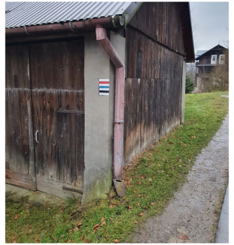
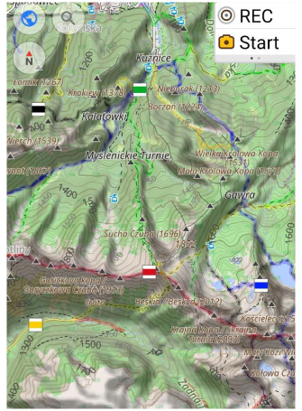
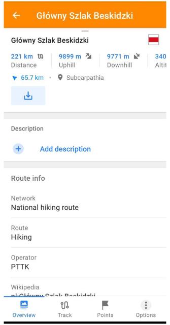
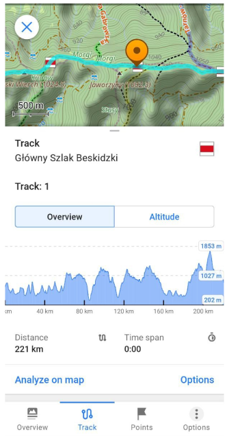
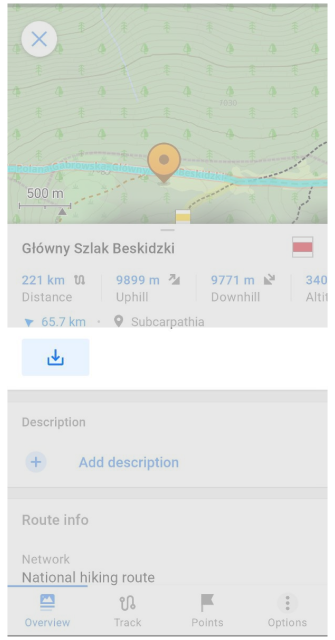
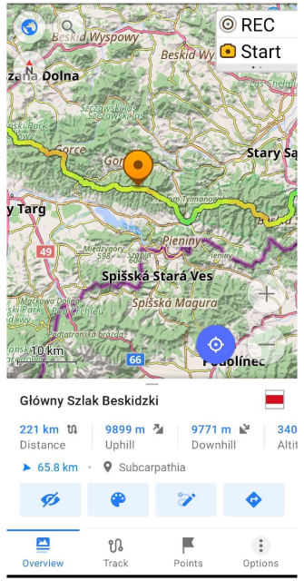

import Tabs from '@theme/Tabs';
import TabItem from '@theme/TabItem';
import AllStores from '@site/src/components/buttons/AllStores.mdx';
import AppleStore from '@site/src/components/buttons/AppleStore.mdx';
import LinksTelegram from '@site/src/components/_linksTelegram.mdx';
import LinksSocial from '@site/src/components/_linksSocialNetworks.mdx';
import Translate from '@site/src/components/Translate.js';
import InfoIncompleteArticle from '@site/src/components/_infoIncompleteArticle.mdx';
import ProFeature from '@site/src/components/buttons/ProFeature.mdx';
import Poll from '@site/src/components/home/Poll';

Hi, Everybody! 

There are thousands of official and nonofficial routes which symbols (marks) you can see in cities, forests and etc. All these routes are routes for your activities. Many of them exist in [OpenStreetMap](https://www.openstreetmap.org/) and you can see them online [here](https://waymarkedtrails.org/) for example.

 

<!--truncate-->

## Routes

In OsmAnd you can highlight routes (present on [OpenStreetMap](https://www.openstreetmap.org/)) and [hiking symbol](https://wiki.openstreetmap.org/wiki/Trail_markings) overlay for your activities. It may be useful for your cycling, hiking, etc. You can select multiple routes at once though they will be displayed as layers and if the road has multiple routes over it only top colour will be visible. If you have some specific rendering styles enabled, you could have a bigger routes variety i.e. for Snowmobile style you could select Snowmobile routes.

 

#### Show routes on the map

To configure it, [follow these steps](@site/docs/user/map/vector-maps.md#routes): 

**<Translate android="true" ids="android_button_seq"/>** *<Translate android="true" ids="shared_string_menu,configure_map,rendering_category_routes"/>* 

**<Translate ios="true" ids="ios_button_seq"/>** *<Translate ios="true" ids="menu,configure_map,rendering_category_routes"/>*

#### Choosing routes in OsmAnd

:::note

While this feature works only for Android version of OsmAnd.

:::

[Hiking / Cycling / Travel routes](http://osmand.net/docs/user/map/vector-maps#routes) are clickable. Just tap **the route symbol**, get full route information and download the GPX file for the selected route. (Routes are marked on the map with [OSMC symbols](https://wiki.openstreetmap.org/wiki/Key:osmc:symbol).)

Clicking on a shield ([OSMC symbols](https://wiki.openstreetmap.org/wiki/Key:osmc:symbol)) proposes to choose the nearest routes.

Choosing the route opens [Track Context menu](@site/docs/user/map/track-context-menu.md):

You can view the route, and its relief, download it as a GPX-file, edit it with "Plan route" tool and even start navigation along it:
- look at Route info (Distance, Uphill, Downhill, Altitude range, Route name, Network, Operator, etc.). 

- looking at Altitude Graph, Analyze on map, Share like GPX-file and etc.

- download the route like GPX-file by clicking to "Download" button. After that, you can do any actions with this GPX-file (navigation, change viewing, modifying by "Route plan" tool and etc).

 

## Generated Travel Routes

:::note

While this feature works only for Android version of OsmAnd.

:::

OpenStreetMap users upload hundreds of [Public GPS Traces](https://www.openstreetmap.org/traces) every day. OsmAnd backend team can download these GPS tracks, sort these by categories (hiking, cycling and etc.). After we generate [OBF-file](@site/docs/technical/osmand-file-formats/osmand-obf.md) with these tracks which you can add to OsmAnd like one of Vector layers. Settings of this layer you find here: 

**<Translate android="true" ids="android_button_seq"/>** *<Translate android="true" ids="shared_string_menu,configure_map,rendering_category_routes,travel_routes"/>* 

For example, we can download generated OBF-files with [Public GPS Traces](https://www.openstreetmap.org/traces):
- [Gpsies-cycling-travel.obf](https://download.osmand.net/uploads/gpsies-cycling.travel.obf)
- [2021-cycling.travel.obf](https://download.osmand.net/uploads/2021-cycling.travel.obf)

Clicking on this file adds the OBF-file to OsmAnd [Local folder](@site/docs/user/personal/maps.md#local-maps).

Now, we can switch on 'Travel routes' and view POIs of routes on the map:

 

Clicking on POI opens [Track Context menu](@site/docs/user/map/track-context-menu.md) of travel routes  like it is done for [Routes](./choosing-routes-in-osmand). You can download GPX file of chosen Travel route, and view all route info:

 

**Advantages of OBF-file**:
- small file size.
- search for tracks directly on the map.
- the ability to make your own [OBF-files with GPX-tracks](https://osmand.net/map): upload GPX-tracks and get OBF-file (with a name "xxx.travel.obf").

_______________________

<Poll/>

______________________

<LinksSocial/>
<LinksTelegram/>
<AllStores/>