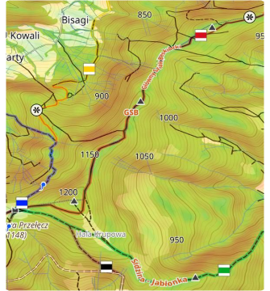
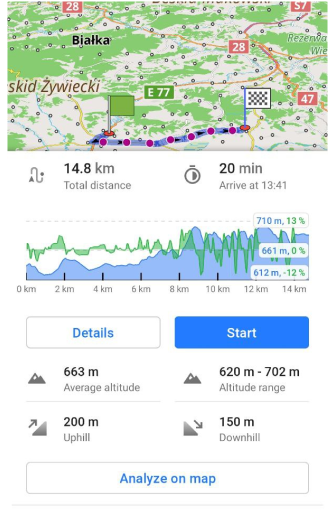

import Tabs from '@theme/Tabs';
import TabItem from '@theme/TabItem';
import AllStores from '@site/src/components/buttons/AllStores.mdx';
import AppleStore from '@site/src/components/buttons/AppleStore.mdx';
import LinksTelegram from '@site/src/components/_linksTelegram.mdx';
import LinksSocial from '@site/src/components/_linksSocialNetworks.mdx';
import Translate from '@site/src/components/Translate.js';
import InfoIncompleteArticle from '@site/src/components/_infoIncompleteArticle.mdx';
import ProFeature from '@site/src/components/buttons/ProFeature.mdx';
import Poll from '@site/src/components/home/Poll';

Hi, Everybody! 

At the last release of OsmAnd for Android we added two Pro features with Elevation data.

The Elevation widget shows a graph with the elevation and slope of your navigation route and your current location on this graph with current altitude and slope. The graph is plotted on two axes. The X-axis is the distance of your route. The Y-axis is the altitude, the value depends on the relief, and the slope is displayed as a percentage.

<!--truncate-->

Relief has a great influence on a trip. Of course, it's very important to know what uphills and downhills wait for us on the way. In OsmAnd you can see [the Altitude graph](https://osmand.net/docs/user/navigation/route-navigation#navigation-route) when you build your route. Working with graphs may be with GPX tracks or for routes.

Our team added two features with this data for Android version and while for [OsmAnd Pro](https://osmand.net/docs/user/purchases/android#pro-features) users. These are Elevation widget and Online Elevation profile.

Elevation widget is very useful for cycling and hiking activities.

## Contour lines and Terrain

Contour lines and Terrain are our first features for relief. These features exist for Android and iOS versions of OsmAnd. Read [our article](https://osmand.net/docs/user/plugins/contour-lines) about it.

 

## Elevation graphs

When you build a navigation road by OsmAnd app you can see [Elevation profile](https://osmand.net/docs/user/navigation/route-navigation#navigation-route) of this road. This graph shows Altitude and Slope data of a route. You can use ["Analyze on map"](https://osmand.net/docs/user/map/tracks-on-map#analyze-track-on-map) for detailing your route.

## Elevation widget

[Elevation widget](https://osmand.net/docs/user/widgets/nav-widgets#elevation-widget) is our OsmAnd Pro feature. You see your position on the Altitude graph.

Android version.

## Online Elevation profile

[Online Elevation profile](https://osmand.net/docs/user/map/track-context-menu/#online-elevation-profile) is our OsmAnd Pro feature. It allows to calculate elevation profile for each points of your GPX track. The feature works online only.

Android version.

## Future feature

OsmAnd team adds more and more features for the application. We try not to make our product compclicated, each user can switch on/off features. 

Our the next version OsmAnd for Android has 3D relief. It's offline using feature.
How to start testing of 3D relief now:

1. Download and install: [OsmAnd OpenGL apk](https://download.osmand.net/latest-night-build/OsmAnd-opengl-arm64-nightly.apk).
2. Enable Plugin: _OsmAnd Development -> Settings -> Use OpenGL rendering_ and _Heightmap_.
3. [Download maps](https://osmand.net/docs/user/start-with/download-maps) of regions France-Italy Mediterranean (near the sea).
4. Adding 3D map file (download and just click to it and open by OsmAnd): [nicce.heightmap.sqlite](https://download.osmand.net/uploads/nicce.heightmap.sqlite)
5. Restart OsmAnd.
6. Enjoy it.

P.S. Of course, we are developing near features for Android version at first. But during the second next year we will add it for iOS version too.

______________________

<LinksSocial/>
<LinksTelegram/>