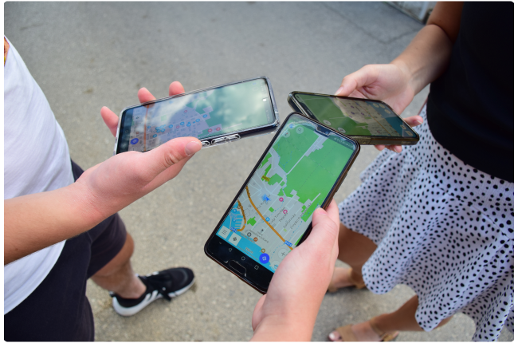

import Tabs from '@theme/Tabs';
import TabItem from '@theme/TabItem';
import AllStores from '@site/src/components/buttons/AllStores.mdx';
import AppleStore from '@site/src/components/buttons/AppleStore.mdx';
import LinksTelegram from '@site/src/components/_linksTelegram.mdx';
import LinksSocial from '@site/src/components/_linksSocialNetworks.mdx';
import Translate from '@site/src/components/Translate.js';
import InfoIncompleteArticle from '@site/src/components/_infoIncompleteArticle.mdx';
import ProFeature from '@site/src/components/buttons/ProFeature.mdx';
import Poll from '@site/src/components/home/Poll';

_Written by [gisplay.pl](https://gisplay.pl/gis/10247-studenci-z-polski-pod-okiem-stowarzyszenia-osm-polska-mapuja-polwysep-w-chorwacji.html)._ Students from Poland, under control of [OSM Polska Association](https://openstreetmap.org.pl/stowarzyszenie/), map the peninsula in Croatia. 

Thanks to the cooperation of the Pedagogical University in Krakow and [OpenStreetMap Polska Association (OSMP)](https://openstreetmap.org.pl/stowarzyszenie/), students from Krakow were taking part in the project of updating the maps of [the Peljesac peninsula in Croatia](https://www.openstreetmap.org/relation/3753553).

_Peljesac peninsula in Croatia (photo: Anna Górska)_

<!--truncate-->

As part of the Peljesac Cartographic range, a group of students under the supervision of _Dr. Paweł Struś_ and _Dr. Krzysztof Wiedermann_ from the Geoinformation Research Laboratory of the University of Life Sciences in Krakow will told about modern methods of obtaining data in the field and their digitization.

Peljesac peninsula in Croatia (photo: Anna Górska)

On behalf of the OpenStreetMap editors community, the event is attended by [_Włodzimierz Bartczak_](https://www.openstreetmap.org/user/Cristoffs), OSMP vice-president, and _Przemysław Boszczar_, OSMP member and one of the most active editors. As part of the course, they familiarized students with the OpenStreetMap data model, data editing tools and data entry principles.

_ Włodzimierz Bartczak and Przemysław Boszczar with students (photo: Anna Górska)_

As part of the project, students collected data in the field, data on tourist infrastructure, including accommodation facilities, restaurants and vineyards located in the vicinity. Remotely analyzed the available orthophotomap and on its basis update the data of land development, communication routes and buildings.  The general application for collecting data was [OsmAnd](https://osmand.net/). By [OpenStreetMap editing plugin](https://osmand.net/docs/user/plugins/osm-editing) it allows to collect of data offline with loading data after.

Editing the map with OsmAnd (photo: Anna Górska)

These data was used to prepare a detailed tourist map of the peninsula (for the needs of the local community, tourist board, entrepreneurs, tourists), and later to prepare thematic maps for testing various methods of spatial analysis and conducting geodiversity research of the Peljesac peninsula, land use control, etc. The data was included to OpenStreetMap resources.

______________________

<LinksSocial/>
<LinksTelegram/>