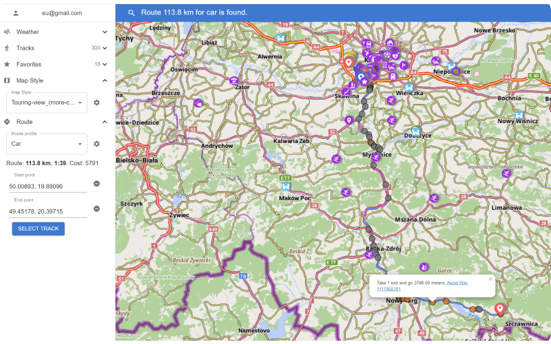

Happy New Year!

We have a good tradition every end of the year to write down New Year Resolutions for the next year and sum up the results of the past year ([Resolutions 2022](https://osmand.net/blog/ny-resolutions-2022)). It's already our 6th Resolutions. 

2022 was very difficult for our team though we stayed strong and #StandWithUkraine 🇺🇦. Nevertheless, there is quite a lot to be proud of 2022 achievements.

In 2022 we launched the new OsmAnd website with new [documentation](https://osmand.net/docs/intro) and [map](https://osmand.net/map). We also introduced the Pro cross-platform subscription for iOS, Android, Web and finally released OpenGL Rendering for Android with 3D terrain.

## 2023 New Year Resolutions

Let's start with the to-do list for 2023, and below you can double-check how a similar list was  crushed in 2022 😉

### Widgets / Trip Computer

**Android + iOS**
* Full customization for widgets screen - left / right / bottom / top panels
* Trip Computer and large widgets 
* Bigger variety of Widgets for your travels and rides

### Quick Action / Customization

**iOS:** we'll bring customization to the same level as in Android, so you can configure Driver / Context Menu etc for selected profiles.

**Android / iOS:** we plan to introduce a more powerful concept of quick actions so that users can configure more than 1 shortcut buttons on the map.

### OsmAnd Cloud

* **Android / iOS / Web:** Seamless integration through all platforms
* **Android / iOS / Web:** Edit & sync Tracks / Favorites online
* **Android / iOS / Web:** Share Tracks / Favorites with friends & family

### Photo Gallery

Next level of integration of Map & Photos including personal photos and public domain from Wikimedia.

* Displaying photos on the map
* Search and browse POI using photos
* Attaching Photos to Favorites and Tracks

<table class="blogimage">
  <tr>
    <td></td>
    <td></td>
    </tr>
</table> 

<table class="blogimage">
  <tr>
    <td></td>
    <td></td>
    </tr>
</table> 

### External Devices

**Android / iOS**

Improve integration with external devices such as sensors, controllers, joysticks, smartwatches

* Support BLE Sensors
* Customize Bluetooth keyboards / controllers access
* Smart notifications management for watches

<table class="blogimage">
  <tr>
    <td></td>
    <td></td>
    </tr>
</table> 

### Tracks

* **iOS:** GPS filter, Recording GPX dialog
* **Android / iOS:** Redesigned Tracks Management
* **Android / iOS:** Generate / share personal heatmap and tracks collection

<table class="blogimage">
  <tr>
    <td></td>
    <td></td>
    </tr>
</table> 

### 3D maps

* **Android / iOS** 

Finalize and make a stable release of a 3D fully offline worldwide map.

### Overall improvements

- Complete offline documentation
- Photo / video attachments to Favorites points
- CarPlay
- Android Auto
- Fast Auto Routing
- Alternative Routes
- Different Weather forecast providers

## 2022 Achievements

Let’s take a look at what was in the original 2022 resolutions list which nearly doesn’t cover all features implemented in 2022 by 2 major releases * [4.2](https://osmand.net/blog/osmand-ios-4-2-released) and [4.3](https://osmand.net/blog/osmand-ios-4-3-released) (iOS); [4.2](https://osmand.net/blog/osmand-android-4-2-released) and [4.3](https://osmand.net/blog/osmand-android-4-3-released) (Android).

[Resolutions 2022](https://osmand.net/blog/ny-resolutions-2022):

* ✔️ Open GL / 3D * Fast Maps (Android)
* ✔️ OsmAnd Cloud (iOS & Web)
* ✔️ Documentation (Web)
* ✔️ Web Map (Web)
* ✔️ Widgets (Android)
* ✔️ Weather (Android & iOS & Web)
* ✔️ Plan Route (Android & iOS & Web)
* ✔️ Tracks (Android & iOS & Web)
* ✔️ Quick actions / Customization (Android & iOS)
* ✔️ Online routing (Android)

### iOS

OsmAnd iOS got 2 major releases with more than <a href="https://github.com/osmandapp/OsmAnd-iOS/milestones?state=closed">200 public features and issues</a> closed on Github.

#### [4.2](https://osmand.net/blog/osmand-ios-4-2-released) * May 19, 2022

<table class="blogimage">
  <tr>
    <td></td>
    <td></td>
    </tr>
</table> 

* [Route line appearance](https://osmand.net/blog/osmand-ios-4-2-released#route-line-appearance)
* [Improved GPX Track file](https://osmand.net/blog/osmand-ios-4-2-released#tracks)
* [Improvements CarPlay](https://osmand.net/blog/osmand-ios-4-2-released#carplay)
* [OsmAnd in Files app](https://osmand.net/blog/osmand-ios-4-2-released#files-app)

#### [4.3](https://osmand.net/blog/osmand-ios-4-3-released) * December 17, 2022

<table class="blogimage">
  <tr>
    <td></td>
    <td></td>
    </tr>
</table> 
 

* [New puchase plans: Pro ans Maps+](https://osmand.net/blog/osmand-ios-4-3-released#new-purchase-plans)
* [Weather](https://osmand.net/blog/osmand-ios-4-3-released#weather-forecast)
* [Cloud: backup & sync](https://osmand.net/blog/osmand-ios-4-3-released#cloud-backup)
* [New colors for GPX tracks and route line](https://osmand.net/blog/osmand-ios-4-3-released#new-colors-for-tracks-and-route-line)
* [OsmAnd Live for OSMers](https://osmand.net/blog/osmand-ios-4-3-released#osmand-live-for-osmers)
* [Improvements for Favorites](https://osmand.net/blog/osmand-ios-4-3-released#new-updates-for-favorites)

### Android

OsmAnd Android got 2 major releases (4.2 and 4.3) with more than <a href="https://github.com/osmandapp/Osmand/milestones?state=closed">800 public features and issues</a> closed on Github.
        
#### [4.2](https://osmand.net/blog/osmand-android-4-2-released) * June 3, 2022

<table class="blogimage">
  <tr>
    <td></td>
    <td></td>
    </tr>
</table>        

* [New widgets](https://osmand.net/blog/osmand-android-4-2-released#new-in-osmand-widgets)
* [2.5D view for testing](https://osmand.net/blog/osmand-android-4-2-released#25d-view-for-testing)
* [Routes on the map](https://osmand.net/blog/osmand-android-4-2-released#routes-on-the-map)
* [Location provider](https://osmand.net/blog/osmand-android-4-2-released#location-provider)
* [Online Elevation profile](https://osmand.net/blog/osmand-android-4-2-released#online-elevation-profile)
* [Improvements for Quick action](https://osmand.net/blog/osmand-android-4-2-released#new-items-for-quick-action)

      
#### [4.3](https://osmand.net/blog/osmand-android-4-3-released) * December 12, 2022
      
<table class="blogimage">
  <tr>
    <td></td>
    <td></td>
    </tr>
</table>  

* [New map rendering engine and 2.5D projection](https://osmand.net/blog/osmand-android-4-3-released#new-faster-map-rendering-engine)
* [Weather plugin](https://osmand.net/blog/osmand-android-4-3-released#weather-plugin)
* [New improvements for Widgets](https://osmand.net/blog/osmand-android-4-3-released#new-improvements-for-widgets)
* [Smooth animation](https://osmand.net/blog/osmand-android-4-3-released#smooth-animation)
* [ANT+ devices](https://osmand.net/blog/osmand-android-4-3-released#support-external-devices-ant)

### Web  

[www.osmand.net/map](https://osmand.net/map)

* [New Website version](https://osmand.net/)
* [Documenation](https://osmand.net/docs/intro)
* [Web OsmAnd Map](https://osmand.net/map)
* [OsmAnd Pro - Features](https://osmand.net/docs/user/purchases/android#pro-features)

## Summary

We are starting the new 2023 year with 15 Software engineers fully equipped and motivated to bring OsmAnd to the next level. We are sticking to our mission to build ***the most powerful open source cartographic tool for Travels*** *(Offline & Online)*.

Thank you (our dear users) for being with us during these difficult years for traveling, we feel your support and we hope to meet your expectations. We wish all the best in 2023!

**Happy 2023!**

**Victor Shcherb & OsmAnd Team**
