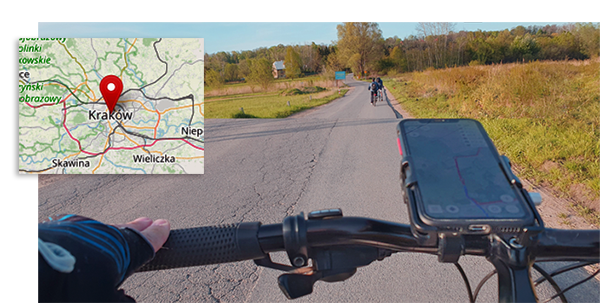

import Tabs from '@theme/Tabs';
import TabItem from '@theme/TabItem';
import AndroidStore from '@site/src/components/buttons/AndroidStore.mdx';
import AppleStore from '@site/src/components/buttons/AppleStore.mdx';
import LinksTelegram from '@site/src/components/_linksTelegram.mdx';
import LinksSocial from '@site/src/components/_linksSocialNetworks.mdx';
import Translate from '@site/src/components/Translate.js';
import InfoIncompleteArticle from '@site/src/components/_infoIncompleteArticle.mdx';
import ProFeature from '@site/src/components/buttons/ProFeature.mdx';
import MyScript2 from './custom.js';
import Tanya from '@site/src/components/usercounter.js';

    <a class="button--black" href='https://osmand.net/apps/'>Próbować OsmAnd</a>

<MyScript2 />

<Tanya />

### Dlaczego potrzebujesz OsmAnd?

##  Kto pyta, nie błądzi

Zaplanuj trasę przed podróżą. 
Ponadto baza danych OsmAnd jest gotowych tras przez parki i ukrytych ścieżek, o których niewielu wie 🛣️ 

## Raz na wozie, raz pod wozem

Z OsmAnd zobaczysz, gdzie możesz zaoszczędzić energię przed trudnymi odcinkami trasy 🚴

    <a class="button--black" href='https://osmand.net/apps/'>Zainstalować OsmAnd app</a>

### Używam innej aplikacji 

Ok, ale możesz dostać więcej. Porównaj OsmAnd (po lewej), kolejną znaną aplikację po prawej 

### Podstawowe funkcje - za darmo!

    <a class="button--black" href='https://osmand.net/apps/'>Próbować OsmAnd</a>

_________________________________________________

<LinksSocial/>
<LinksTelegram/>
<AppleStore/>
<AndroidStore/>

