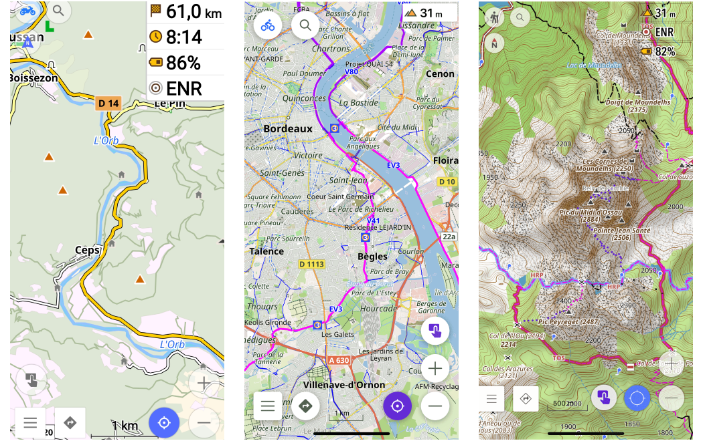
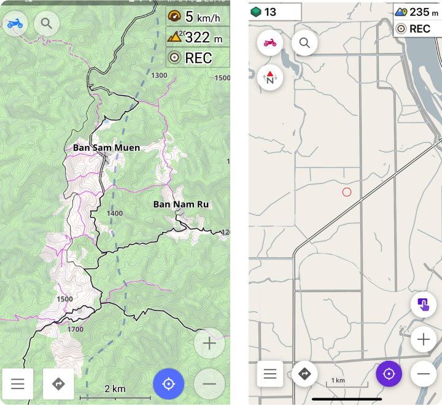

import Tabs from '@theme/Tabs';
import TabItem from '@theme/TabItem';
import AndroidStore from '@site/src/components/buttons/AndroidStore.mdx';
import AppleStore from '@site/src/components/buttons/AppleStore.mdx';
import LinksTelegram from '@site/src/components/_linksTelegram.mdx';
import LinksSocial from '@site/src/components/_linksSocialNetworks.mdx';
import Translate from '@site/src/components/Translate.js';
import InfoIncompleteArticle from '@site/src/components/_infoIncompleteArticle.mdx';
import ProFeature from '@site/src/components/buttons/ProFeature.mdx';

Hello everybody!

In this article, I want to tell you how OsmAnd users create their own map styles.

## OsmAnd map styles

At first about Map styles by default.

OsmAnd contains own [10 map rendring styles](https://osmand.net/docs/user/map/vector-maps#default-map-styles): OsmAnd, Touring view, UniRS and LightRS, Nautical, Winter and ski, Topo, OSM-carto, Desert, Offroad, Snowmobile.  All of these styles contain one type of data from [OpenStreetMap](https://www.openstreetmap.org/). [Rendering.xml](https://github.com/osmandapp/OsmAnd-resources/tree/master/rendering_styles) contains rules on how to display (draw) the map on a device screen.

## Custom rendering styles

OsmAnd is a powerful customised application. Each user can create your own Map style. Documentation about it is [here](https://osmand.net/docs/technical/osmand-file-formats/osmand-rendering-style).

## Examples

Here we added examples of users rendering styles.

### Louis-LJ styles

By our vision, it's [the most advanced project](https://github.com/OsmAnd-Rendering) with map styles for OsmAnd. Here you can find styles for motorcycle, cycling, and hiking activities, and a manual for rendering creation.

You can always discuss rendering in [the telegram](https://t.me/OsmandRendering).

### Outdoor Explorer

It's one more user map style for OsmAnd. This style was created for enduro, MTB and hiking activities.

[Here](https://github.com/cmoffroad/osmand-outdoor-explorer-plugin) you can download Custom plugin and use new map styles.

______________________

<LinksSocial/>
<LinksTelegram/>