import Tabs from '@theme/Tabs';
import TabItem from '@theme/TabItem';
import AndroidStore from '@site/src/components/buttons/AndroidStore.mdx';
import AppleStore from '@site/src/components/buttons/AppleStore.mdx';
import LinksTelegram from '@site/src/components/_linksTelegram.mdx';
import LinksSocial from '@site/src/components/_linksSocialNetworks.mdx';
import Translate from '@site/src/components/Translate.js';
import InfoIncompleteArticle from '@site/src/components/_infoIncompleteArticle.mdx';
import ProFeature from '@site/src/components/buttons/ProFeature.mdx';

Good news, everybody! 
Revolutionary changes we made in 4.5 OsmAnd release for Android devices. Go ahead and read all what was added and improved.

**Big Spoiler:** 
- OsmAnd Cloud backup for Favourites, OsmAnd Settings and OSM Notes going free
- New Terrain format and 3D relief
- New Track management menu
- BLE sensors
- Train profile..

<!--truncate-->

* [BLE/ANT+ sensors](#bleant-sensors)
* [Free backup](#free-account-backup)
* [New format for Terrain maps](#terrain-maps-updates)
* [Tracks management menu](#track-management)
* [New for Android Auto](#android-auto-improvements)
* [Widget improvements](#widget-improvements)
* [Visible in 3D Mode](#2d3d-button)
* [Train profile](#train-profile)
* [Contour lines updates](#contour-lines-for-map-sources)
* [External keyboards improvements](#more-actions-for-external-keyboards)
* [Updates for Voice prompts settings](#announce-deviation-from-the-route)
* [Start screen](#updated-start-screen)
* [Hazardous Materials classes](#hazardous-materials-classes-for-north-america)
* [Via ferrata for pedestrian routing](#via-ferrata-for-pedestrian-routing)
* [CAI scale for route difficulty classification](#cai-scale)
* [Support of themed icons](#support-themed-icons-for-android-13)
* [Update of OsmAnd Cloud options](#option-delete-cloud-account)
* [Accessibility plugin update](#accessibility-updates)
* [Custom routing files](#custom-routing-files-options)
* [Fixed](#fixed)

## BLE/ANT+ sensors

For this release we redesigned [External sensor Plugin](https://osmand.net/docs/user/plugins/external-sensors), added [BLE](https://en.wikipedia.org/wiki/Bluetooth_Low_Energy) connection for sensors:
- reworked connection screen

 

- record and view sensor data in [GPX format](https://osmand.net/docs/user/plugins/trip-recording#recording-settings)

 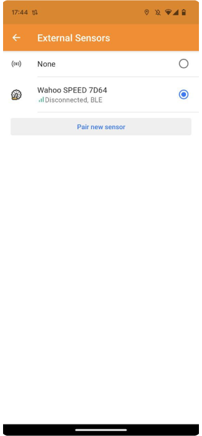

## Free account (Backup)

For OsmAnd 4.5 was added OsmAnd Start plan. A user should register an email for the [OsmAnd Cloud](https://osmand.net/docs/user/personal/osmand-cloud) and for activation OsmAnd Start.

_OsmAnd Menu → Settings → OsmAnd Cloud_

After that, you can [backup](https://osmand.net/docs/user/personal/osmand-cloud#select-data-to-back-up) your [favorites](https://osmand.net/docs/user/personal/favorites), [OSM Edits and Notes](https://osmand.net/docs/user/plugins/osm-editing#create--modify-osm-note), and [OsmAnd settings](https://osmand.net/docs/user/personal/profiles) for free. 

 

## Terrain maps updates

We have added _Terrain map_ for countries in [Download maps](https://osmand.net/docs/user/start-with/download-maps) menu. This data type can be used to generate [Slopes, Hillshades (paid)](https://osmand.net/docs/user/purchases/android#free-and-paid-features), and 3D maps ([OsmAnd Pro](https://osmand.net/docs/user/purchases/android#pro-features)).

_OsmAnd menu → Download maps_

Our updates:
- [Slope](https://osmand.net/docs/user/plugins/contour-lines#slope-map) and [Hillshades](https://osmand.net/docs/user/plugins/contour-lines#hillshade-map) can be generated from _Terrain map_ data

 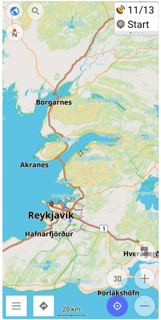

- Redesigned [_Terrain menu_](https://osmand.net/docs/user/map/configure-map-menu):

_OsmAnd menu → Configure map → Terrain_

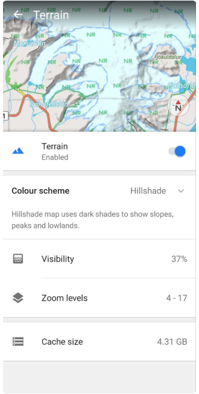 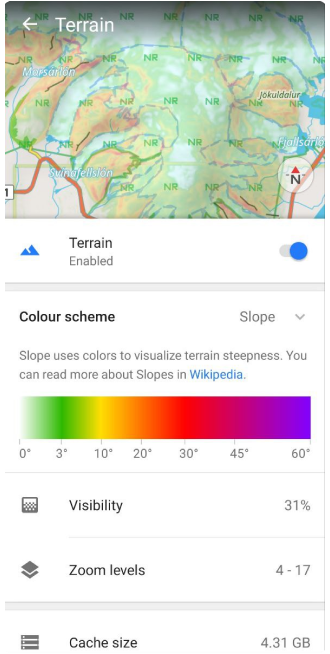

- Added "3D Relief" button ([OsmAnd Pro](https://osmand.net/docs/user/purchases/android#pro-features)) for Terrain menu. It allows you to activate 3D view for relief (offline).

_OsmAnd menu → Configure map → Terrain → 3D Relief_

 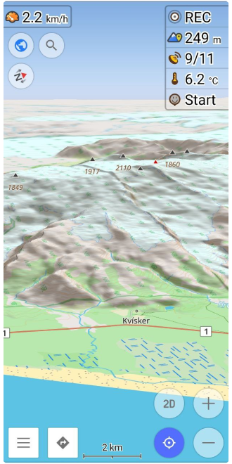

## Track management

[_My Places > Tracks_](https://osmand.net/docs/user/personal/tracks) menu has been re-organized:
- Added sorting.
- Added filters:
    - With the ability to save the filter.
- Added folder options:
    - Now you can share the tracks folder with selected tracks.
    - You can also delete selected tracks folder.
- Added all tracks stat.

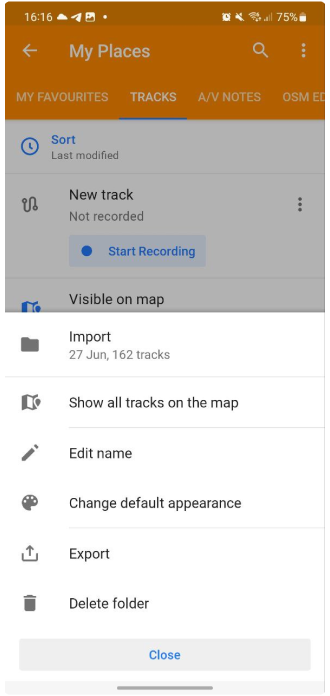 

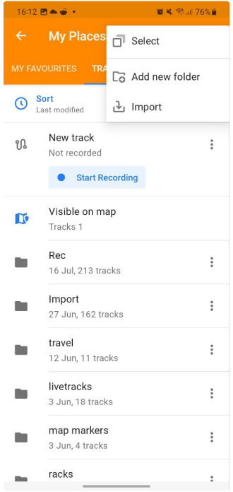 

## Android Auto improvements

- New start menu for accessing Favorites, POIs, Map markers, Tracks, and History categories.

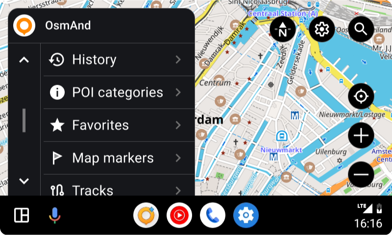

- Driving profile:
   - If the current profile is "Driving" (derived from Driving - Truck, Car, Motorcycle...), then AA keeps selected profile.
   - If the current profile is not "Driving", it is automatically changed to Driving.
- Fixed laggy location.
- Added button to hide Screen menu.

## Widget improvements

We added the list of widgets for the [Top/Bottom panels](https://osmand.net/docs/user/widgets/configure-screen#widget-panels):

_OsmAnd menu → Configure screen → Top panel / Bottom panel_

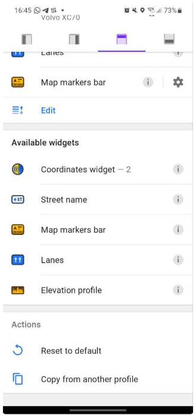 

## 2D/3D button

The new "3D/2D Mode" button for the map screen was added. Now you can make a map tilt not only with [two fingers](https://osmand.net/docs/user/map/interact-with-map#gestures). "3D/2D Mode" button acts differently with menus and on map screens if _3D Mode_ in Configure Screen is set to Visible in 3D Mode.

_OsmANd Menu → Configure Screen → Buttons → 3D Mode_:
- Hidden
- Visible
- VIsible in 3D mode

** **map tilt angle by button is the last tilt angle by two-finger gestures**

  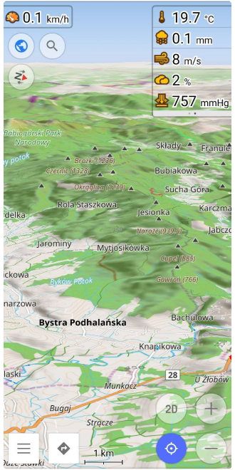

## Train profile

_Train_ profile was added to [Profile list](https://osmand.net/docs/user/personal/profiles). The new profile allows the calculation of railway routes.

** **Disabled by default**: _OsmAnd Menu → Settings → App profiles_

## Contour lines for Map sources

["Contour lines"](https://osmand.net/docs/user/plugins/contour-lines#contour-lines-map) function works with any ["Map source"](https://osmand.net/docs/user/map/configure-map-menu):

_OsmAnd menu → Configure map → Map source..._

Now, you can see contour lines with raster maps (Map sources):

## More actions for external keyboards

Added the expanded list of default actions for [external keyboards](https://osmand.net/docs/user/map/interact-with-map#external-input-device-buttons).

## Announce deviation from the route

Added option to disable / enable "Announce deviation from the route" for [Voice prompts](https://osmand.net/docs/user/navigation/guidance/navigation-settings#voice-prompts) settings:

_OsmAnd menu → Configure profile → Navigation settings → Voice prompts → Other → Announce deviation from the route_

** **Enabled by default**

## Updated Start screen

[Start screen](https://osmand.net/docs/user/start-with/first-steps#how-to-download-maps): added option restore OsmAnd state from file.

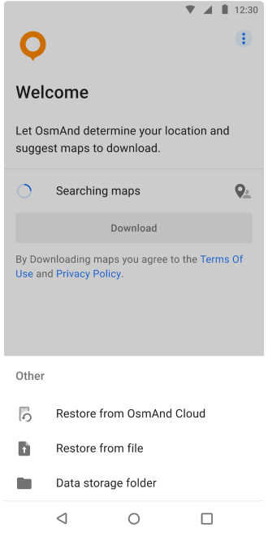

## Hazardous Materials classes for North America

Added [Hazardous Materials](https://osmand.net/docs/user/navigation/routing/car-based-routing/#route-parameters---truck) classes for North America:

_OsmAnd menu → Configure profile (Truck) → Navigation settings → Route parameters → Transporting of hazardous materials_

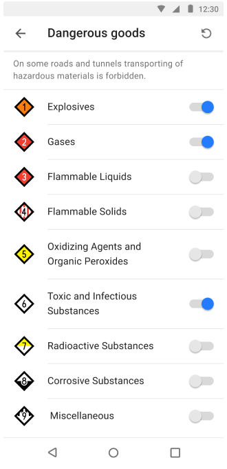

## Via ferrata for pedestrian routing

Added support of _Via ferrata_ for [pedestrian routing](https://osmand.net/docs/user/navigation/routing/pedestrian-routing):

_OsmAnd menu → Configure profile (Walking) → Navigation settings → Route parameters → Mountainside route (Via ferrata)_

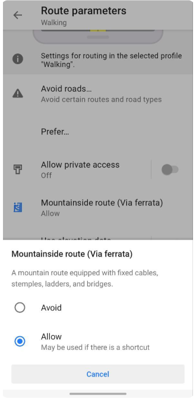

##  CAI scale

Added [CAI (Club Alpino Italiano)](https://www.cai.it/) scale for routes [difficulty classification](https://montanarilife.com/2016/07/03/hiking-trail-rating-systems-italy/):

_OsmAnd menu → Configure map → Routes → Difficulty classification_

## Support themed icons for Android 13

We support themed (adaptive) icons for [Android 13](https://developer.android.com/develop/ui/views/launch/icon_design_adaptive#user-theming).

## Option Delete Cloud account

We added the ability to delete an [OsmAnd Cloud](https://osmand.net/docs/user/personal/osmand-cloud) account:

_OsmAnd Menu → Settings → OsmAnd Cloud →  → Delete account_

## Accessibility updates

[Accessibility](https://osmand.net/docs/user/plugins/accessibility): touch target size for all buttons changed to 48 dp fixed issue with map UI that was visible for screen readers.

## Custom routing files option

[Custom routing](https://osmand.net/docs/user/navigation/routing/osmand-routing#customize-offline-routing): added options to delete or overwrite routing files.

_OsmAnd menu → Configure profile → Navigation settings → [Navigation type](https://osmand.net/docs/user/navigation/guidance/navigation-settings#navigation-type) → &#8942; (routing_custom.xml) → Delete_

## Fixed

- [Per-app language selection](https://github.com/osmandapp/OsmAnd/issues/16938) (Android 13).
- Include Bearing/Heading data for Trip recording on [OsmAnd development plugin settings](https://osmand.net/docs/user/plugins/development#plugin-settings).
- [Bugs](https://github.com/osmandapp/OsmAnd/milestone/38?closed=1).

_______________________________________________

<LinksSocial/>
<LinksTelegram/>
<AndroidStore/>