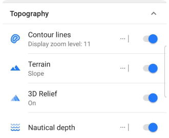
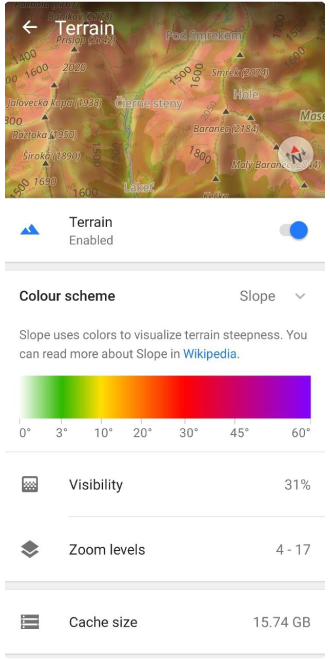
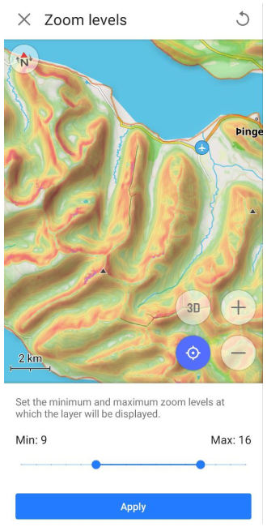
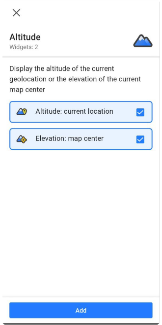

import Tabs from '@theme/Tabs';
import TabItem from '@theme/TabItem';
import AndroidStore from '@site/src/components/buttons/AndroidStore.mdx';
import AppleStore from '@site/src/components/buttons/AppleStore.mdx';
import LinksTelegram from '@site/src/components/_linksTelegram.mdx';
import LinksSocial from '@site/src/components/_linksSocialNetworks.mdx';
import Translate from '@site/src/components/Translate.js';
import InfoIncompleteArticle from '@site/src/components/_infoIncompleteArticle.mdx';
import ProFeature from '@site/src/components/buttons/ProFeature.mdx';

Hello everybody!

In the [OsmAnd 4.5 release](https://osmand.net/blog/osmand-android-4-5-released#terrain-maps-updates), a new type of terrain map has been added. This is a new type of data in our application, which is needed for terrain rendering, as well as for some additional functions related to elevations. All the information is in our [documentation](https://osmand.net/docs/user/), but in this article, we will describe how and what can be seen and received on the screen with a new data type.

Go

<!--truncate-->

At first, look at this screenshots: 

|||
|------|-------|
|||

In these images, you can see 3D relief and slopes with vector and raster maps. The widget shows Elevation on the screen center. 

This is an example of the possibilities of terrain data and that's not all.

**Advantages**:
- small download size.
- possibility of different displays for data: hillshades, slopes, 3D relief.
- offline using.

## Terrain map data

At first, you need to buy OsmAnd package and download Terrain map data. It is available in [Download maps menu](https://osmand.net/docs/user/plugins/contour-lines#how-to-download): _OsmAnd menu → Download maps → Regions → Chosen country → Terrain map (3D)_. Here you can find the Terrain map for each country.

:::note
**Terrain map data is [a paid function](https://osmand.net/docs/user/purchases/android#free-and-paid-features)**:
- Hillshades/Slopes are available for OsmAnd+, OsmAnd Maps+ packages
- 3D Relief is available for [OsmAnd Pro subscription](https://osmand.net/docs/user/purchases/android#pro-features).
:::

## Topography menu

When you download Terrain data, the next step is to activate it for your map. 
Go to _OsmAnd menu → Configure map → Topography_

Terrain map data is used for two menu items: [_Terrain_](#terrain) and [_3D Relief_](#3d-relief). Read more about it below.

### Terrain 

The Terrain menu enables and configures two parameters: [_Hillshade_](https://osmand.net/docs/user/plugins/contour-lines#hillshade) and [_Slope_](https://osmand.net/docs/user/plugins/contour-lines#slope).

Viewing of Terrain (Hillshade and Slope) on the map:

|Hillshade|Slope|
|------|-------|
|||

How to choose a colour scheme and other parameters for layers read below.

Choose your terrain parameter _OsmAnd menu → Configure map → Topography → Terrain → **Colour scheme**_:

- _Hillshade_ allows you to explore the topography by illuminating it with hypothetical lighting which simulates shading, thus revealing relief.

- _Slope_ allows you to explore the steepness (incline) of slopes expressed in degrees of deviation from the horizontal.

|Colour scheme - Hillshade|Colour scheme - Slope|
|------|-------|
|||

**_Visibility_** is a parameter for transparency of the colors used to display the angle (Slope) and the shading (Hillshade). 

|Visibility 31%|Visibility 74%|
|------|-------|
|||

**_Zoom levels_** is a parameter for setting the minimum and maximum zoom levels at which the layer will be displayed.

**_Cache size_** is a parameter that shows the size of the cache. Each time you view terrain info on the map (hillshade or slope), all this data is cached for quick use in the future (no additional load on the device processor).

Clear the cache: _System settings → Apps → OsmAnd → Storage → Clear cache_

|Before|After|
|------|-------|
|||

### 3D relief

The [3D Relief feature](https://osmand.net/docs/user/plugins/contour-lines#3d-relief) produces a raised relief and provides a three-dimensional representation of the landscape. 3D Relief works offline and can be used with [OsmAnd vector maps](https://osmand.net/docs/user/map/vector-maps.md) or any  [raster maps](https://osmand.net/docs/user/map/raster-maps.md#select-raster-maps) as a [Map Source](https://osmand.net/docs/user/map/raster-maps.md#main) or as an [Underlay/Overlay](https://osmand.net/docs/user/map/raster-maps.md#overlay-layer).

To enable 3D Relief, go to _Menu → Configure map → Topography → 3D Relief_ and toggle on.

Now, you can see 3D Relief (offline) on the map with any map layers:

|Vectom map layer|Raster map layer|
|------|-------|
|||

## Widget

With Terrain map data you can view the altitude for each point on the map.

To display [_Elevation: map center_](https://osmand.net/docs/user/widgets/info-widgets#-elevation-map-center) widget, add it on the device screen:

_OsmAnd Menu → Configure screen → Left / Right panel → Altitude_

|Widget settings screen|Widgets on the screen|
|------|-------|
|||

## Calculation elevation

The next feature (_Calculation elevation_) allows to calculate (offline) elevation by using Terrain map data for any GPX tracks without elevation data for any points on the map: [_Track Context menu → Track → Altitude → Calculate elevation → Calculate offline_](https://osmand.net/docs/user/map/track-context-menu#altitude). 

|Before|After|
|------|-------|
|||

______________________________________________
**Thank you for reading this article and familiarizing yourself with the new features of our application. Join our social networks for communication and feedback.**
_______________________________________________

<LinksSocial/>
<LinksTelegram/>
<AndroidStore/>

