import Tabs from '@theme/Tabs';
import TabItem from '@theme/TabItem';
import AndroidStore from '@site/src/components/buttons/AndroidStore.mdx';
import AppleStore from '@site/src/components/buttons/AppleStore.mdx';
import LinksTelegram from '@site/src/components/_linksTelegram.mdx';
import LinksSocial from '@site/src/components/_linksSocialNetworks.mdx';
import Translate from '@site/src/components/Translate.js';
import InfoIncompleteArticle from '@site/src/components/_infoIncompleteArticle.mdx';
import ProFeature from '@site/src/components/buttons/ProFeature.mdx';

Hello, everyone!

We are glad to introduce you to the article from our Finnish advanced user Antti from [his blog](https://www.advseeker.fi/).

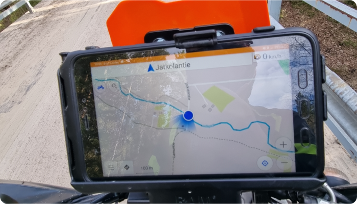

&#9755;  Let's go!

<!--truncate-->

* [What is TET route?](#tet)
* [Import TET route](#import-tet-route)
* [Start navigation](#start-navigation)
* [Creating profile for gravel roads](#creating-profile)
* [Configure screen per profile](#configure-screen)
* [Trip recording](#trip-recording)
* [Change basemap](#change-basemap)
* [Removing automatic centering](#removing-automatic-centering)
* [How soon application should reroute](#how-soon-application-should-reroute)
* [Bonus: Custom map types](#custom-map-types)

### TET

TET (Trans Euro Trail) is an 80,000km GPX route from the edge of Africa to the Arctic Circle. Created by TET adventure motorcycle community.

Read more and find your route [here](https://transeurotrail.org/).

Join to Public group on [Facebook](https://www.facebook.com/groups/Transeurotrail.org).

### Import TET route
Often there is a question of where to get TET route. The only source for the correct and valid GPX file that holds the full route is [Trans Euro Trail's own web page](https://transeurotrail.org/). Go there with your mobile select the country hit the Download GPX button and accept terms and rules. Once the GPX file is downloaded open it and you should see OsmAnd as a possible application to open the file.

Once the application is opened you will see information about the GPX file. This GPX file contains 13 separate tracks and you can choose what tracks are imported or all. Click the Import 13/13 button to import selected tracks.

| Download TET route   | Open it by OsmAnd    | Import tracks screen in OsmAnd    |
|----|-----|-----|
|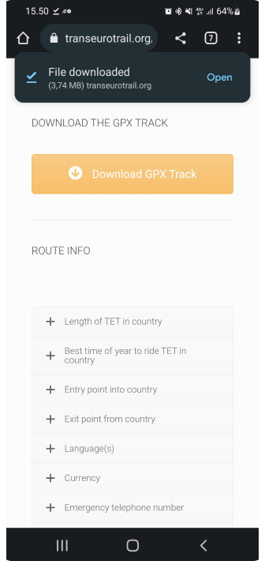|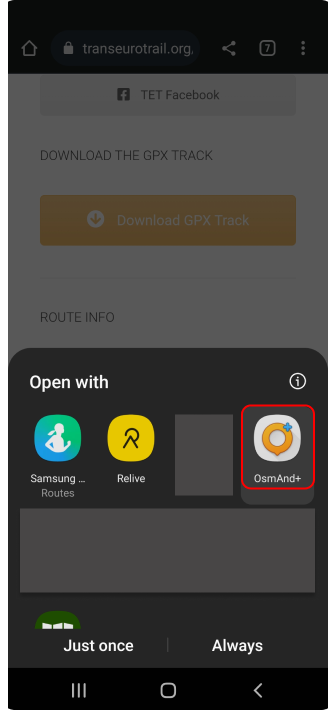||

If tracks are not visible right away after import you need to make those visible from the menu:

_OsmAnd Menu → Configure map → [Tracks](https://osmand.net/docs/user/map/tracks-on-map#tracks-in-configure-map-menu)_

You will see all tracks that are available in the application. Select the ones that you imported and press OK.

|    |     |     |
|----|-----|-----|
|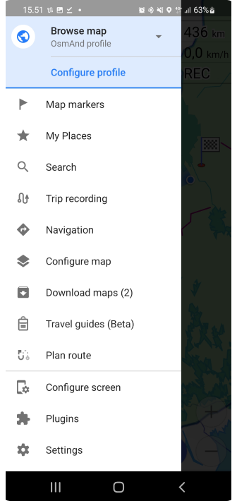|| |

Now you can see that Tracks count is updated and when you press the back button you will see routes on the map.

|     |     |
|-----|-----|
|| 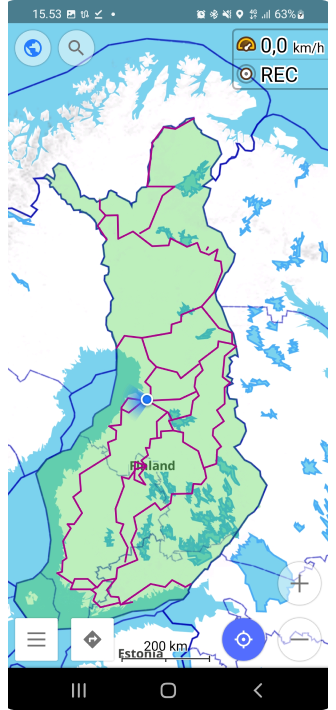|

### Start navigation

[Navigation](https://osmand.net/docs/user/navigation/setup/gpx-navigation) is started by clicking the track that you want to follow. Once you click track menu will open that tells basic information about the track like name and distance etc.

There are 4 main buttons that are from left to right: _Hide track from the map_, _Change colors_, _Edit track_, and _Navigate_. Click Navigate button. You will see direction of the route on the next screen.

| Tap on a track  | Follow track   |
|----|-----|
|||

Quite often you might need to change direction if you are not located in a place where the track starts. This can be done by pressing options (gear icon top of the _Start_ button). Then click close.

Then select [_Follow track_](https://osmand.net/docs/user/navigation/setup/gpx-navigation#follow-track-menu) and click _Reverse track direction_.

|     |     |
|-----|-----|
||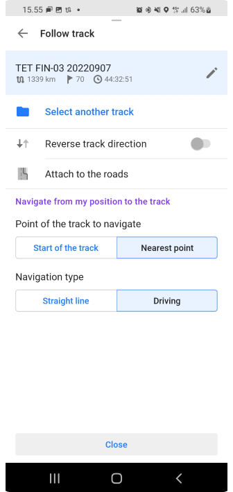| 

Now you can see that track arrows are pointing other direction.

|     |     |
|-----|-----|
|| | 

Now we can start navigation by pressing the _Start_ button.

|     |     |
|-----|-----|
|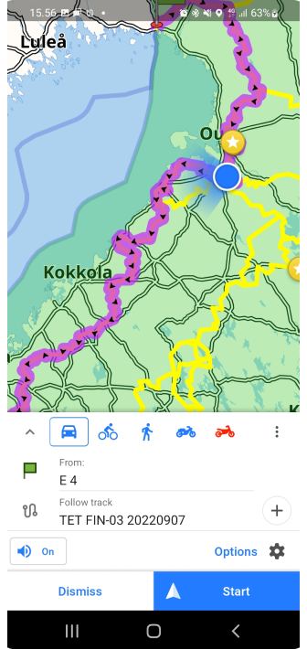|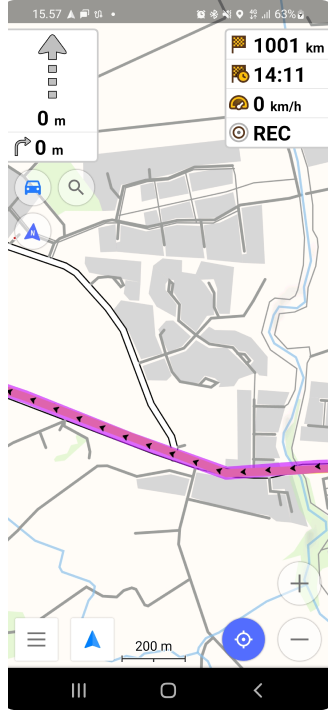|

### Creating profile

OsmAnd is the only application that allows you [to create a profile](https://osmand.net/docs/user/personal/profiles) that will route you through gravel roads always when possible. This will give great twist to planning trips. Just click the location on the map and then select navigate then the app will do the rest.

So how to do that? hit _the OsmAnd menu_ and select _Settings_:

1. Scroll page down
2. _New profile_.
3. Base profile is _Motorcycle_. Give a new name for Profile. Select colour and icon press the _Save_ button.

|  Settings menu | _New Profile_ button   |  New Profile screen  |
|----|-----|-----|
||| |

Now we have new profile, but we need to edit it to meet our expectations. This tutorial expects that you want to drive **gravel roads**. But you can modify all settings as you want.

Click [_Navigation settings_](https://osmand.net/docs/user/personal/profiles#navigation-settings) and then _Route parameters_:

|     |     |
|-----|-----|
|||

Remove _Fastest route_ setting so the application routes you alternative routes. We want to avoid motorways (_No motorways_) but other roads are OK. Then we want to _Prefer unpaved roads_ so we turn that on.

|     |     |     |
|-----|-----|-----|
|| | |

Then press back so you go back to the map. Now you can click the top left corner where is _Profile_ icon. Select the newly created profile. You can see what tracks are visible etc. 

(Change Profile order on the list: _OsmAnd menu → Settings → Edit Profile list_)

|  |    |       |
|-----|-----|------|
||| |

When you go to map and click someplace in the map and then press navigate it will follow your new Profile settings and create a route with given parameters.

|     |      |
|-----|------|
| | |

### Configure screen

One important thing between profiles is that you can easily change what you want to see on the map. It might very that if you ride bigger roads you might want to see the speed limit indicator and you might want to see your current speed etc, When you are off roading it might not be so relevant information. Let's say we want to remove speed information from the screen for this _Dualsport_ profile.

So Lets do following:
1. go to _OsmAnd Menu_
2. Click _Settings_
3. Click the profile that you want to edit
4. Click [_Configure screen_](https://osmand.net/docs/user/personal/profiles#configure-screen)

| |    |    |
|----|-----|-----|
||| |

:::note
I also wanted to highlight [_Configure map_](https://osmand.net/docs/user/map/configure-map-menu) if you want to use a different map for this profile than what other profiles are using it can be done from there.
:::

Now we can see that there are several panels where we have different types of [widgets](https://osmand.net/docs/user/widgets/). As [_Current speed_](https://osmand.net/docs/user/widgets/info-widgets#current-speed) was in right panel let's click it. Now we can see all widgets that are set for the right panel. Order can be changed and more can be added by clicking the _Edit_ button at the bottom of the page. If we just want to remove one widget you can press it and then select Remove from the widget information page.

|     |     |     |
|-----|-----|-----|
||| |

One thing that I want to Highlight is [_Compass_](https://osmand.net/docs/user/widgets/map-buttons#compass). I had a problem that the map was not pointing up when I was navigating and I didn’t see the _Compass_ button. Or sometimes I was able to see it and then it got lost and I could not understand what was the issue. So I recommend that the _Compass_ is set [always visible](https://osmand.net/docs/user/widgets/map-buttons#display-options) so you can easily select how you want your map to behave while navigating.

| |    |
|----|-----|
|||

After changes go back to the map and the _Speed_ widget display has disappeared and if you take another profile it is visible there. So profiles are a pretty powerful tool to use OsmAnd for all kinds of purposes.

### Trip recording

[Trip recording](https://osmand.net/docs/user/plugins/trip-recording) in OsmAnd is not activated by default. The feature is available under The [_Plugins_ menu](https://osmand.net/docs/user/plugins/).

|    |    |
|----|-----|
|||

|     |     |      |
|-----|-----|------|
| 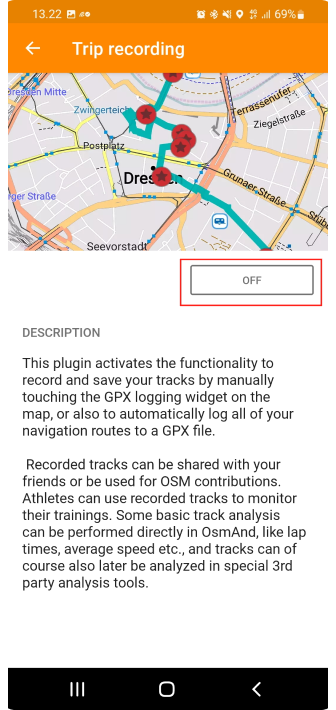| | 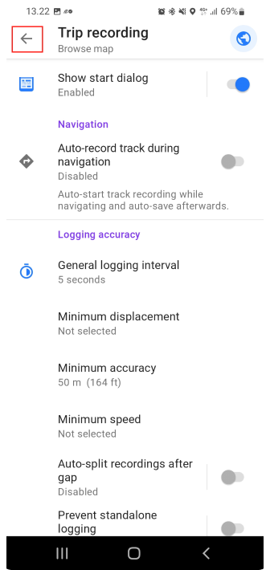|

Once the Plugin is enabled there is a new item in the _Settings_ menu:

|    |     |
|----|-----|
||| 

Click the _Start_ button and once you have done recording select _Save_ from the notification bar. You can view the recorded route on the map by selecting _Show_ on the map and opening a track.

|     |     |
|-----|-----|
| | 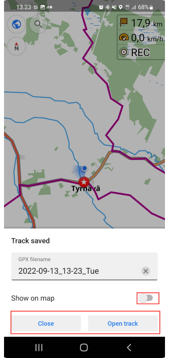|

### Change basemap

You might prefer another [_Basemap_](https://osmand.net/docs/user/map/raster-maps#main) than the default OsmAnd one. You can change suitable maps from settings. Select Install more to easily install new maps or select _Add_ if you have a specific source for maps.

:::note
1. You need to activate the [_Online maps_ plugin](https://osmand.net/docs/user/plugins/online-map).
2. Read more about additional map sources [here](https://osmand.net/blog/raster-maps).
:::

|     |     |     |     |
|-----|-----|-----|-----|
|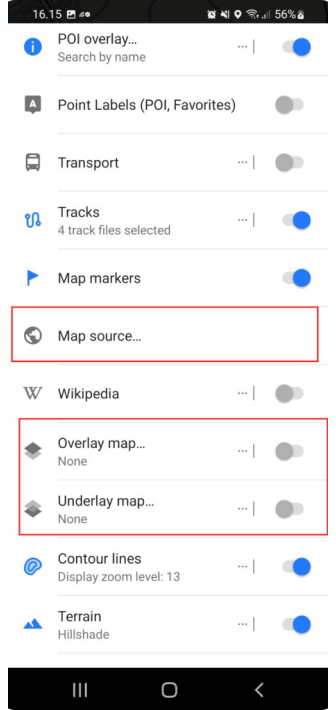|| | |

It is also possible to set any map as [_Underlay_](https://docs.osmand.net/docs/user/map/raster-maps/#underlay-layer) or [_Overlay_](https://docs.osmand.net/docs/user/map/raster-maps/#overlay-layer) map. This allows you to mix good sides in several maps. I recommend playing with these settings to find exactly the right settings for you. Usually, default is good enough.

### Removing automatic centering 

[Automatic centering](https://docs.osmand.net/docs/user/navigation/guidance/navigation-settings#map-during-navigation) is good to have, but once I purchased [Silverfox bluetooth controller](https://www.silverfoxcontrollers.com/) I disabled this feature. While I use a controller I don’t want the screen to center itself when I look at possible routes ahead. I was using a default timer that was 15 sec for automatic centering. That can be changed from the same place if you don’t want to disable the whole feature.

So how to do it? Click the menu open and follow the screenshot guidance, notice that this is a profile-based setting so you can enable it for driving mode and disable it from Motorbike profiles.

|    |    |    |
|----|-----|-----|
|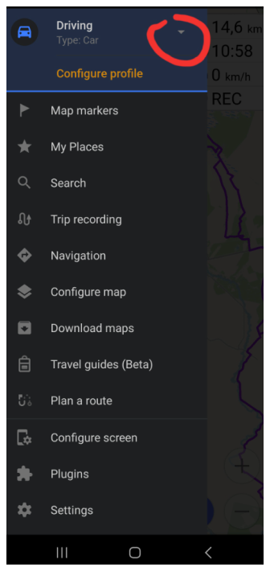|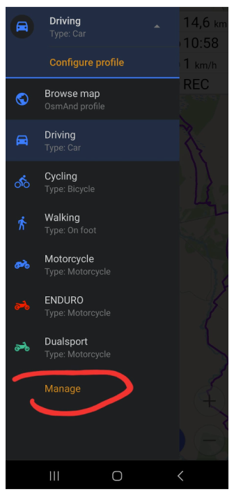| |

|    |    |    |
|----|-----|-----|
||| |

### How soon application should reroute

Many might have noticed that if you follow TET route it is not following roads as it is just a track that should be followed without road navigation. Anyway, I like to see where to turn next so I use navigation in TET tracks. Sometimes OsmAnd wants to start recalculating the route if the actual Line goes too far away from a road that you should ride.

Here we have one example inside of the red box When you follow the road, but the line that you navigate goes away from the road OsmAnd might want to recalculate a new route to get back to where you dropped from the line. This causes quite unneeded updates in UI and if you have navigation commands on to helmet headset you might also get recalculated audio information.

So to avoid this it is good to add more flex when OsmAnd is thinking that you are in the wrong place.

| |
|----|
|| 

You can modify [route recalculation settings](https://osmand.net/docs/user/navigation/guidance/navigation-settings#recalculate-route) under Profile. Once again it is a profile that specifies how OsmAnd works. So you can have different settings when you go with a car and different when motorbiking. I have used 500m to trigger a recalculation, but you can check what works for you. It is also possible to disable the whole recalculation from the same place, but I like to keep it on.

|    |    |    |
|----|-----|-----|
||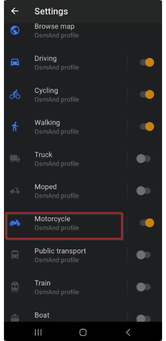| |

|    |    |    |
|----|-----|-----|
||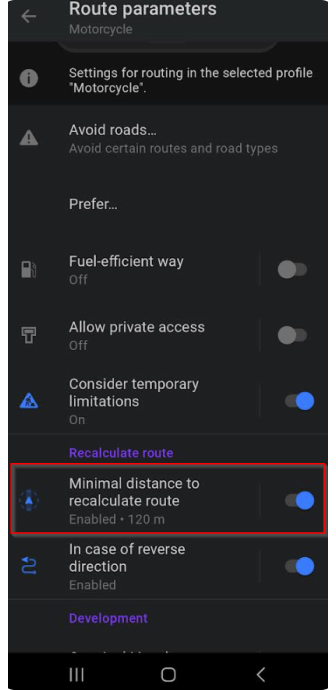| 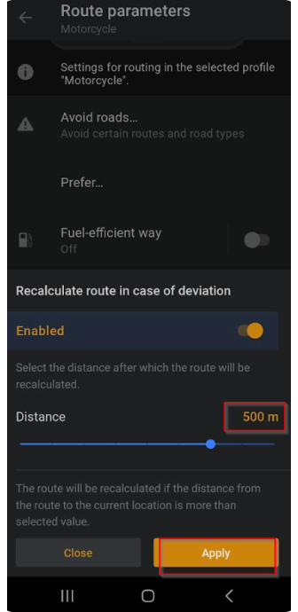|

### Web Planner
OsmAnd has also launched a web planner that can be found at [www.osmand.net/map](https://osmand.net/map) to get all out of it, [Pro subscription](https://osmand.net/docs/user/purchases/) is needed, but Basic is works with a free account too. This is still quite simple, but hopefully, we see progress on this planner and the same filter (prefer gravel roads) to the web that we have on the mobile side.

### Custom map type

Outdoor explorer Plugin allows you to see road surface. Information is taken from openstreetmap so also contribution to it is pretty easy.

You can find this plugin and setup guide [here](https://github.com/cmoffroad/osmand-outdoor-explorer-plugin).

I noticed an issue when I was trying to use Samsung own “My files” application to open plugin file, but when I installed [total commander](https://play.google.com/store/apps/details?id=com.ghisler.android.TotalCommander) installation was OK.

:::note
Find more Custom map types in the [OsmAnd blog article](https://osmand.net/blog/rendering).

|    |    |
|----|-----|
|||

You can read and see my materials here:
**[Website](https://www.advseeker.fi/), [Facebook](https://www.facebook.com/advseeker.fi), [Instagram](https://www.instagram.com/advseeker.fi/), [Youtube channel](https://www.youtube.com/@advseeker)**.

________________________________

**We appreciate your interest in us and thank you for taking the time to read this article. Join us on social media to keep up to date with the latest news and share your experiences. Your opinion is important to us.**

<LinksSocial/>
<LinksTelegram/>
<AndroidStore/>