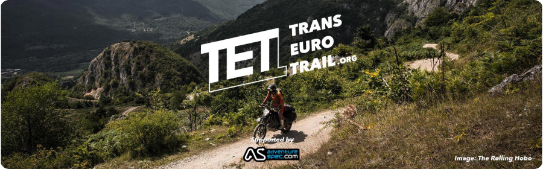
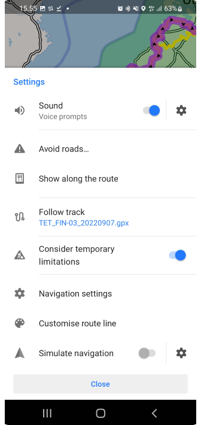
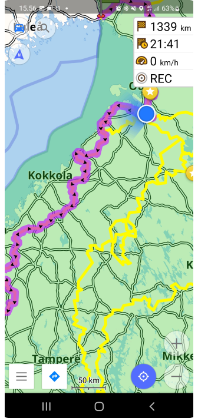
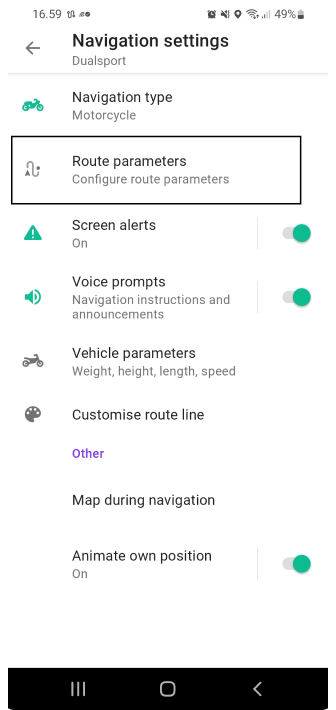
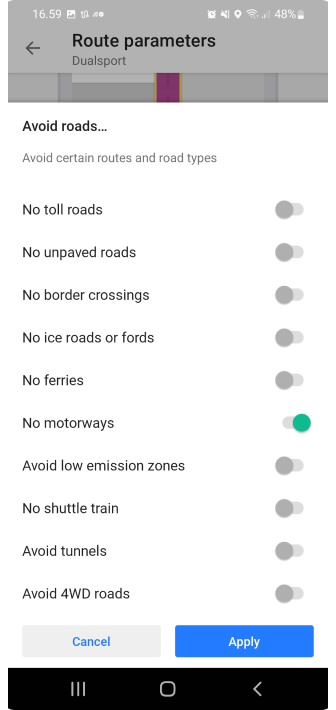
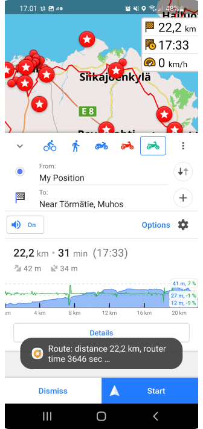

import Tabs from '@theme/Tabs';
import TabItem from '@theme/TabItem';
import AndroidStore from '@site/src/components/buttons/AndroidStore.mdx';
import AppleStore from '@site/src/components/buttons/AppleStore.mdx';
import LinksTelegram from '@site/src/components/_linksTelegram.mdx';
import LinksSocial from '@site/src/components/_linksSocialNetworks.mdx';
import Translate from '@site/src/components/Translate.js';
import InfoIncompleteArticle from '@site/src/components/_infoIncompleteArticle.mdx';
import ProFeature from '@site/src/components/buttons/ProFeature.mdx';

Hello, everyone!

We are glad to introduce you to the article from our Finnish advanced user Antti from [his blog](https://www.advseeker.fi/).

&#9755;  Let's go!

<!--truncate-->

* [What is TET route?](#tet)
* Import TET route
* Start navigation
* Creating profile for gravel roads
* Configure screen per profile
* Trip recording
* Change basemap
* Removing automatic centering
* How soon application should reroute
* Bonus: Install OsmAnd Outdoor Explorer Plugin

### TET

TET (Trans Euro Trail) is an 80.000km GPX route from the edge of Africa to the Artic Circle. Created by TET adventure motorcycle community.

Read more and find your route [here](https://transeurotrail.org/).

Join to Public group in [Facebook](https://www.facebook.com/groups/Transeurotrail.org).

### Import TET route

Often there is question where to get TET route. Only source for correct and valid GPX file that holds full route is [Trans Euro Trail own web page](https://transeurotrail.org/). Go there with your mobile and select country and hit Download gpx button and accept terms and rules. Once gpx file is downloaded open it and you should see OsmAnd as possible application to open file.

| Download TET route   | Open it by OsmAnd    | Import tracks screen in OsmAnd    |
|----|-----|-----|
||||

Once application is opened you will see information about gpx file. This gpx file was containing 13 separate tracks and you can choose what tracks are imported or all. Click Import 13/13 button to import selected tracks.

If tracks are not visible right away after import you need to make those visible from menu. Menu button is located it bottom left corner. Select Configure map and then Tracks. You will see all tracks that are available in application. Select the ones that you imported and press OK. Now you can see that Tracks count is updated and when you press back button you will see routes in map.

| |    |    |  |  |
|----|-----|-----|-----|------|
||| | | |

### Start navigation

Navigation is started by clicking the track that you want to follow. Once you click track menu will open that tells basic information about track like name and distance etc.

There are 4 main buttons that are from left to right: Hide track from map, Change colors, Edit track, Navigate. Click Navigate button. You will see direction of route in next screen.

| Tap on a track  | Follow track   |
|----|-----|
|||

Quite often you might need to change direction if you are in not located in place where the track starts. This can be done by pressing options (gear icon top of Start button).

Then select follow track and click Reverse track direction. Then click close. Now you can see that track arrows are pointing other direction.

| |    |    |  |
|----|-----|-----|-----|
||| | | 

Now we can start navigation by pressing start button.

|  |   |
|----|-----|
|||

### Creating for gravel roads

OsmAnd is only application that allows you to create profile that will route you trough gravel roads always when possible. This will give great twist for planning trips. Just click the location on the map and then select navigate then app will do the rest.

So how to do that? hit the menu and select settings.

1. Scroll page down
2. New profile.
3. Base profile is Motorcycle, Give new name for Profile. Select colour and icon press save.

|   |    |    |
|----|-----|-----|
||| |

Now we have new profile, but we need to edit it to meet our expectations. This tutorial expects that you want to drive gravel roads. But you can modify all settings as you want.

Click navigation settings and then route parameters.

| |    |    |  |  |
|----|-----|-----|-----|------|
||| | | |

Remove Fastest route setting so application routes you alternative routes. We want to avoid motorways but other roads are ok. Then we want to prefer unpaved roads so we turn that on.

Then press back so you go back to map. Now you can click top left corner where is profile icon. Select newly created profile. You can see what tracks are visible etc. When you go to map and click some place in map and then press navigate it will follow your new profile settings and creates route with given parameters.

| |    |    |  |  |
|----|-----|-----|-----|------|
||| | | |

### Configure screen per profile

