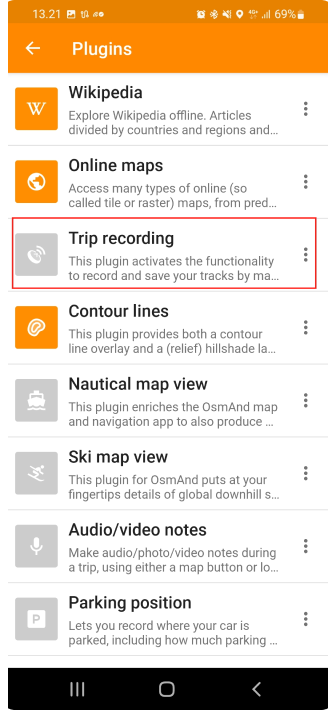
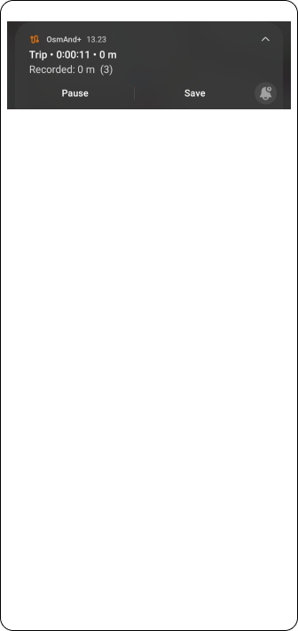

import Tabs from '@theme/Tabs';
import TabItem from '@theme/TabItem';
import AndroidStore from '@site/src/components/buttons/AndroidStore.mdx';
import AppleStore from '@site/src/components/buttons/AppleStore.mdx';
import LinksTelegram from '@site/src/components/_linksTelegram.mdx';
import LinksSocial from '@site/src/components/_linksSocialNetworks.mdx';
import Translate from '@site/src/components/Translate.js';
import InfoIncompleteArticle from '@site/src/components/_infoIncompleteArticle.mdx';
import ProFeature from '@site/src/components/buttons/ProFeature.mdx';

Hello, everyone!

We are glad to introduce you to the article from our Finnish advanced user Antti from [his blog](https://www.advseeker.fi/).

&#9755;  Let's go!

<!--truncate-->

* [What is TET route?](#tet)
* Import TET route
* Start navigation
* Creating profile for gravel roads
* Configure screen per profile
* Trip recording
* Change basemap
* Removing automatic centering
* How soon application should reroute
* Bonus: Install OsmAnd Outdoor Explorer Plugin

### TET

TET (Trans Euro Trail) is an 80.000km GPX route from the edge of Africa to the Artic Circle. Created by TET adventure motorcycle community.

Read more and find your route [here](https://transeurotrail.org/).

Join to Public group in [Facebook](https://www.facebook.com/groups/Transeurotrail.org).

### Import TET route

Often there is question where to get TET route. Only source for correct and valid GPX file that holds full route is [Trans Euro Trail own web page](https://transeurotrail.org/). Go there with your mobile and select country and hit Download gpx button and accept terms and rules. Once gpx file is downloaded open it and you should see OsmAnd as possible application to open file.

| Download TET route   | Open it by OsmAnd    | Import tracks screen in OsmAnd    |
|----|-----|-----|
||||

Once application is opened you will see information about gpx file. This gpx file was containing 13 separate tracks and you can choose what tracks are imported or all. Click Import 13/13 button to import selected tracks.

If tracks are not visible right away after import you need to make those visible from menu. Menu button is located it bottom left corner. Select Configure map and then Tracks. You will see all tracks that are available in application. Select the ones that you imported and press OK. Now you can see that Tracks count is updated and when you press back button you will see routes in map.

| |    |    |  |  |
|----|-----|-----|-----|------|
||| | | |

### Start navigation

Navigation is started by clicking the track that you want to follow. Once you click track menu will open that tells basic information about track like name and distance etc.

There are 4 main buttons that are from left to right: Hide track from map, Change colors, Edit track, Navigate. Click Navigate button. You will see direction of route in next screen.

| Tap on a track  | Follow track   |
|----|-----|
|||

Quite often you might need to change direction if you are in not located in place where the track starts. This can be done by pressing options (gear icon top of Start button).

Then select follow track and click Reverse track direction. Then click close. Now you can see that track arrows are pointing other direction.

| |    |    |  |
|----|-----|-----|-----|
||| | | 

Now we can start navigation by pressing start button.

|  |   |
|----|-----|
|||

### Creating for gravel roads

OsmAnd is only application that allows you to create profile that will route you trough gravel roads always when possible. This will give great twist for planning trips. Just click the location on the map and then select navigate then app will do the rest.

So how to do that? hit the menu and select settings.

1. Scroll page down
2. New profile.
3. Base profile is Motorcycle, Give new name for Profile. Select colour and icon press save.

|   |    |    |
|----|-----|-----|
||| |

Now we have new profile, but we need to edit it to meet our expectations. This tutorial expects that you want to drive gravel roads. But you can modify all settings as you want.

Click navigation settings and then route parameters.

| |    |    |  |  |
|----|-----|-----|-----|------|
||| | | |

Remove Fastest route setting so application routes you alternative routes. We want to avoid motorways but other roads are ok. Then we want to prefer unpaved roads so we turn that on.

Then press back so you go back to map. Now you can click top left corner where is profile icon. Select newly created profile. You can see what tracks are visible etc. When you go to map and click some place in map and then press navigate it will follow your new profile settings and creates route with given parameters.

| |    |    |  |  |
|----|-----|-----|-----|------|
||| | | |

### Configure screen per profile

One important thing between profiles is that you can easily change what you wan to see in map. It might vary that if you ride bigger roads you might want to see speed limit indicator and you might want to see your current speed etc, When you are off roading it might not bee so relevant information. Lets say we want to remove speed information from screen for this Dualsport profile.

So Lets do following:
1. go to Menu
2. Click settings
3. Click the profile that you want to edit
4. Click Configure screen

| |    |    |
|----|-----|-----|
||| |

:::note
I also wanted to highlight Configure map if you want to use different map for this profile than what other profiles are using it can be done from there.
:::

Now we can see that there are several panels where we have different type of widgets. As Current speed was in right panel lets click it. Now we can see all widgets that are set for right panel. Order can be changed and more can be added by clicking Edit button in bottom of page. If we just want to remove one widget you can press it and then select Remove from widget information page.

| |    |    |
|----|-----|-----|
||| |

One thing that I want to Highlight is Compass. I had problem that map was not pointing up when I was navigating and I didn’t see compass button. Or sometimes I was able to see it and then it get lost and I could not understand what was the issue. So I recommend that Compass is set always visible so you can easily select how you want your map behave while navigating.

| |    |
|----|-----|
|||

After changes go back to map and speed display has disappeared and if you take another profile it is visible there. So profiles are pretty powerful tool to use OsmAnd for all kind of purposes.

### Trip recording

Trip recording in OsmAnd is not activated by default. Feature is available under plugins menu.

| |    |    |  |  |
|----|-----|-----|-----|------|
||| | | |

Once plugin is enabled there is new item in settings menu:

| |    |    |  |
|----|-----|-----|-----|
||| | |

Click Start button and once you have done recording select save from notification bar. You can view recorded route in map by selecting show on map and open track.

### Change basemap

You might prefer other basemap than default osmAnd one. You can change suitable map from settings. Select Install more to easily install new maps or select Add if you have specific source for maps.

| |    |    |  |
|----|-----|-----|-----|
||| | |

It is also possible to set any map as underlay or overlay map. This allows you to mix good sides in several maps. I recommend to play with these settings to find exactly right settings for you. Usually default is good enough.

### Removing automatic centering 

Automatic centering is good to have, but once I purchased Silverfox bluetooth controller I have disabled this feature. While I use controller I don’t want screen to center itself when I look possible routes ahead. I was using default timer that was 15 sec for automatic centering. That can be changed from same place if you don’t want to disable whole feature.

So how to do it? Click menu open and follow screenshot guidance, notice that this is profile based setting so you can enable it for driving mode and disable from Motorbike profiles.

|    |    |    |
|----|-----|-----|
||| |

|    |    |    |
|----|-----|-----|
||| |

### How soon application should reroute

Many might have noticed that if you follow TET route it is not following roads as it is just a track that should be followed without road navigation. Anyway I like to see where to turn next so I use navigation in TET tracks. Some times OsmAnd wants to start recalculating route if actual Line goes too far away from road that you should ride.

Here we have one example inside of red box When you follow road, but line that you navigate goes away from road OsmAnd might want to recalculate new route to get back to where you dropped from line. This causes quite unneeded updates in UI and if you have navigation commands on to helmet headset you might also get recalculate audio information. 

So to avoid this it is good to add more flex when OsmAnd is thinking that you are in wrong place.

| |
|----|
|| 

You can modify route recalculation settings under profile. Once again it is profile that specifies how OsmAnd works. So you can have different settings when you go with car and different when motorbiking. I have used 500m to trigger recalculation, but you can check what works for you. It is also possible to disable whole recalculation from same place, but I like to keep it on.

|    |    |    |
|----|-----|-----|
||| |

|    |    |    |
|----|-----|-----|
||| |

### Web Planner

Osmand has also launched web planner that can be found from [www.osmand.net/map](https://osmand.net/map) to get all out of it, pro subscription is needed, but basic are working with free account too. This is still quite simply, but hopefully we see progress on this planner and same filter (prefer gravel roads) to web too what we have in mobile side.

### Bonus: Install OsmAnd Outdoor Explorer Plugin

Outdoor explorer Plugin allows you to see road surface. Information is taken from open street map so also contribution to it is pretty easy.

You can find this plugin and setup guide from here: https://github.com/cmoffroad/osmand-outdoor-explorer-plugin

I noticed issue when I was trying to use Samsung own “My files” application to open plugin file, but when I installed total commander installation was ok.

|    |    |
|----|-----|
|||

Did I miss something? Let me know and I will add it here!