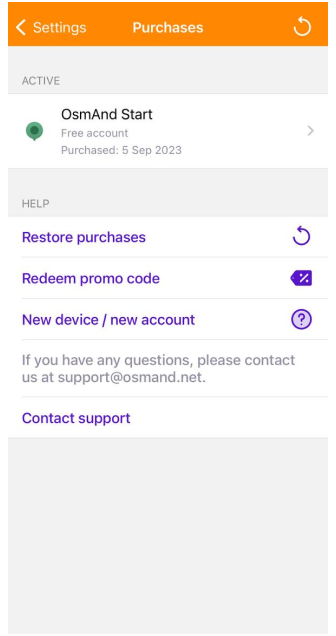
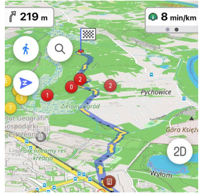

import Tabs from '@theme/Tabs';
import TabItem from '@theme/TabItem';
import AndroidStore from '@site/src/components/buttons/AndroidStore.mdx';
import AppleStore from '@site/src/components/buttons/AppleStore.mdx';
import LinksTelegram from '@site/src/components/_linksTelegram.mdx';
import LinksSocial from '@site/src/components/_linksSocialNetworks.mdx';
import Translate from '@site/src/components/Translate.js';
import InfoIncompleteArticle from '@site/src/components/_infoIncompleteArticle.mdx';
import ProFeature from '@site/src/components/buttons/ProFeature.mdx';

Hello, everyone!

We are pleased to announce the release of a new version of [OsmAnd for iOS](https://itunes.apple.com/us/app/osmand-maps-travel-navigate/id934850257).

<!--truncate-->

**What's new**

* Free backup of favourites, settings and OSM edits to OsmAnd Cloud
* Redesigned topography menus and added New Relief format
  * Contour lines plugin renamed to Topography
  * Added support for the new Terrain map format
  * Added 3D Relief 
  * Added separate button to switch 2D/3D Mode
  * Changed direction of titlt gesture
* Redesigned Configure Screen
* Completely redesigned widget experience:
  * added ability to change widget position
  * added grouping by pages
  * one list of widgets for left and right panel
* Difficulty classification - Configure Map
* Added OpenStreetMap authorization through OAuth 
* Added "CAI" scale for "Difficulty classification of the routes"
* Fixed issue with favorites export, that could lead to data loss

### OsmAnd Start

For OsmAnd 4.5 was added [OsmAnd Start](./start) plan. A user should register an email for the [OsmAnd Cloud](https://osmand.net/docs/user/personal/osmand-cloud) and then activate _OsmAnd Start_.

_OsmAnd Menu → Settings → OsmAnd Cloud_

After that, you can [backup](https://osmand.net/docs/user/personal/osmand-cloud#select-data-to-back-up) your [Profiles](https://osmand.net/docs/user/personal/profiles), [favorites](https://osmand.net/docs/user/personal/favorites), [OSM Edits and Notes](https://osmand.net/docs/user/plugins/osm-editing#create--modify-osm-note), and [OsmAnd settings](https://osmand.net/docs/user/personal/profiles) for free.

Size of OsmAnd Free Cloud - 5 MB

|Purchases menu|Back up data menu|
|-------|-------|
||    |

Read more about OsmAnd Start in [our article](https://osmand.net/blog/start) for OsmAnd Start in OsmAnd.

### Topography and 3D Relief

We have added _Terrain map_ for countries in [Download maps](https://osmand.net/docs/user/start-with/download-maps) menu. This data type can be used to generate [Slopes, Hillshades (paid)](https://osmand.net/docs/user/purchases/android#free-and-paid-features), and 3D maps ([OsmAnd Pro](https://osmand.net/docs/user/purchases/android#pro-features)).

Our updates:
- Renamed _Contour lines_ plugin to [_Topography_](https://osmand.net/docs/user/plugins/contour-lines) plugin.
- Added support for the new [_Terrain map (3D)_](https://osmand.net/docs/user/personal/maps#map-types) forma (it's a paid function). This map data is used for generated Slopes/Hillshades, 3D map view. Read more [here](https://osmand.net/blog/terrain#terrain-map-data).
- Now, [Slope](https://osmand.net/docs/user/plugins/contour-lines#slope-map) and [Hillshades](https://osmand.net/docs/user/plugins/contour-lines#hillshade-map) are [generated from _Terrain map (3D)_ data](https://osmand.net/blog/terrain#terrain).
- Added _3D Relief_(Paid function) for the map. Read more [here](https://osmand.net/blog/terrain#3d-relief): _Menu → Configure map → Terrain → 3D Relief_.
- Redesigned [_Topography menu_](https://osmand.net/docs/user/map/configure-map-menu): _OsmAnd menu → Configure map → Topography: Contour lines, Terrain, Nautical depth_
- The new "3D/2D Mode" button for the map screen was added. Now you can make a map tilt not only with [two fingers](https://osmand.net/docs/user/map/interact-with-map#gestures). "3D/2D Mode" button acts differently with menus and on map screens if _3D Mode_ in Configure Screen is set to Visible in 3D Mode.
_OsmAnd Menu → Configure Screen → Buttons → 3D Mode_:
  - Hidden
  - Visible
  - Visible in 3D mode
- Changed direction of titlt gesture

  ** **map tilt angle by button is the last tilt angle by two-finger gestures**

Read more about Terrain maps in our [Blog article](https://osmand.net/blog/terrain).

| Slope | 3D relief|
|------|------|
|||

### New Configure Screen

Configure Screen menu was devided on Two sections: _Widgets_ and _Buttons_

- On [_Widgets_](https://osmand.net/docs/user/widgets/configure-screen#widget-panels) section, you can add or remove widgets on a screen device and switch on/off _Transparent_ function for them. Read more about new widget updates [on this article](#widget-updates).
- On [_Buttons_](https://osmand.net/docs/user/widgets/configure-screen#buttons) section, you add on a device screen and set parameters for Compass, Quick Action, 3D mode buttons  and switch on/off _Distance by tap_ function.

|Configure screen menu| Widgets and buttons on a screen|
|------|------|
|| |

### Widget updates

We've done a lot of work on the widgets and interface of [the Configure screen](#new-configure-screen):
- We redesigned the Configure screen, separating the widgets from the buttons, and spacing the different widget panels more clearly.
- Added pages for widgets.
- Duplicates.
- Combined the widgets from the left, right, top and bottom panels.

#### Pages and Duplicates for widgets 

Widgets in the _Left_ panel and _Right_ panel can be grouped into Pages.

You can show Duplicates for the right/left panels at the same time, as well as for each page of widgets.

_OsmAnd menu → Configure screen → Widgets (Left / Right panel) → Edit → Add widget/Add page_

|Configure screen menu| Widgets and buttons on a screen|
|------|------|
|| |

Additional settings menu for widget panels:

_OsmAnd menu → Configure screen → Widgets (panels) → "..." button → Reset to default/Copy from another profile/Help_

#### Average speed widget

The new Average speed widget shows the average speed of the current ride:

_Menu → Configure screen → Widgets → Left / Right panel → Average speed_

The average speed is calculated for the specified time interval. Click on the "Average speed" button to select the time interval for which the average speed will be measured:

_Menu → Configure screen → Widgets → Left / Right panel → Average speed → Interval/Take stops into account_

#### True bearing widget

Added new widgets for "Bearing". Bearing now has 3 separate widgets:

_Menu → Configure screen → Widgets → Left / Right panel → Bearing_

* **Relative bearing** is the angle between your forward movement direction and the target point.
* **Magnetic bearing** is the clockwise (horizontal) angle between the magnetic north and the target point observed from your location.
* **True bearing** is expressed as the horizontal angle between the geographic meridian and a line on Earth. Specifically, true point bearing is the angle measured in degrees clockwise from the True North line.

### Updates for Configure Map 

Added [CAI (Club Alpino Italiano)](https://www.cai.it/) scale for routes [difficulty classification](https://montanarilife.com/2016/07/03/hiking-trail-rating-systems-italy/):

_OsmAnd Menu → Configure map → Routes → Difficulty classification_

### OSM authorization through OAuth

Read more about Login settings [here](https://osmand.net/docs/user/plugins/osm-editing#settings).

### More

- Fixed issue with favorites export, that could lead to data loss
- Added "Announce deviation from the route" for [Voice prompts](https://osmand.net/docs/user/navigation/guidance/navigation-settings#voice-prompts)
_________________________________________________

<LinksSocial/>
<LinksTelegram/>
<AppleStore/>