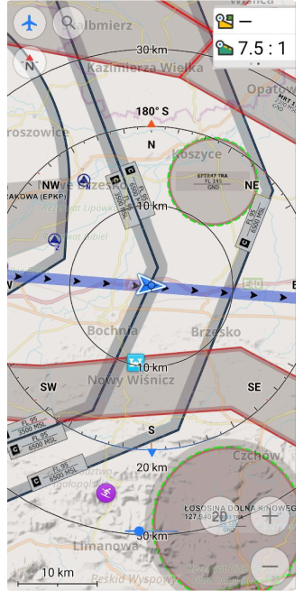
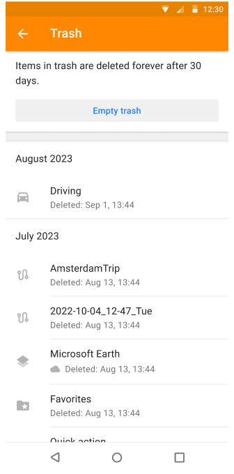
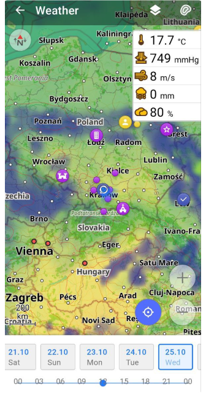

import Tabs from '@theme/Tabs';
import TabItem from '@theme/TabItem';
import AndroidStore from '@site/src/components/buttons/AndroidStore.mdx';
import AppleStore from '@site/src/components/buttons/AppleStore.mdx';
import LinksTelegram from '@site/src/components/_linksTelegram.mdx';
import LinksSocial from '@site/src/components/_linksSocialNetworks.mdx';
import Translate from '@site/src/components/Translate.js';
import InfoIncompleteArticle from '@site/src/components/_infoIncompleteArticle.mdx';
import ProFeature from '@site/src/components/buttons/ProFeature.mdx';
import InfoAndroidOnly from '@site/src/components/_infoAndroidOnly.mdx';

Good news, everybody!  
Version 4.6 of the OsmAnd program for Android devices has undergone revolutionary changes. Go and read what has been added and improved.  

<!--truncate-->

- [Updates for widgets](#widgets-update):
   - Updates for [Top/Bottom panels](#updates-for-topbottom-panels) in the Configure screen menu.
   - Added [Glide Ratio](#added-glide-ratio-widgets) Widget.
   - Added [Temperature widget](#added-temperature-widget) for External sensors.
- New [Local tab](#redesigned-local-menu) in Maps & Resources menu.
- New feature [Smart Folder](#smart-folders) in Tracks menu.
- [Filters](#filters-for-tracks) for Tracks search.
- Added [Custom Quick Action](#custom-quick-action-buttons) buttons.
- Adding a [screen Trash](#trash-feature-in-osmand-cloud) to view and manage files deleted from OsmAnd Cloud.
- New [Help screen](#new-help-screen) with offline support.
- [Redesigned Weather screen](#redesign-weather-screen).
- Added share [point coordinates](#share-point-coordinates-by-an-osm-link) by OSM link.
- [Custom actions](#custom-actions-for-buttons-of-external-controllers) for buttons of external controllers.
- Update for [Plan a route](#update-plan-a-route).
- [More](#more) updates for the release.

## Widgets update

We've done a lot work on the widgets and it interface.

### Updates for Top/Bottom panels

1. Added ability to add/remove rows for top/bottom panel: 

_OsmAnd menu → Configure screen → [Widgets (Top / Bottom panel)](https://osmand.net/docs/user/widgets/configure-screen#top--bottom-panel-widgets) → Edit → Add row_

| View mode  | Edit mode   |
|-----|------|
| |

2. Added support 3 size simple widgets: L / M / S.
 
There is ability to add more then one widget in a row.

|  |   |
|-----|------|
| |

### Added Glide Ratio Widgets

Simple _[Glide Ration](https://en.wikipedia.org/wiki/Lift-to-drag_ratio#Glide_ratio)_ widgets were added for Aircraft usage. Widgets show the glide ration to the target or avearge glide for the current trip:

 _OsmAnd menu → Configure screen → Widgets (Left / Right panel) → [Glide ratio to target](https://osmand.net/docs/user/widgets/info-widgets/#glide-ratio)_ and [_Average glide ratio_](https://osmand.net/docs/user/widgets/info-widgets/#glide-ratio)

- _Glide ratio to target_ shows the glide ration needed to reach the target point (You need to use [Map marker](https://osmand.net/docs/user/personal/markers) as a target point).
- _Average glide ratio_ shows the average glide ratio for the set interval. For this widget you can specify the time interval for glide averaging.

|Glide ration widgets| Widgets on the screen|
|--------|---------|
|||

### Added Temperature widget

We added the new external widget ([External sensor plugin](https://osmand.net/docs/user/plugins/external-sensors/#overview)) which show the tempetarute sensor data. Read more how to connect a sensor to OsmAnd [here](https://osmand.net/docs/user/plugins/external-sensors/#setup).

Next you need [to add the temperature widget](https://osmand.net/docs/user/widgets/configure-screen/#right--left-panel-widgets) to the OsmAnd screen:

_Menu → Configure screen → [Left panel /Right panel](https://osmand.net/docs/user/widgets/configure-screen/#right--left-panel-widgets) → External sensors → Temperature_

|   |   |
|--------|---------|
|||

## Redesigned "Local" menu

_Local menu_ contains more info about OsmAnd data:
_Menu → Download maps (Maps & Resources) → Local_. 

- _Resources_: Standart Maps; Terrain maps; Wikipedia and Travel maps; Nautical Maps; Weather; Map sources; Rendering styles; Routing; Cache.
- _My Places_: Favorites; Tracks; OSM Notes; OSM Edits; A/V Notes; Map markers; History; Itinerary.
- _Settings_: Profiles; Other.

| Resources  | My places  |  Settings   |
|--------|---------|---------|
||||

You can choose each item subcategories for opening subcategories screen and it options:

| Terrain maps  | Tracks  |
|--------|---------|
|||

## Smart folders

Smart Folders allow you to specify a set of criteria for GPX tracks to be contained in the folder, to make keeping way of files even easier:

_OsmAnd menu → My Places → Tracks → &#8942; → Add smart folder_

| Tracks menu  | Settings  |
|--------|---------|
|||

Now, you can add filters for Smart folders.

## Filters for tracks

Filters for tracks can be used for tracks Search function and for Smart folders.

_OsmAnd menu → My Places → Tracks → 🔍 → Filter_

_OsmAnd menu → My Places → Smart folder → Filter_

**Filters**: _Duration, Time in motion, Length, Average speed, Uphill, Downhill, Average altitude, Max altitude, Date of creation, Nearest cities, Other_.

| Search menu | Filter menu |
|--------|---------|
|||

## Custom Quick Action buttons

_OsmAnd menu → Configure screen → Buttons → Custom buttons_

- Added custom quick action buttons to the screen.

- Allow to change appearance for buttons: icon/shape/color. 

- Allow to change appearance for all buttons on the map screen.

At this moment all Default buttons:  _Configure map, Search, Compass, Menu, Navigation, 3D Mode, My location, Zoom in / out_

- Allow to move any button on the map 

- Allow to hide any button from the map

## Trash feature in OsmAnd Cloud

Trash feature was added for OsmAnd Cloud:

_OsmAnd menu → Settings → OsmAnd Cloud → Trash_

_Trash_ is the screen to view and manage files deleted from OsmAnd Cloud.

_Empty trash_ button deletes all items. 

:::note
Items in trash will be erased after 30 days.
:::

| OsmAnd Cloud menu| Trash menu|
|-------|-------|
|||

Each item from _Trash_ can be _Restore_ or _Delete_. 

| Item's acitons|
|-------|
||

## New help screen

We redesigned _Help_ menu with added articles from [www.osmand.net/docs](https://osmand.net/docs/intro/) with next menu sections and offline (saved to cache) new documentation:

_Most viewed_, [_User guide_](https://osmand.net/docs/user/), [_Troubleshooting_](https://osmand.net/docs/user/troubleshooting/), _Contact us_, _Report issues_, _About OsmAnd_.

| | |
|-------|-------|
|||

## Redesign weather screen

Added the convenient time scale.

| |
|-------|
||

## Share point coordinates by an OSM link

Now in the Context menu of a point, you can find not only geographical coordinates in various formats, but also a shareable [OpenStreetMap Link with location marker](https://wiki.openstreetmap.org/wiki/Browsing#Adding_a_Marker).  

| | |
|-------|-------|
| ||

## Custom actions for buttons of external controllers

Now, you can create your custom buttoons for [external controllers](https://osmand.net/docs/user/map/interact-with-map#external-input-device-buttons).

Menu → Settings → Profiles → General settings → External input devices

Choose your external input devices (Keyboard, for example) and make Key bindings.

| Add new type| Add key binding|
|-------|-------|
| ||

Actions and Map iteracions for Key bindings

| Key bindings|
|-------|
| |

## Update Plan a route

Added "Import from track" function allows to import to current track from another existing trask (waypoints, segments, all data) 

_[Plan a route](https://osmand.net/docs/user/plan-route/create-route) →  Options → Import from track_

| Options menu|
|-------|
| |

## More

- Improved memory management for large GPX tracks
- Shutdown [OpenPlaceRevies project](https://osmand.net/docs/user/plugins/openplacereviews)
- Updated Search screen for Android Auto
- Fixed map freezes for Android Auto
- Renamed _Terrain_ to [_Topography_](https://osmand.net/docs/user/plugins/contour-lines#configure-map-view) menu
- _Select all_ / _Deselect all_ actions for [Track menu](https://osmand.net/docs/user/personal/tracks#my-places-menu)
- Fixed _North fixed_ mode for [Compass](https://osmand.net/docs/user/map/interact-with-map#map-orientation-modes)
- Added widget _Available RAM_ for [OsmAnd Development plugin](https://osmand.net/docs/user/plugins/development)
- Added paragliding / baby carriage / stroller / buggy [icons](https://osmand.net/docs/user/personal/profiles#profile-appearance) for profiles
- Added [ANT+ temperature widget](https://osmand.net/docs/user/plugins/external-sensors) for Garmin tempe device
- [_"Destination is reached"_](https://osmand.net/docs/user/navigation/guidance/map-during-navigation), the location moves to map center

________________________________________

<LinksSocial/>
<LinksTelegram/>
<AndroidStore/>
