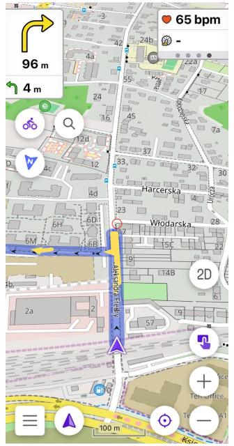
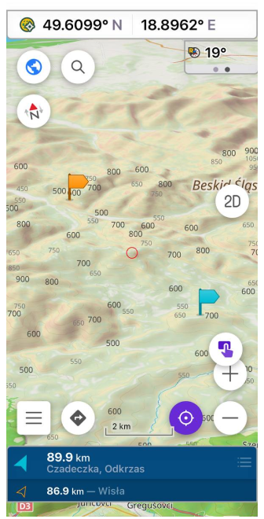
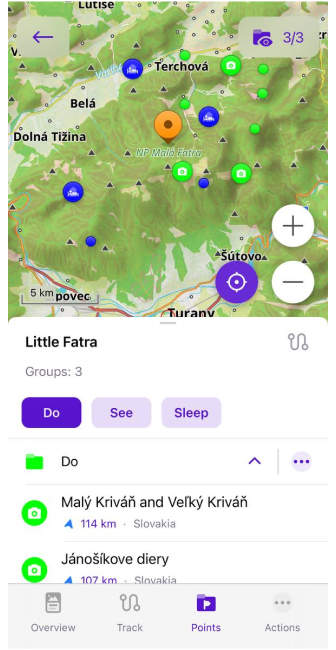

import Tabs from '@theme/Tabs';
import TabItem from '@theme/TabItem';
import AndroidStore from '@site/src/components/buttons/AndroidStore.mdx';
import AppleStore from '@site/src/components/buttons/AppleStore.mdx';
import LinksTelegram from '@site/src/components/_linksTelegram.mdx';
import LinksSocial from '@site/src/components/_linksSocialNetworks.mdx';
import Translate from '@site/src/components/Translate.js';
import InfoIncompleteArticle from '@site/src/components/_infoIncompleteArticle.mdx';
import ProFeature from '@site/src/components/buttons/ProFeature.mdx';

Hello, everyone!

We are pleased to announce the release of a new version of [OsmAnd for iOS](https://itunes.apple.com/us/app/osmand-maps-travel-navigate/id934850257).

<!--truncate-->

### What's new

- CarPlay dashboard support
- External sensors
- Trash for Cloud
- Simple widget for Top / Bottom panel
- Travel Guides
- Night theme
- Redesign OSM plugin for uploading POI/Note
- Add OSM link with pin into the Context menu

## CarPlay updates

- added dashboard support

- Fixed bugs

## External sensors

For this release [External BLE sensors](https://osmand.net/docs/user/plugins/external-sensors) were added for OsmAnd. 

Now you can add next external sensors to OsmAnd:

- **Heart Rate**. The heart rate sensor can transmit your heart rate in real time. This is useful for cycling training when you want to track your heart rate to optimize your training efforts.
- **Bicycle Power**. Your bike's power sensors measure the power you exert when you pedal. This allows you to analyze and optimize your workouts to improve efficiency and performance.
- **Bicycle Cadence**. Cadence is the number of pedal turns per minute. Cadence sensors help you maintain optimal pedaling speed for efficient cycling.
- **Bicycle Speed**. Speed sensors provide information about your current speed while cycling.
- **Bicycle Distance**. Distance sensors measure the distance you travel when you're driving.
- **Temperature**. The widget displays the ambient temperature, which can be very useful if you don't want to overheat or freeze on your bike or motorcycle.

|Sensor connection| Widget on the screen|
|-------|------|
|||

## Simple widget for Top / Bottom panel

Added _Coordinates_, _Lanes_, _Map markers bar_, _Street name_ widgets for Top and Bottom panels:

## Travel Guides

For this release we added [Wikivoyage Travel Guides](https://osmand.net/docs/user/plan-route/travel-guides). Now you can upload Wikivoyage points and articles for your trip on the OsmAnd map.

_OsmAnd Menu > Travel guides_

|Download menu| Articles list|
|-------|------|
|||

Now, you can add wikivoyage points on the map or find in om _My Places > Tracks > Travel_ menu

|Wikivoyage article| Points on the map|
|-------|------|
|||

## Night theme

Added night theme for all OsmAnd screens.

Changing appearance for OsmAnd is changing appearance for iOS system:

_iOS Settings > Display & Brightness > Light/Dark or Automatic_

|iOS settings screen| OsmAnd Configure map menu|
|----|----|
|||

## Redesign OSM plugin

Changed [POI/Note upload menu](https://osmand.net/docs/user/plugins/osm-editing#create--modify-poi).

## Share point coordinates by an OSM link

Now in [the Context menu](https://osmand.net/docs/user/map/map-context-menu#details) of a point, you can find not only geographical coordinates in various formats, but also a shareable OpenStreetMap Link with location marker.

