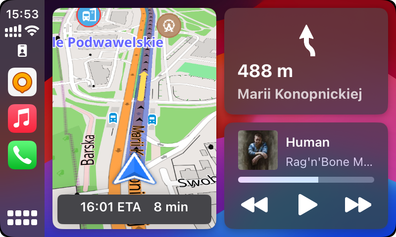
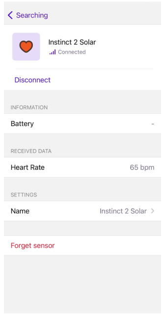
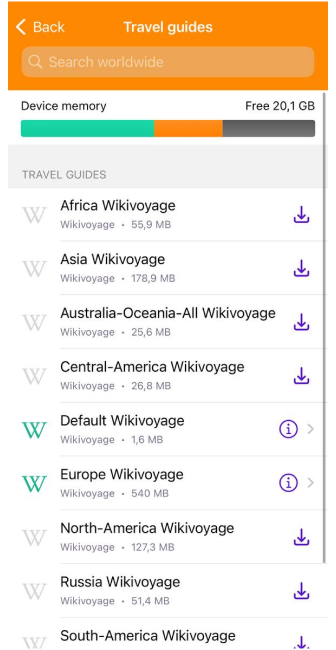
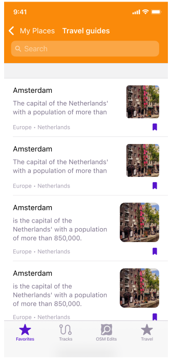
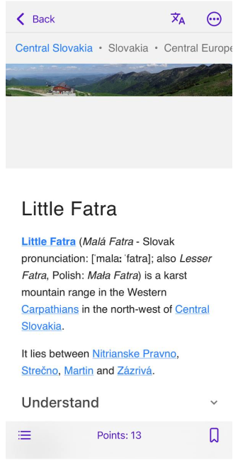
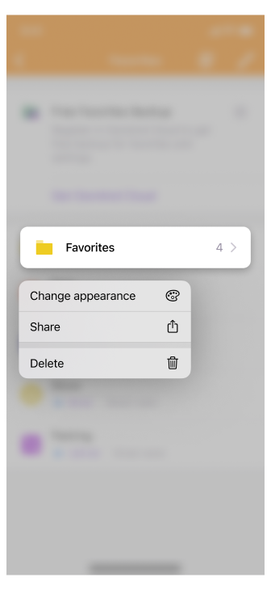
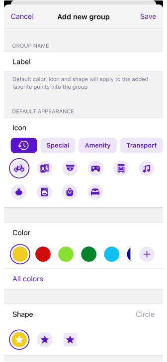
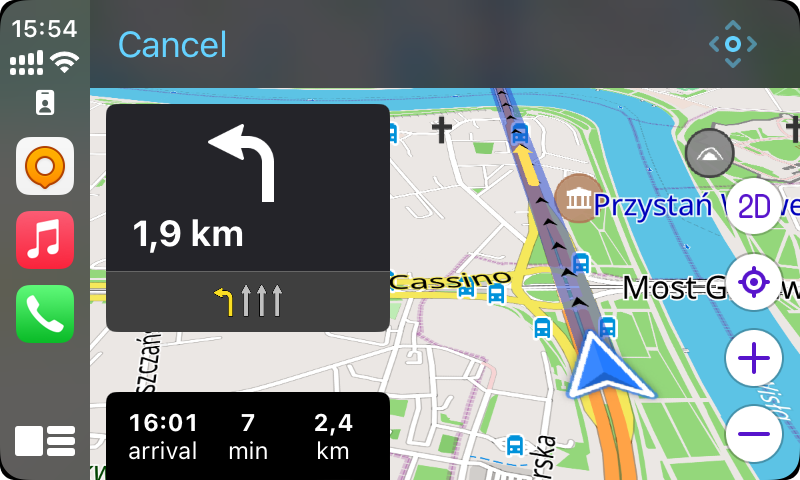

import Tabs from '@theme/Tabs';
import TabItem from '@theme/TabItem';
import AndroidStore from '@site/src/components/buttons/AndroidStore.mdx';
import AppleStore from '@site/src/components/buttons/AppleStore.mdx';
import LinksTelegram from '@site/src/components/_linksTelegram.mdx';
import LinksSocial from '@site/src/components/_linksSocialNetworks.mdx';
import Translate from '@site/src/components/Translate.js';
import InfoIncompleteArticle from '@site/src/components/_infoIncompleteArticle.mdx';
import ProFeature from '@site/src/components/buttons/ProFeature.mdx';

Hello, everyone!

We are pleased to announce the release of a 4.6 version of OsmAnd for iOS devices. [Update it at the AppStore.](https://itunes.apple.com/us/app/osmand-maps-travel-navigate/id934850257).

<!--truncate-->

### What's new

- [External sensors](#external-sensors)
- [Updates for Widgets](#widget-updates)
- [Wikivoyage Travel Guides](#travel-guides)
- [Default appearance for Favorites folder](#default-appearance-for-favorites-folder)
- [New help screen](#new-help-screen)
- [CarPlay dashboard support and 3D](#carplay-dashboard-support-and-3d)
- [Night theme](#night-theme)
- [More](#more)
  - New GPX slope palitra
  - Rename Route parameters
  - Additional info for navigation route
  - Share point coordinates by an OSM link
  - Redesign OSM Plugin
  - Bugs fixed

## External sensors

The release introduces support for [Bluetooth Low Energy (BLE) sensors](https://osmand.net/docs/user/plugins/external-sensors), providing compatibility for a range of external sensors such as speed, cadence, distance, temperature and pulse. This inclusion enhances the app’s capability to sync and display data from these external devices, catering to cycling enthusiasts and those using supplementary fitness equipment.   

|Sensor connection| Widget on the screen|
|-------|------|
|||
You can add the following external sensors to the OsmAnd application:
- **Heart Rate**. The heart rate sensor can transmit your heart rate in real time. This is useful for cycling training when you want to track your heart rate to optimize your training efforts.
- **Bicycle Cadence**. Cadence is the number of pedal turns per minute. Cadence sensors help you maintain optimal pedalling speed for efficient cycling.
- **Bicycle Speed**. Speed sensors provide information about your current speed while cycling.
- **Bicycle Distance**. Distance sensors measure the distance you travel when you're driving.
- **Temperature**. The widget displays the ambient temperature, which can be very useful if you don't want to overheat or freeze on your bike or motorcycle.

This data from external sensors can be added for a [recording track](https://osmand.net/docs/user/plugins/external-sensors/#trip-recording) or to the [Widget panel](https://osmand.net/docs/user/widgets/info-widgets/#external-sensors-widgets). This data you can see on [_Analyze Track on the map_](https://osmand.net/docs/user/map/tracks-on-map#analyze-track-on-map).

## Widget updates

### External sensors widgets

As we noted in [this article](#external-sensors) that external sensors were added. And now you can add [widgets of external sensors](https://osmand.net/docs/user/widgets/info-widgets/#external-sensors-widgets) to a device screen:

_Menu → Configure screen → Right/Left panel → Add widget → External sensors_

### Top / Bottom panels

Added [_Coordinates_](https://osmand.net/docs/user/widgets/info-widgets#coordinates-widget), [_Lanes_](https://osmand.net/docs/user/widgets/nav-widgets#lanes), [_Map markers bar_](https://osmand.net/docs/user/widgets/markers), [_Street name_](https://osmand.net/docs/user/widgets/nav-widgets#street-name) widgets for Top and Bottom panels:

## Travel Guides

For this release, we added [Wikivoyage Travel Guides](https://osmand.net/docs/user/plan-route/travel-guides). Now, you can upload Wikivoyage points and articles for your trip on the OsmAnd map.

*OsmAnd Menu → Travel guides*

|Download menu| Articles list|
|-------|------|
|||

Added Bookmarks for _Travel_ tab in _My Places menu_:

*OsmAnd Menu → My Places → Travel*

|Trabel tab| Bookmark|
|-------|------|
|||

You can add wikivoyage points on the map or find in om [_My Places > Tracks > Travel_](https://osmand.net/docs/user/personal/tracks/#my-places-menu) menu.

|Wikivoyage article| Points on the map|
|-------|------|
|||

## Default appearance for Favorites folder

- Added context menu for Favorites folders.
- Allow to set default appearance for Favorites folders.

|Context menu| Appearance menu|
|----|----|
|||

## New Help screen

This is an important new feature for users who often travel in regions with limited internet access. The application now has an offline (saved to cache) help screen that helps you solve questions and find information without a network connection.

_Menu → Help_

In addition, the _Help_ menu has been completely redesigned, adding articles from [www.osmand.net/docs](https://osmand.net/docs/intro) with additional menu sections:

_Most viewed, User guide, Troubleshooting, Contact us, Report issues, About OsmAnd_.

## CarPlay dashboard support and 3D

One of the additions in this update is the integration of the OsmAnd map into the CarPlay dashboard.  
- Added dashboard support.
- Added 3D button to the CarPlay screen.
- Fixed bugs.

|3D| Dashboard|
|----|----|
| | |

## Night theme

Added the night theme for all OsmAnd screens.
Changing appearance for OsmAnd is changing appearance for iOS system:

_iOS Settings > Display & Brightness > Light/Dark or Automatic_

|iOS settings screen| OsmAnd Configure map menu|
|----|----|
|||

## Share point coordinates by an OSM link

Now in [the Context menu](https://osmand.net/docs/user/map/map-context-menu/#coordinates) of a point, you can find not only geographical coordinates in various formats but also a shareable OpenStreetMap Link with a location marker.

## More

### GPX slope color

Palitra for Slope ([Track Appearance](https://osmand.net/docs/user/map/tracks-on-map#track-appearance)) is symmetric. The reasoning is that in plenty of use cases like hiking, biking, trail running, and skiing, descents are of equal significance than ascents, there is no reason to compress the color space of one vs. the other.

|Track Appearance menu| Track on the map|
|----|----|
|||

### Rename Route parameters

For [_Cycling_ and _On foot_](https://osmand.net/docs/user/navigation/routing/bicycle-based-routing#route-parameters---bicycle) routing we renamed "_Use elevation data_" to "_Preferred terrain_":
- _Menu → Configure profile (Boat, Driving, Walking or another one) → Navigation settings → Route parameters → Preferred terrain → Any, Flat, Less hilly, Hilly_
- _Navigation button → Settings → Preferred terrain → Any, Flat, Less hilly, Hilly_

### Info for navigaton route

Additional info was added for Navigaton screen:
- Altitude range (Max/Min altitude)
- [CO2 emission](https://osmand.net/docs/user/navigation/guidance/navigation-settings#fuel-used-by-motor) (Vehicle engine type is provided)

### Share point coordinates by an OSM link

Now in [the Context menu](https://osmand.net/docs/user/map/map-context-menu/#coordinates) of a point, you can find not only geographical coordinates in various formats, but also a shareable OpenStreetMap Link with location marker.

### Redesign OSM plugin

Changed [POI/Note upload menu](https://osmand.net/docs/user/plugins/osm-editing#create--modify-poi).

### Bugs fixed

Bugs: [3235](https://github.com/osmandapp/OsmAnd-iOS/issues/3235), [3262](https://github.com/osmandapp/OsmAnd-iOS/issues/3262), [3268](https://github.com/osmandapp/OsmAnd-iOS/issues/3268), [3242](https://github.com/osmandapp/OsmAnd-iOS/issues/3242), [3251](https://github.com/osmandapp/OsmAnd-iOS/issues/3251), [3245](https://github.com/osmandapp/OsmAnd-iOS/issues/3245), [3240](https://github.com/osmandapp/OsmAnd-iOS/issues/3240), [3239](https://github.com/osmandapp/OsmAnd-iOS/issues/3239), [3218](https://github.com/osmandapp/OsmAnd-iOS/issues/3218), [3207](https://github.com/osmandapp/OsmAnd-iOS/issues/3207), [3153](https://github.com/osmandapp/OsmAnd-iOS/issues/3153), [3178](https://github.com/osmandapp/OsmAnd-iOS/issues/3178), [3166](https://github.com/osmandapp/OsmAnd-iOS/issues/3166), [3297](https://github.com/osmandapp/OsmAnd-iOS/issues/3297). 

The release of the OsmAnd 4.6 app for iOS offers users a wide range of improvements, new features, more powerful navigation and data management tools, making the use of the app more convenient, informative and adapted to different usage situations.  
_________________________________________________
<LinksSocial/>
<LinksTelegram/>
<AppleStore/>