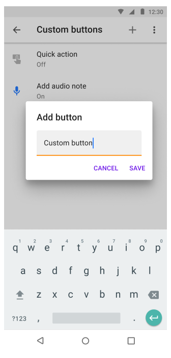
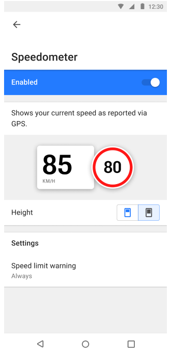
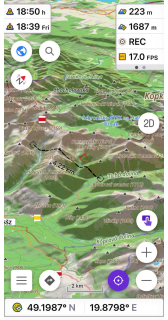
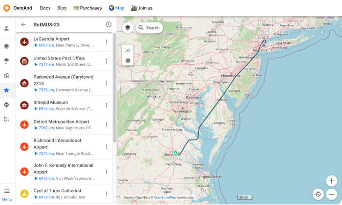

import Tabs from '@theme/Tabs';
import TabItem from '@theme/TabItem';
import AndroidStore from '@site/src/components/buttons/AndroidStore.mdx';
import AppleStore from '@site/src/components/buttons/AppleStore.mdx';
import LinksTelegram from '@site/src/components/_linksTelegram.mdx';
import LinksSocial from '@site/src/components/_linksSocialNetworks.mdx';
import Translate from '@site/src/components/Translate.js';
import InfoIncompleteArticle from '@site/src/components/_infoIncompleteArticle.mdx';
import ProFeature from '@site/src/components/buttons/ProFeature.mdx';
import InfoAndroidOnly from '@site/src/components/_infoAndroidOnly.mdx';

Happy New Year!

We are continuing this good tradition for the sixth time. At the end of each year we write _New Year Resolutions_ and our plans for the next one.

This year has been difficult for our company, as most of our team, based in Ukraine 🇺🇦 ❤️, works in war conditions. But despite all the difficulties, we worked according to the goals specified in the previous resolution ([Resolutions 2023](https://osmand.net/blog/ny-resolutions-2023)), and you can compare [the results in our report](#2023-achievements). Briefly, in 2023, we've introduced a free subscription for cross-platform named OsmAnd Start, completely redesigned the terrain and 3D section, made a big contribution to widgets and much more.

## 2024 New Year Resolutions

☛ Let's start with the to-do list for 2024, and [below](#2023-achievements) you can check again how a similar list was completed (or not completed 😉) in 2023.

<!--truncate-->

### Quick action & Widgets 

Our main goal is to provide ultimate **Trip computer** experience. We did big steps toward it in 2023 and we need to continue next year. Here is the list we think about:

* Allow to add & configure custom buttons on the HUD display
* Map quick actions to external keyboards, devices, etc
* Allow to build screens full of widgets without map or with different map views
* Redesign Configure Map to allow easy set up on the go

| Full widgets (iOS)|  Custom buttons | 
|-----|------|
| | |

### New Maps

Next year we would like to focus on different external map sources which could help a lot in real situations. With power of OpenStreetMap we can put almost any layer on top of it and it immediately adds value. Though for many of our users it's hard to find & configure these extra sources, so we want to provide some of the out of the box:

* **Weather** - New forecast data, New sources, New animations!
* **USA Government maps** (PAD-US) and other local authorities maps including private areas. Typically, government data cannot be ported to OSM due to licensing issues, even though they are open-sourced and contain valuable information.
  * In order to support custom vector maps, we need to build full Geotif, GDAL vector support in OsmAnd
* **OSM Custom Maps**. From OpenStreetMap data it's still possible to build many interesting and new maps like 
  * Map of fun roads to drive on motorcycle with color visualization of curvy roads
  * Map of hiking, running routes and their networks based on Route relations.
  * Track collections based on OSM GPS traces similar to Strava Heatmaps
  * Map of 3D Buildings
* **Wikivoyage** - we want to review our user interface of Travel guides, so people will be using Wikivoyage and other locally build travel guides more often.
* **Paragliding maps**. 3D track log and K-wind Maps.
* **Nautical maps**

| Travel Guides | [PAD-US](https://www.usgs.gov/programs/gap-analysis-project/science/pad-us-data-overview#overview) | New nautical style |
|-----|------|-------|
| | | |

### Routing & Navigation

Last year we've made a huge commmitment to solve slow routing issue with OsmAnd, it was difficult in order to support all variety of features we have offline maps, split by regions, hourly updated maps, dozen of routing parameters for each profiles and we are almost there. Also we've improved smoothness of map animations during navigation and it's also not done yet. Next year we will continue to work on routing & navigation features same as we have done this year, so you can enjoy improvements in different areas:
* Fast routing. Allow to build 1000 km routes in a matter of 5 seconds.
* Redesign navigation screen, so all necessary information will be available as 2 large widgets on top & bottom.
* Provide more navigation information as labels on the map to avoid fixed place widgets
* Add combined widget for current speed and speed limit. Needed for Android Auto & CarPlay.
* Autozoom / Auto-tilt.
* Android Auto / Car Play: add more settings to configure on screen display and possibility to quickly specify which roads to avoid to provide better routes

| Navigation widget | Speed limited |
|-----|------|
| | |

### Photos 

Next 2024 year we also would like to focus on visualization of provided routes, places that you see on the maps.
We want you to have:
* A photogallery that could inspire you to visit places around you
* A possibility to attach media from your library to favourites, tracks, waypoints.
* A detailed list of photos for a specific place

### Collaborative editing

This year we worked on our draft Web version that replicates some features of mobile applications but mostly it was focusing to provide you access to your data on the Web. So you can view, delete, add information. 

Next year we would like to continue doing it and add possibility to share between accounts or make some tracks or favorite groups available to everybody.

| [osmand.net/map](https://osmand.net/map) |
|-----|
| |

### Many, many other features

Every year it makes harder & harder to make list of new year resolutions, as the list of features we want to have in the app is growing. Here is our shortlist of features that we didn't manage to put in the groups above:

* Find a better and easier way to engage more people to contribute to OpenStreetMap
* Documentation & App Guides
* AI Assistant to help to cope with OsmAnd capabilities :)
* Work on application performance (quick start, quick screen transitions)

## 2023 Achievements

Let’s take a look at what was in the original 2023 resolutions list which nearly doesn’t cover all features implemented in 2023 by major releases * [4.4](https://osmand.net/blog/osmand-ios-4-4-released), [4.4.5](https://osmand.net/blog/osmand-ios-4-45-released), [4.5](https://osmand.net/blog/osmand-ios-4-5-released),[4.6](https://osmand.net/blog/osmand-ios-4-6-released) **(iOS)**; [4.4](https://osmand.net/blog/osmand-android-4-4-released), [4.5](https://osmand.net/blog/osmand-android-4-5-released), [4.6](https://osmand.net/blog/osmand-android-4-6-released) **(Android)**, [beta](https://osmand.net/docs/user/plan-route/web) Map **Web**.

[Resolutions 2023](https://osmand.net/blog/ny-resolutions-2023):

* ✔️ Widgets: full customization for widgets screen (Android), large widget (Android), bigger variety of Widgets for your travels and rides(Android/iOS).
* ✔️ OsmAnd Cloud: edit & sync Tracks / Favorites online, seamless integration through all platforms (Android/iOS/Web).
* ✔️ External Devices: support BLE Sensors (Android/iOS), customize Bluetooth keyboards/controllers access (Android/iOS).
* ✔️ Tracks: redesigned Tracks Management (Android).
* ✔️ 3D maps: finalize and make a stable release of a 3D fully offline worldwide map (Android/iOS).
* ✔️ CarPlay updates and improvements (Dashboard, 3D view, search menu).
* ✔️ Android Auto updates and improvements (Dashboard, 3D view, search menu).
* ✔️ Fast Auto Routing (Beta version for Android).

### iOS

OsmAnd iOS got 4 major releases with more than <a href="https://github.com/osmandapp/OsmAnd-iOS/milestones?state=closed">200 public features and issues</a> closed on Github.

#### [4.4](https://osmand.net/blog/osmand-ios-4-4-released) * April 05, 2023

| CarPlay updates | Hiking routes   |
|-----|------|
| | |

* [Wikipedia updates](https://osmand.net/blog/osmand-ios-4-4-released#wikipedia-updates)
* [Search for Favorites](https://osmand.net/blog/osmand-ios-4-4-released#search-for-favorites)
* [CarPlay updates](https://osmand.net/blog/osmand-ios-4-4-released#carplay-updates)
* [Hiking routes](https://osmand.net/blog/osmand-ios-4-4-released#hiking-routes)
* [Improved privacy](https://osmand.net/blog/osmand-ios-4-4-released#improved-privacy)
* [Map ruler update](https://osmand.net/blog/osmand-ios-4-4-released#map-ruler-update)
* [Widgets updates](https://osmand.net/blog/osmand-ios-4-4-released#widgets-updates)
* [External input devices](https://osmand.net/blog/osmand-ios-4-4-released#external-input-devices)

#### [4.4.5](https://osmand.net/blog/osmand-ios-4-45-released) * June 03, 2023

| Track recording widgets | Train profile and routing   |
|-----|------|
| | |

* [Elevation: map center](https://osmand.net/blog/osmand-ios-4-45-released#elevation-map-center)
* [New Track recording widgets](https://osmand.net/blog/osmand-ios-4-45-released#new-track-recording-widgets)
* [External keyboard updates](https://osmand.net/blog/osmand-ios-4-45-released#external-keyboard-updates)
* [Custom color for tracks](https://osmand.net/blog/osmand-ios-4-45-released#custom-color-for-tracks)
* [Train profile and routing](https://osmand.net/blog/osmand-ios-4-45-released#train-profile)

#### [4.5](https://osmand.net/blog/osmand-ios-4-5-released) * October 19, 2023

| 3D Relief | OsmAnd Start   |
|-----|------|
| | |

* [OsmAnd Start](https://osmand.net/blog/osmand-ios-4-5-released#osmand-start)
* [Topography and 3D Relief](https://osmand.net/blog/osmand-ios-4-5-released#topography-and-3d-relief)
* [New Configure Screen](https://osmand.net/blog/osmand-ios-4-5-released#new-configure-screen)
* [Widget updates](https://osmand.net/blog/osmand-ios-4-5-released#widget-updates)

#### [4.6](https://osmand.net/blog/osmand-ios-4-6-released) * December 20, 2023

| Travel Guides | Night theme   |
|-----|------|
| | |

* [External sensors](https://osmand.net/blog/osmand-ios-4-6-released/#external-sensors)
* [Travel Guides](https://osmand.net/blog/osmand-ios-4-6-released/#travel-guides)
* [New Help screen](https://osmand.net/blog/osmand-ios-4-6-released/#new-help-screen)
* [External sensors widgets](https://osmand.net/blog/osmand-ios-4-6-released/#external-sensors-widgets)
* [Top / Bottom panels](https://osmand.net/blog/osmand-ios-4-6-released/#top--bottom-panels)
* [Default appearance for Favorites folder](https://osmand.net/blog/osmand-ios-4-6-released/#default-appearance-for-favorites-folder)
* [CarPlay dashboard support and 3D](https://osmand.net/blog/osmand-ios-4-6-released/#carplay-dashboard-support)
* [Night theme](https://osmand.net/blog/osmand-ios-4-6-released/#night-theme)
* [Rename Route parameters](https://osmand.net/blog/osmand-ios-4-6-released/#rename-route-parameters)

### Android

OsmAnd Android got 3 major releases with more than <a href="https://github.com/osmandapp/Osmand/milestones?state=closed">800 public features and issues</a> closed on Github.

#### [4.4](https://osmand.net/blog/osmand-android-4-4-released) * April 1, 2023

| Speed/Slope graph | Tracks menu  |
|-----|------|
| | |

* [Tracks menu](https://osmand.net/blog/osmand-android-4-4-released#tracks-menu)
* [Speed/Slope graph](https://osmand.net/blog/osmand-android-4-4-released#speedslope-graph)
* [Nautical miles and feed](https://osmand.net/blog/osmand-android-4-4-released#nautical-miles-and-feet)
* [Downloand Overlay/Underlay maps](https://osmand.net/blog/osmand-android-4-4-released#downloand-overlayunderlay-maps)

      
#### [4.5](https://osmand.net/blog/osmand-android-4-5-released) * July 31, 2023
      
| BLE/ANT+ sensors | OsmAnd Start |
|-----|------|
| | |

* [BLE/ANT+ sensors](https://osmand.net/blog/osmand-android-4-5-released#bleant-sensors)
* [Free "OsmAnd Cloud" account (for backup)](https://osmand.net/blog/osmand-android-4-5-released#free-osmand-cloud-account-for-backup)
* [Terrain maps updates](https://osmand.net/blog/osmand-android-4-5-released#terrain-maps-updates)
* [Track management](https://osmand.net/blog/osmand-android-4-5-released#track-management)
* [2D/3D button](https://osmand.net/blog/osmand-android-4-5-released#2d3d-button)
* [More actions for external keyboards](https://osmand.net/blog/osmand-android-4-5-released#more-actions-for-external-keyboards)
* [Via ferrata for pedestrian routing](https://osmand.net/blog/osmand-android-4-5-released#via-ferrata-for-pedestrian-routing)
* [CAI scale](https://osmand.net/blog/osmand-android-4-5-released#cai-scale)
* [Option Delete Cloud account](https://osmand.net/blog/osmand-android-4-5-released#option-delete-cloud-account)
* [Custom routing files option](https://osmand.net/blog/osmand-android-4-5-released#custom-routing-files-option)

#### [4.6](https://osmand.net/blog/osmand-android-4-6-released) * December 20, 2023

| Smart folders | Row for Top/Bottom widgets |
|-----|------|
| | |

* [Row for Top/Bottom widgets](https://osmand.net/blog/osmand-android-4-6-released/#updates-for-topbottom-panels)
* [Glide Ratio Widgets](https://osmand.net/blog/osmand-android-4-6-released/#glide-ratio-widgets)
* [Temperature widget](https://osmand.net/blog/osmand-android-4-6-released/#temperature-widget)
* [Sun position widget](https://osmand.net/blog/osmand-android-4-6-released/#sun-position-widget)
* [Local menu redesign](https://osmand.net/blog/osmand-android-4-6-released/#local-menu-redesign)
* [Smart folders](https://osmand.net/blog/osmand-android-4-6-released/#smart-folders)
* [Filters for tracks](https://osmand.net/blog/osmand-android-4-6-released/#filters-for-tracks)
* [Trash feature in OsmAnd Cloud](https://osmand.net/blog/osmand-android-4-6-released/#trash-feature-in-osmand-cloud)
* [New Help screen](https://osmand.net/blog/osmand-android-4-6-released/#new-help-screen)
* [Redesign weather screen](https://osmand.net/blog/osmand-android-4-6-released/#redesign-weather-screen)
* [Android Auto updates](https://osmand.net/blog/osmand-android-4-6-released/#android-auto-updates)

### Web 

* [RedesignWeb OsmAnd Map](https://osmand.net/map)
* [More Documentation articles](https://osmand.net/docs/intro)
* [OsmAnd Pro - Features for Web](https://osmand.net/docs/user/plan-route/web#osmand-pro-sync)
* [Option Delete Cloud account](https://osmand.net/blog/osmand-android-4-5-released#option-delete-cloud-account)
* [OsmAnd Start](https://osmand.net/blog/osmand-android-4-5-released#option-delete-cloud-account)
* [Plan Route tool](https://osmand.net/docs/user/plan-route/web#create-track-pro)
* Your [Favorites and Tracks](https://osmand.net/docs/user/plan-route/web#tracks) on the Web

## Summary

We are starting the new 2024 year with 20 Software engineers fully equipped and motivated to bring OsmAnd to the next level. We are sticking to our mission to build ***the most powerful open source cartographic tool for Travels*** *(Offline & Online)*.

Thank you (our dear users) for being with us during these difficult years for traveling, we feel your support and we hope to meet your expectations. We wish all the best in 2024!

**Happy 2024!**

**Victor Shcherb & OsmAnd Team**

_________________

<LinksSocial/>
<LinksTelegram/>
<AndroidStore/>
