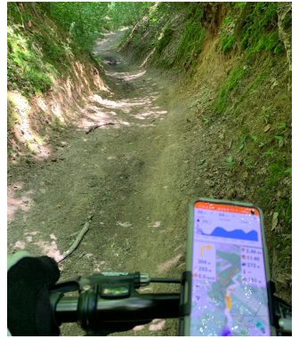
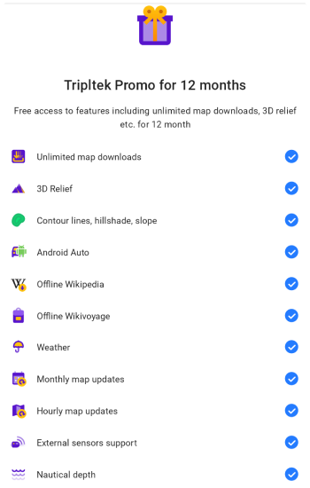
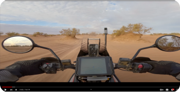

import Tabs from '@theme/Tabs';
import TabItem from '@theme/TabItem';
import AndroidStore from '@site/src/components/buttons/AndroidStore.mdx';
import AppleStore from '@site/src/components/buttons/AppleStore.mdx';
import LinksTelegram from '@site/src/components/_linksTelegram.mdx';
import LinksSocial from '@site/src/components/_linksSocialNetworks.mdx';
import Translate from '@site/src/components/Translate.js';
import InfoIncompleteArticle from '@site/src/components/_infoIncompleteArticle.mdx';
import ProFeature from '@site/src/components/buttons/ProFeature.mdx';
import InfoAndroidOnly from '@site/src/components/_infoAndroidOnly.mdx';

Hello everybody!

At this post I want to show my vision on OsmAnd kit for offroading by motorcycle and 4x4. 

<!--truncate-->

In many cases you can use ordinary smartphone or tablet of course. And if speak about me, I mount my casual smartphone to a bicycle wheel, or keep it on my pocket during hiking.

But for difficult conditions like vibration, dust, water you need to use special devices for these activities. Ordinary its are IP67 Tablet and External controller. Example how it looks like:

Maybe you saw stories from famous travellers where you can note special devices and OsmAnd as navigation app. Some of them it's [Noraly (Itchy Boots)](https://www.itchyboots.com/) and [Charly Sinewan](https://sinewan.us/).

Some screenshots from [Itchy Boots Youtube channel](https://www.youtube.com/@ItchyBoots):

On  [OsmAnd 4.6](https://osmand.net/blog/osmand-android-4-6-released) we added new opportunities. For [External input devices](https://osmand.net/blog/osmand-android-4-6-released#custom-actions-for-external-controller-buttons), now you can bind you actions for device buttons. For widgets you can use Top/Bottom panels, change widgets size and etc.

Start with [OsmAnd 4.6](https://osmand.net/blog/osmand-android-4-6-released), we gave a special offer for [Tripltek devices](https://www.tripltek.com/) - it's a free yearly Promo subscription. Each Tripltek owner can install OsmAnd app and receive many [Pro functions](https://osmand.net/docs/user/purchases/android#pro-features). This is a very powerfull, waterproof, dustproof, shockprof device, with ultra brightness display, on which you can see all the details on the map even in sunny weather.

Even mine, as a user of the application for more than 10 years, was pleasantly surprised by the capabilities of the device; before that I used my iPhone. but in the bright sun it was impossible to see anything on the screen.

Travel-blogger Charly Sinewan uses Tripltek table with OsmAnd app. You can see movies on his Youtube channel:

Read more about Tripltek devices here

<!--truncate-->

