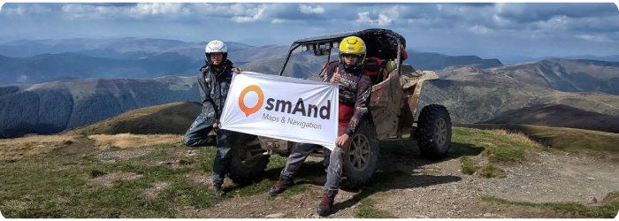
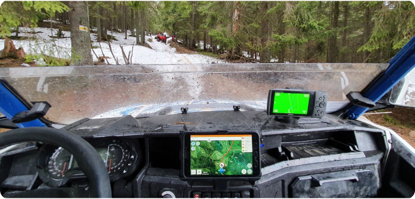

import Tabs from '@theme/Tabs';
import TabItem from '@theme/TabItem';
import AndroidStore from '@site/src/components/buttons/AndroidStore.mdx';
import AppleStore from '@site/src/components/buttons/AppleStore.mdx';
import LinksTelegram from '@site/src/components/_linksTelegram.mdx';
import LinksSocial from '@site/src/components/_linksSocialNetworks.mdx';
import Translate from '@site/src/components/Translate.js';
import InfoIncompleteArticle from '@site/src/components/_infoIncompleteArticle.mdx';
import ProFeature from '@site/src/components/buttons/ProFeature.mdx';
import InfoAndroidOnly from '@site/src/components/_infoAndroidOnly.mdx';

Hello everybody!

In this post, I want to talk about my vision for using the OsmAnd kit for off-roading by motorcycle and 4x4.

<!--truncate-->

In many cases, you can use an ordinary smartphone or tablet, of course. As for me, I mount my casual smartphone to a bicycle wheel or keep it in my pocket during hiking.

However, for difficult conditions like vibration, dust, and water, you need to use special devices for these activities. Ordinarily, these are IP67 tablets and external controllers.

On  [OsmAnd 4.6](https://osmand.net/blog/osmand-android-4-6-released), we have introduced new features. For [External input devices](https://osmand.net/blog/osmand-android-4-6-released#custom-actions-for-external-controller-buttons), you can now bind your actions to device buttons. Additionally, for widgets, you can use Top/Bottom panels, change widget size, and more.

Here's an example of what it looks like:

Maybe you've seen stories from famous travelers where they note special devices and OsmAnd as the navigation app. Some of them are [Noraly (Itchy Boots)](https://www.itchyboots.com/) and [Charly Sinewan](https://sinewan.us/).

Here are some screenshots from [Itchy Boots' Youtube channel](https://www.youtube.com/@ItchyBoots):

For the last six months, I have been using the [Tripltek T9](https://www.tripltek.com/tripltek9) tablet for my off-road activities. I have been a user of the OsmAnd application for more than 13 years and was pleasantly surprised by the capabilities of the device. Prior to that, I used my iPhone, but in bright sunlight, it was impossible to see anything on the screen.

Starting with [OsmAnd 4.6](https://osmand.net/blog/osmand-android-4-6-released), we decided to offer a special OsmAnd app offer for [Tripltek devices](https://www.tripltek.com/) - a free yearly Promo subscription. Each Tripltek owner can install the OsmAnd app and receive many [Pro functions](https://osmand.net/docs/user/purchases/android#pro-features). This is a very powerful, waterproof, dustproof, shockproof device, with an ultra-bright display on which you can see all the details on the map even in sunny weather.

 

Motorcycle adventurer and travel blogger [Charly Sinewan](https://sinewan.us/) also uses a Tripltek tablet with the OsmAnd app. You can watch movies on his [Youtube channel](https://www.youtube.com/watch?v=TwTS_vN3N38):

 

Read more about [Tripltek devices here](https://www.tripltek.com/).
