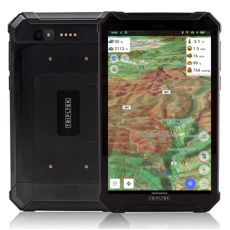
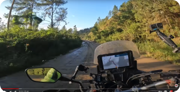
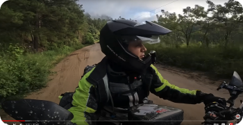
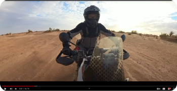

import Tabs from '@theme/Tabs';
import TabItem from '@theme/TabItem';
import AndroidStore from '@site/src/components/buttons/AndroidStore.mdx';
import AppleStore from '@site/src/components/buttons/AppleStore.mdx';
import LinksTelegram from '@site/src/components/_linksTelegram.mdx';
import LinksSocial from '@site/src/components/_linksSocialNetworks.mdx';
import Translate from '@site/src/components/Translate.js';
import InfoIncompleteArticle from '@site/src/components/_infoIncompleteArticle.mdx';
import ProFeature from '@site/src/components/buttons/ProFeature.mdx';
import InfoAndroidOnly from '@site/src/components/_infoAndroidOnly.mdx';

Hello Adventurers!

In today's digital age, outdoor enthusiasts, adventurers as myself, and professionals rely heavily on navigation tools to traverse unfamiliar terrain safely and efficiently. With the rise of smartphones and tablets, navigation apps have become indispensable companions for outdoor activities. Among these, OsmAnd stands out as a powerful navigation app, offering robust features tailored for outdoor exploration. When paired with [TRIPLTEK](https://www.tripltek.com/) rugged tablets, users can experience unparalleled navigation capabilities even in the harshest environments.

<!--truncate-->

By combining the capabilities of OsmAnd navigation app with [TRIPLTEK](https://www.tripltek.com/) tablets, outdoor enthusiasts can unlock a new level of navigation precision, reliability, and resilience. The synergy between these two technologies empowers users to explore remote wilderness areas, conquer challenging terrain, and navigate with confidence, knowing they have reliable tools at their disposal.

Whether embarking on a backcountry hiking expedition, conducting field surveys, or navigating off-road trails, OsmAnd and [TRIPLTEK](https://www.tripltek.com/)  offer a winning combination for outdoor navigation. With their robust features, durability, and performance, they provide users with the peace of mind to explore the great outdoors safely and confidently.

## Can’t beat this combo!

For the past six months, I've been utilizing the  [TRIPLTEK 9](https://www.tripltek.com/tripltek9) for my off-road ventures. Having been a loyal user of the OsmAnd application for over 13 years, I was pleasantly surprised by the capabilities of this device. Previously, I relied on my iPhone for navigation, but its screen became virtually unreadable in bright sunlight.

With the release of  [OsmAnd 4.6](https://osmand.net/blog/osmand-android-4-6-released), we introduced a special offer for [TRIPLTEK](https://www.tripltek.com/) - a complimentary annual promotional subscription. This offer allows every Tripltek owner to install the OsmAnd app and unlock Pro features (https://osmand.net/docs/user/purchases/android#pro-features). The Tripltek tablet itself is a robust, waterproof, dustproof, and shockproof device, boasting an ultra-bright display that ensures all map details remain visible even in sunny conditions. 

The integration of OsmAnd with [TRIPLTEK](https://www.tripltek.com/) tablets enhances the outdoor navigation experience significantly. Users can now enjoy the full suite of OsmAnd features on a ruggedized device tailor-made for outdoor adventures. This combination provides unparalleled reliability and usability, making it an invaluable tool for off-road enthusiasts, hikers, and explorers alike.

 

An excellent demonstration of the capabilities of this combination can be observed through the experiences shared by these YouTube content creators. [Sebastian Villanueva](https://www.instagram.com/seba.adventure/) and [Charly Sinewan](https://www.instagram.com/charlysinewan/).

Here are some screenshots from [Sebastian Villanueva' Youtube channel](https://www.youtube.com/@Seba.adventure) with [Tripltek tablet](https://www.tripltek.com/) and the OsmAnd app:

 

Motorcycle adventurer and travel blogger [Charly Sinewan](https://sinewan.us/) also uses [Tripltek tablet](https://www.tripltek.com/) with the OsmAnd app. You can follow his adventures on his [Youtube channel](https://www.youtube.com/watch?v=TwTS_vN3N38):

 

**Tripltek** links: 
- [Facebook](https://www.facebook.com/TripltekPro/)
- [Instagram](https://www.instagram.com/tripltek)

Read more about [Tripltek devices here](https://www.tripltek.com/).

### OsmAnd Navigation App: A Comprehensive Outdoor Companion

OsmAnd is a feature-rich navigation app designed to cater to the needs of outdoor enthusiasts, hikers, backpackers, and off-road travelers. Developed with a focus on usability and reliability, OsmAnd provides a wide array of functionalities essential for navigating through diverse landscapes:

1. **[Offline Maps](https://osmand.net/docs/user/map/vector-maps)**: One of the standout features of OsmAnd is its ability to download maps for offline use. This is particularly advantageous when exploring remote areas with limited or no internet connectivity. Users can pre-download maps of their intended route, ensuring access to crucial navigation data even in the absence of a network connection.

2. **[Detailed Topographic Maps](https://osmand.net/docs/user/plugins/contour-lines)**: OsmAnd offers detailed topographic maps that provide valuable information about elevation, terrain features, and points of interest. These maps enable users to plan their routes effectively, anticipate challenges, and make informed decisions while navigating through rugged terrain.

3. **[GPS Tracking and Waypoints](https://osmand.net/docs/user/plugins/trip-recording)**: The app allows users to track their location in real-time using GPS technology. Users can mark waypoints, create routes, and record tracks to facilitate navigation and ensure they stay on course. Additionally, OsmAnd supports importing and exporting waypoints, enabling seamless integration with other navigation devices and platforms.

4. **[Navigation Tools](https://osmand.net/docs/user/navigation/)**: OsmAnd offers a variety of navigation tools, including compasses, altimeters, and inclinometers, to aid users in orientation and navigation. These tools are invaluable for maintaining direction, estimating elevation changes, and navigating through challenging terrain conditions.

5. **[Offline Navigation and Route Planning](https://osmand.net/docs/user/plan-route/create-route)**: With OsmAnd, users can plan and navigate routes offline, eliminating the need for constant internet connectivity. This feature is especially beneficial for outdoor activities in remote locations where internet access may be unreliable or unavailable.

### TRIPLTEK Tablets: Built for the Outdoors

[TRIPLTEK](https://www.tripltek.com/) rugged tablets are designed to withstand the rigors of outdoor use, making them the ideal companion for adventurers, field professionals, and outdoor enthusiasts. Built to military-grade standards, [TRIPLTEK](https://www.tripltek.com/) offers unparalleled durability, performance, and reliability in challenging environments:

1. **Rugged Construction**: TRIPLTEK  feature ruggedized designs that are resistant to water IP68, dust, shock, and extreme temperatures. These tablets can withstand drops, vibrations, and harsh weather conditions, ensuring uninterrupted operation in the toughest outdoor environments.

2. **High-Visibility Display**: TRIPLTEK delivers crisp and clear visuals in bright sunlight. The True Sunlight readable display with an unmatched 1300 nits brightness ensures optimal visibility of maps, navigation data, and other critical information under direct sunlight.

3. **Long Battery Life**: TRIPLTEK tablets are engineered with long-lasting batteries that provide extended runtime, allowing users to navigate and explore for extended periods without worrying about battery life. This is particularly advantageous for outdoor activities where access to power sources may be limited.

4. **Versatile Connectivity Options**: TRIPLTEK offers versatile connectivity options, including GPS, Wi-Fi, Bluetooth, and cellular connectivity. This enables seamless integration with navigation apps like OsmAnd, allowing users to leverage the full capabilities of their tablets for outdoor navigation.

_________________
<LinksSocial/>
<LinksTelegram/>