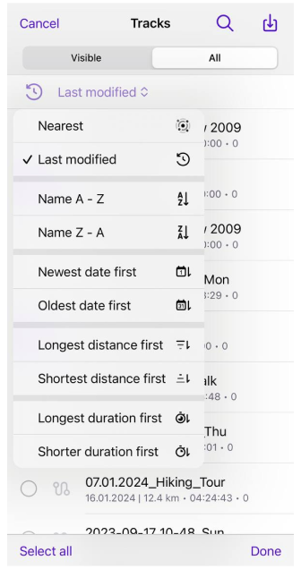

import Tabs from '@theme/Tabs';
import TabItem from '@theme/TabItem';
import AndroidStore from '@site/src/components/buttons/AndroidStore.mdx';
import AppleStore from '@site/src/components/buttons/AppleStore.mdx';
import LinksTelegram from '@site/src/components/_linksTelegram.mdx';
import LinksSocial from '@site/src/components/_linksSocialNetworks.mdx';
import Translate from '@site/src/components/Translate.js';
import InfoIncompleteArticle from '@site/src/components/_infoIncompleteArticle.mdx';
import ProFeature from '@site/src/components/buttons/ProFeature.mdx';

Hello, everyone!

We are pleased to announce the release of a 4.7 version of OsmAnd for iOS devices. [Update it at the AppStore](https://itunes.apple.com/us/app/osmand-maps-travel-navigate/id934850257).

<!--truncate-->

## What's new

- Enhanced top and bottom widget panels to accommodate all widgets.
- Improved management for tracks visible on the map.
- Updated "Analyze on Map" with the ability to display metrics from sensors.
- Enhanced tags support for GPX has been added: link, author, copyright, and keywords. 
- Improved widget configuration by allowing users to move pages and rows.
- Fixed the "Coordinates" widget where, in some cases, the last digits were missed.
- Fixed "3D Mode" button behavior: tapping on the button doesn't save the tilt angle.
- Fixed status bar color for older iOS versions.
- Use App Language for Basemap.
- New "Sun position" widget.
- OsmAnd Cloud: added ability to restore deleted files from trash.
- OsmAnd Cloud: added ability to delete account.
- Mac OS version: fixed rotate and pinch to zoom gestures.
- Add support for additional tags for OSM routes.
- "My Places > Tracks" redesign.

## Widgets updates

- Enhanced top and bottom widget panels to accommodate all widgets.

- Background color opacity for transparency widget mode.

## Redesign Track menu of Configure map

Improved management for tracks visible on the map:

iOS Menu → Configure map → Show on map → Tracks

We added two secitions: _Visible_ and _All_

- _Visible_ - you can select and unselect visible tracks on the map and choose its from _Recently visible_ secition
- _All_ - you can choose tracks from all track list.

 

You can use the next actions (Buttons):

- 🔍 Magnifying glass for seaching a track from the track list.
- 📥 import a track from device.
- _"Select All"_ - select all tracks from the list.
- _"Done"_ - done your track selections and close the "Tracks" section.

By clicking to _"Last modified"_ you open the _Sort tracks_ menu. Where you can sort your tracks by:
- _"Nearest"_ or _"Last modified"_
- _"Name A-Z"_ or _"Name Z-A"_
- _"Newest date first"_ or _"Oldest date first"_
- _"Longest distance first"_ or _"Shortest distance first"_
- _"Longest duration first"_ or _"Shorter duration first"_

 

## Updates of Analize on map

Updated ["Analyze on Map"](https://osmand.net/docs/user/map/tracks-on-map#analyze-track-on-map) with the ability to display metrics from [sensors](https://osmand.net/docs/user/plugins/external-sensors#trip-recording).

- you can analise your track data with external sensors data: choose the track → [Options](https://osmand.net/docs/user/map/track-context-menu/#options) → Analyze on map → Select graph data

  