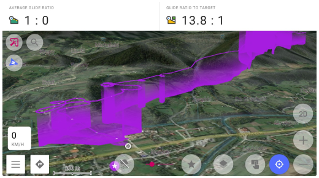
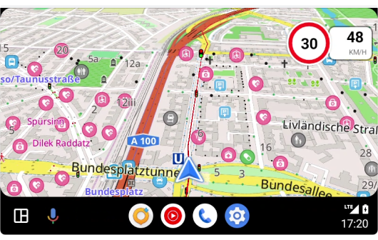
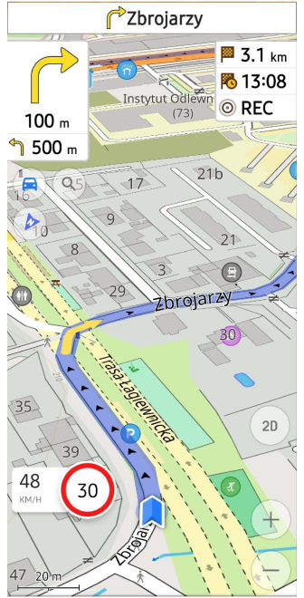
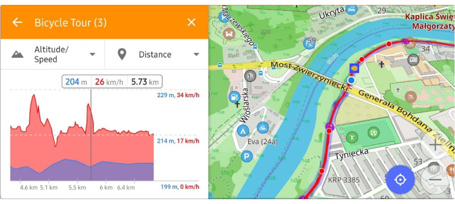
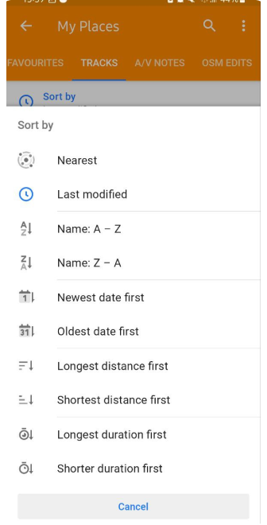
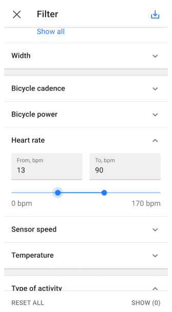

import Tabs from '@theme/Tabs';
import TabItem from '@theme/TabItem';
import AndroidStore from '@site/src/components/buttons/AndroidStore.mdx';
import AppleStore from '@site/src/components/buttons/AppleStore.mdx';
import LinksTelegram from '@site/src/components/_linksTelegram.mdx';
import LinksSocial from '@site/src/components/_linksSocialNetworks.mdx';
import Translate from '@site/src/components/Translate.js';
import InfoIncompleteArticle from '@site/src/components/_infoIncompleteArticle.mdx';
import ProFeature from '@site/src/components/buttons/ProFeature.mdx';
import InfoAndroidOnly from '@site/src/components/_infoAndroidOnly.mdx';

Good news!  

We're thrilled to announce the release of OsmAnd version 4.7 for Android devices, now available for download on Google Play. This latest update brings a suite of new features and improvements designed to enhance your navigation experience.

**[Get the Update Today!](https://play.google.com/store/apps/dev?id=8483587772816822023)**

To enjoy these new features and improvements, head to Google Play or your preferred app market to download or update to OsmAnd version 4.7. We're committed to making OsmAnd the best navigation tool for Android users, and we're excited for you to experience the latest advancements.

Thank you for your continued support of OsmAnd. Happy navigating!

<!--truncate-->

## What's new

- [Fast offline routing](#enhanced-offline-navigation)
- [Navigation settings for Developers](#navigation-settings-for-developers)
- [Speedometer](#speedometer)
  - [Speedometer for Android Auto](#speedometer-for-android-auto)
- [Round up numbers](#round-up-numbers) in navigation widgets
- [Custom Quick Action Buttons](#custom-buttons)
- [All route tags](#routes-tags) for the Route info of the Context menu
- [Vertical exaggeration](#vertical-exaggeration)
- [3D tracks visualization](#3d-track-visualization)
- [Battery optimization dialogue](#battery-optimization-dialogue) of Track recording
- [Redesign graphs](#redesign-graphs) of tracks and route
- [OAuth 2.0 for OpenStreetMap login](#oauth-20-for-osm-login) for OpenStreetMap login
- [Tracks menu updated](#tracks-menu)
   - Apply sorting order to all subfolders > Tracks
   - Designed the new Selected Tracks screen
- [Filter by Sensor data](#filter-by-sensor-data) (HR, Cadence, Power) for GPX tracks
- [Added tags support](#tags-support): author, cmt, link, keywords, copyright, email. Moved sensor tags to gpxtpx:TrackPointExtensio.
- [More for this release](#more)

:::note

OsmAnd 4.7.10 is the last build for installation to Android 6.

:::

## Enhanced Offline Navigation

A new, speedy offline navigation feature has been introduced, utilizing a hierarchical highway algorithm.

**To ensure the swift routing functions correctly, it's essential that all vector maps are up-to-date and synchronized by date.**

For instance, navigating offline by car from Inzlingen to Waldershof now only requires 10 seconds.

## Navigation settings for Developers

Initially, activating the [Development plugin](https://osmand.net/docs/user/plugins/development) is required.

Navigate through _Menu → Settings → App profile → Navigation settings → Route parameters → Development_:
- _Routing type_: Select the engine and algorithm for routing.
- _GPX approximation_: Opt for a GPX track approximation method.
- _Autozoom_: Activate autozoom for easier navigation.
- _OsmAnd live data_: Utilize the [most recent map updates](https://osmand.net/docs/user/personal/maps/#osmand-live) for routing.

## Speedometer

Introduced a new distinctive widget called Speedometer:

Go to _Menu → Configure screen → Other → Speedometer_

Within this section, you can select the size (_small, medium, large_) of the Speedometer and specify when to receive a Speed limit warning (_Always, When exceeded_).

 

### Speedometer for Android Auto

Speedometer was added for Android Auto too.

## Round up numbers

Select the format for displaying distance information in navigation widgets (such as distance to a point, the next turn, and lanes). Opt for _"Precise"_ for exact figures, or choose _"Round up"_ for simpler readability:

_Menu → Settings → Navigation Profile → General settings → Units & formats → Distance during navigation → Precise_ or _Round up_

 

## Custom Buttons

In this update, we've introduced Custom Buttons, a unique type of [Quick action](https://osmand.net/docs/user/widgets/quick-action) tool. This means users can now create a custom action button for their device's screen.

_Menu → Configure screen → Buttons → Custom buttons → + → Add button_

 

Next, you have the option to assign one or more actions to the custom button you've created and activate it.

 

Now, the new custom button will be visible on your device's screen. Tapping this button instantly toggles the selected action on or off.

## Routes tags

Extracted [Route](https://osmand.net/docs/user/map/tracks-on-map#routes-on-the-map) Tags from [OpenStreetMap data](https://wiki.openstreetmap.org/wiki/Relation:route) Data for [Track Context menu](http://localhost:3000/docs/user/map/tracks-on-map#save-as-a-track): Includes `distance`, `direction`, `state`, `color`, `roundtrip`, `tourism`, `description`, `type`, `start/end points`, and `elevation` change (`descent/ascent`).

Example of relation tags for ["CAIOSM - Emilia Romagna - sentiero 137"](https://www.openstreetmap.org/relation/16115660):

## Vertical exaggeration

A special coefficient for [3D relief](https://osmand.net/docs/user/plugins/contour-lines#3d-relief) has been added in this release. Now, you can adjust the Vertical Exaggeration:

 _Menu → Configure map → Topography (3D Relief) → Vertical exaggeration_ (Ensure that 3D relief is enabled)

This feature allows you to view the contours of smoother topography with enhanced detail.

## 3D track visualization

Added 3D visialization for tracks by altitude (it's a [paid feature](https://osmand.net/docs/user/purchases/android#free-and-paid-features) of Maps+):

_[Track Context menu](https://osmand.net/docs/user/map/tracks-on-map#track-appearance) → Change Appearance → 3D Track_
- _Visualized by_: Altitude, Fixed height.
- _Wall color_: Solid, Downward gradient, Upward gradient.
- _Track line_: Top, Bottom, Top and bottom.

## Battery optimization dialogue

A "Battery Optimization" banner has been introduced in the [Trip recording plugin settings](https://osmand.net/docs/user/plugins/trip-recording#recording-settings). By clicking on it, you can adjust battery optimization settings, which may lead to gaps and inaccuracies in the recorded tracks:

_Menu → Settings → App Profile → Trip recoding → Read more (Android battry optimization)_

 

## Redesign graphs

[Elevation graphs](https://osmand.net/docs/user/plan-route/create-route#graph) have been revamped to eliminate overlapping labels:

## OAuth 2.0 for OSM login

Updated the OpenStreetMap login process to use OAuth 2.0 for the [_OpenStreetMap editing plugin_](https://osmand.net/docs/user/plugins/osm-editing#settings):

"The Operations Working Group is shutting down OAuth 1.0a and HTTP Basic Auth in 2024. They have been deprecated since 2023 and their role in authorization has replaced by OAuth 2.0 which the standard authorization method for most systems."

## Tracks menu

- Organization of subfolders (_My Places_ menu):

You can now apply a sorting order across all subfolders:

_Menu → My places → Tracks → &#8942; → Sort subfolders_

 

- New Selected _Tracks screen_ for "Plan a route", "Navigation", "Markers", "Development", "Quick action":

_Navigation → Settings → Follow track → Select_

## Filter by Sensor data

Introduced the ability to [filter](https://osmand.net/docs/user/personal/tracks#filter) GPX tracks by sensor data.

## Tags support

- The import process for GPX files now includes support for [for tags](https://osmand.net/docs/user/map/track-context-menu#description-and-info) such as `author`, `cmt`, `link`, `keywords`, `copyright`, `email` , allowing for the display of this information in the _Track Context menu_.

- Move [External sensors](https://osmand.net/docs/user/plugins/external-sensors) tags to `gpxtpx:TrackPointExtensio`.

## More

- [Reduced 2.5D tilt](https://github.com/osmandapp/OsmAnd/issues/16027) angle at low zoom levels.
- [Map tilt angle](https://github.com/osmandapp/OsmAnd/issues/18798) saved by taping on a button.
<!--- Added option of [Auto Sync](https://osmand.net/docs/user/personal/osmand-cloud) for OsmAnd Cloud.-->
- Updated [Search screen of Android Auto](https://github.com/osmandapp/OsmAnd/issues/17209).
- Added POI's [category "Water"](https://github.com/osmandapp/OsmAnd/issues/16021).
- Introduce map [rotation North fixed](https://github.com/osmandapp/OsmAnd/issues/17086) with the ["Enable Fixed North Up"](https://osmand.net/docs/user/personal/profiles#other) toggle in the General settings.
- [Added visual border](https://github.com/osmandapp/OsmAnd/issues/14486) of downloading area ([Online maps](https://osmand.net/docs/user/map/raster-maps#download--update-tiles)) to square.
- Changed map zoom after [searching for POIs' categories](https://github.com/osmandapp/OsmAnd/issues/18901).
- [Do not switch profile](https://github.com/osmandapp/OsmAnd/issues/19166) during initial Route calculation.
- Added [Android Location services](https://osmand.net/docs/user/plugins/osmand-tracker#position) for OsmAnd Tracker. [Fixed _OsmAnd Tracker widget_](https://github.com/osmandapp/OsmAnd/issues/18235).
