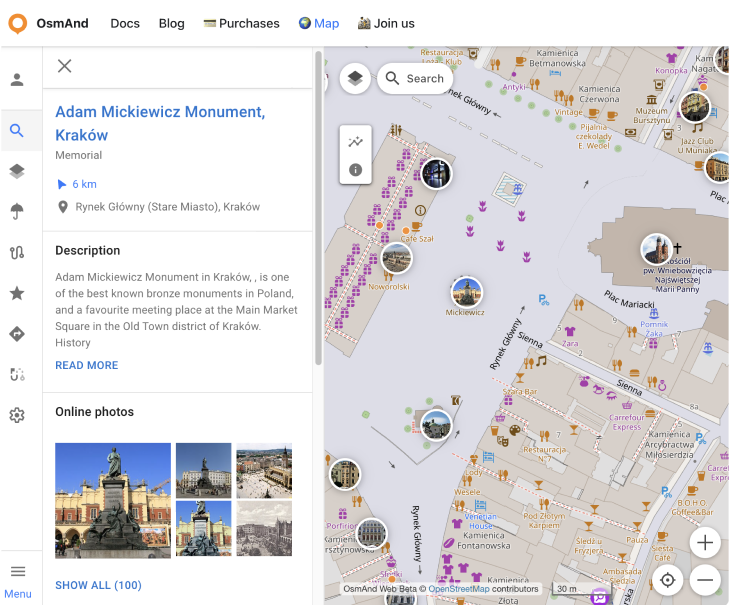

import Tabs from '@theme/Tabs';
import TabItem from '@theme/TabItem';
import AndroidStore from '@site/src/components/buttons/AndroidStore.mdx';
import AppleStore from '@site/src/components/buttons/AppleStore.mdx';
import LinksTelegram from '@site/src/components/_linksTelegram.mdx';
import LinksSocial from '@site/src/components/_linksSocialNetworks.mdx';
import Translate from '@site/src/components/Translate.js';
import InfoIncompleteArticle from '@site/src/components/_infoIncompleteArticle.mdx';
import ProFeature from '@site/src/components/buttons/ProFeature.mdx';

Hello, everyone!

We are glad to introduce first full release of our [map web service](https://osmand.net/map). 

<!--truncate-->

**What's new**

– System language by default (process)
- New Map Context menu
- Explore map menu
- Updates POI context menu
- Displaied Wikipedia/Wikivoyage on the map (testing)
- Provide URL's for different web sections
- Updates favorites icons (4.8?)
- Added banner to promote mobile version (4.8?)
- Fixed wrong precipitation data
- Fixed lagging of huge numbers user data

## System language

The Web uses language from browser settings. For Chrome priority `chrome://settings/languages`.

User can change system (menu) language manually by _Menu → ⚙ → Dislay language_.

## Map Context menu

For this release the new Map Context menu was added. For opening the menu to click the right button of mouse to any place of the map. At this menu next actions have been added:
 - _Where am I_
 - _Show weather_
 - _Create new route_
 - _Add Favorite_
 - _Directions from_
 - _Directions to_
 - _Cope coordinates_
 - _Add pin_
 - _Show regions_

## Explore map menu

New feature for the web with finding places by POIs categories on the map. Show photos for POI on the map.

Click to 🔍 button and open tab with Popular POI on the screen. Tap to one of it for opening POI context menu.

For starting search by categories you need to open the Categories menu and choose needed items:

### POI Context menu

By clicking to POI the new Context menu:
- name (category)
- direction and Distance
- Description
- Online photos

### Photo gallery

