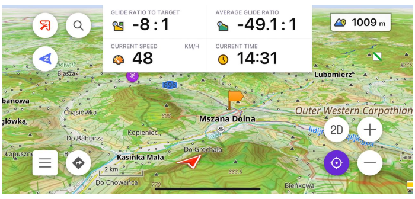
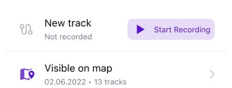
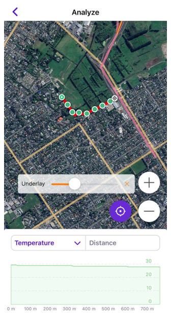
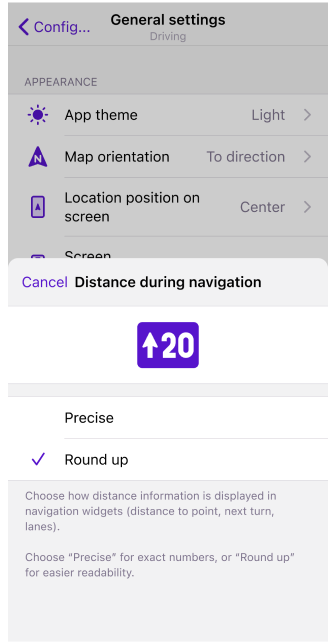
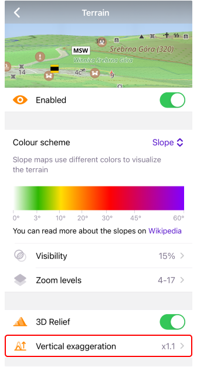

import Tabs from '@theme/Tabs';
import TabItem from '@theme/TabItem';
import AndroidStore from '@site/src/components/buttons/AndroidStore.mdx';
import AppleStore from '@site/src/components/buttons/AppleStore.mdx';
import LinksTelegram from '@site/src/components/_linksTelegram.mdx';
import LinksSocial from '@site/src/components/_linksSocialNetworks.mdx';
import Translate from '@site/src/components/Translate.js';
import InfoIncompleteArticle from '@site/src/components/_infoIncompleteArticle.mdx';
import ProFeature from '@site/src/components/buttons/ProFeature.mdx';

Hello Everyone,

We're delighted to share some exciting news with you! OsmAnd version 4.7 for iOS devices is now officially available. This latest update brings a host of new features and improvements that we can't wait for you to try.

You can download the update right now from the [AppStore](https://itunes.apple.com/us/app/osmand-maps-travel-navigate/id934850257). Added new widgets, improved user interface, and several performance upgrades that make OsmAnd even better.

<!--truncate-->

## What's new

- [Redesign Tracks menu](#redesign-tracks-menu)
- [Widget settings updates](#widgets-updates)
- [Tracks menu of Configure map](#redesign-tracks-menu-of-configure-map)
- [Updates of GPX tracks](#updates-of-gpx-tracks)
  - [3D visualization](#3d-visualization)
  - [External sensors data](#external-sensors-data-for-analize-on-map) for Analize on map
  - [Additional tags support](#additional-tags-support)
- [Sun position widget](#sun-position-widget)
- [Glide ratio widget](#glide-ratio-widget)
<!--- [Speedometer](#speedometer)
  - [Speedometer for CarPlay](#speedometer-for-carplay)-->
- [Round up numbers](#round-up-numbers-in-navigation-widgets)
- [Vertical exaggeration](#vertical-exaggeration)
- [OsmAnd Cloud updates](#osmand-cloud-updates)
- [Basemap app language](#app-language-for-basemap)
- [Missing maps download](#missing-maps-download)
- [More](#more)

## Redesign Tracks menu

We've completely redesigned the [_Tracks menu_](https://osmand.net/docs/user/personal/tracks#my-places-menu) in [_My Places_](https://osmand.net/docs/user/personal/myplaces). 

 

_Tracks on map_ folder now directly opens the [_Tracks menu_](#redesign-tracks-menu-of-configure-map) in Configure map.

By tapping the _3-dot_ button, you access a menu with the following actions:
- _Add folder_ allows you to create and name a new folder.
- _Import_ enables the importation of a GPX file.

 

_New track_ allows to start [_Trip recording_](https://osmand.net/docs/user/plugins/trip-recording) action. Just click _"Start recording"_ button. During the recording, you can view the Recording track data, including distance, duration, and the number of waypoints. There are two key actions available during recording: _Stop record_ and _Save GPX track_.

 

A long press on any folder opens the _Folder_ menu, which includes the following options:
- _Rename_ lets you rename the selected folder.
<!--- _Appearance_ opens the [_Appearance menu](https://osmand.net/docs/user/map/tracks-on-map#track-appearance), allowing you to customize the appearance of tracks within the selected folder. -->
- _Export_ enables you to export the folder [as an OSF file](https://osmand.net/docs/user/personal/import-export#export).
- _Move_ provides the option to relocate a folder to another Tracks folder or to create a new folder for moving the selected folder into it.
- _Delete_ gives you the ability to remove the selected folder.

A long press on any GPX track brings up a menu with the following options:
- _Show on map_ displays the selected track on the map.
- _Navigation_ [starts navigation using the track](https://osmand.net/docs/user/navigation/setup/gpx-navigation).
- _Analyze_ launches [_Analyse on map_](https://osmand.net/docs/user/navigation/setup/route-details#analyse-on-map).
- _Share_ allows you to share the selected track.
- _Upload modifications to OSM_ enables you to upload changes to OpenStreetMap.
- _Edit_ opens the selected track in [Plan a route for editing](https://osmand.net/docs/user/plan-route/create-route).
- _Duplicate_ provides the option to create a copy of the selected track.
- _Rename_ lets you change the name of the selected track.
- _Move_ allows you to relocate the selected track to a specified folder.
- _Delete_ gives you the option to remove the selected track.

## Widgets updates

- Enhanced [top and bottom widget panels](https://osmand.net/docs/user/widgets/configure-screen#top--bottom-panels) to accommodate all widgets.

- Background color opacity for transparency widget mode.

- Improved widget configuration by allowing users [to move pages and rows](https://osmand.net/docs/user/widgets/configure-screen#widget-panels).

 

## Redesign Tracks menu of Configure map

Enhanced management of tracks displayed on the map:

_iOS Menu → Configure map → Show on map → Tracks_

We've introduced two sections: _Visible_ and _All_

- In _Visible_, you can select and deselect tracks to be displayed on the map and choose from a "Recently Visible" section.
- In _All_, you have the option to select tracks from the complete track list.

 

You can utilize the following actions (buttons) for track management:
- 🔍 Magnifying glass for seaching a track from the track list.
- 📥 import a track from device.
- _"Select All"_ - select all tracks from the list.
- _"Done"_ - done your track selections and close the "Tracks" section.

By clicking on _"Last modified"_ you access the _Sort tracks_ menu. Here, you can organize your tracks by:
- _"Nearest"_ or _"Last modified"_
- _"Name A-Z"_ or _"Name Z-A"_
- _"Newest date first"_ or _"Oldest date first"_
- _"Longest distance first"_ or _"Shortest distance first"_
- _"Longest duration first"_ or _"Shorter duration first"_

 

## Updates of GPX tracks

### 3D visualization

Introduced 3D visualization for tracks based on altitude (it's a [paid feature](https://osmand.net/docs/user/purchases/ios#free-and-paid-features) of Maps+):

_[Track Context menu](https://osmand.net/docs/user/map/tracks-on-map#track-appearance) → Change Appearance → 3D TRACK_
- _Visualized by_: Altitude, Fixed height.
- _Wall color_: Solid, Downward gradient, Upward gradient.
- _Track line_: Top, Bottom, Top and bottom.
- _Vertical exaggeration_: None to x3.0

### External sensors data for Analize on map

Updated ["Analyze on Map"](https://osmand.net/docs/user/map/tracks-on-map#analyze-track-on-map) feature to include the capability to display metrics from [sensors](https://osmand.net/docs/user/plugins/external-sensors#trip-recording).

- You can now analyze your track data alongside external sensors data: choose the track → [Options](https://osmand.net/docs/user/map/track-context-menu/#options) → Analyze on map → Select graph data

  

### Additional tags support

- Enhanced [tags support](https://osmand.net/docs/user/map/track-context-menu#description-and-info) for GPX has been implemented, including _`link`, `author`, `copyright`, and `keywords`_. 

- Added support for additional [tags for OSM routes (tourist routes)](https://osmand.net/docs/user/map/tracks-on-map#routes-on-the-map): `description`, `from`, `to`, `distance`, `direction`, `state`, `colour`, `ascent`, `descent`, `roundtrip`, `tourism`

## Sun position widget

A new [_Sun position_ widget](https://osmand.net/docs/user/widgets/info-widgets#sun-position) has been added, complementing the Sunrise and Sunset widgets. This section of widgets is now named _"Sun position"_:

_Menu → Configure screen → Widgets → Add widget → Sun Position → Sun position, Sunrise, Sunset_. 

_"Sun Position"_ widget displays the time until sunrise or sunset, based on the current time. This widget offers the following settings:
- _Mode_: Select from _"Next event"_, _"Sunset"_, _"Sunrise"_.
- _Format_: Choose between  _"Time left"_ or _"Next event"_. These format settings can be adjusted by tapping the widget on the screen.

 

## Glide ratio widget

Simple [Glide Ratio widgets](https://osmand.net/docs/user/widgets/info-widgets#glide-ratio) have been introduced for use in aircraft. These widgets display the glide ratio to the target or the average glide ratio for the current flight.

_OsmAnd menu → Configure screen → Widgets (All panels) → Glide ratio to target/Target elevation and Average glide ratio/Average vertical speed_

<!--
## Speedometer

Introduced a new distinctive widget called Speedometer:

Go to _Menu → Configure screen → Other → Speedometer_

Within this section, you can select the size (_small, medium, large_) of the Speedometer and specify when to receive a Speed limit warning (_Always, When exceeded_).

### Speedometer for CarPlay

The Speedometer feature has been introduced for CarPlay as well.

 -->

## Round up numbers in navigation widgets

You can now select the format for displaying distance information in navigation widgets, like distance to a point, the next turn, and lanes. Choose _"Precise"_ for exact figures or _"Round up"_ to enhance readability with simpler, rounded numbers:

_Menu → Settings → Navigation Profile → General settings → Units & formats → Distance during navigation → Precise or Round up_

 

## Vertical exaggeration

A special coefficient for [3D relief](https://osmand.net/docs/user/plugins/contour-lines#3d-relief) has been added in this release. Now, you can adjust the Vertical Exaggeration:

 _iOS Menu → Configure map → Terrain → Vertical exaggeration_ (Ensure that 3D relief is enabled)

This feature allows you to view the contours of smoother topography with enhanced detail.

## OsmAnd Cloud updates

- OsmAnd Cloud: added ability [to restore deleted files from Trash](https://osmand.net/docs/user/personal/osmand-cloud#trash).

- OsmAnd Cloud: added ability [to delete account](https://osmand.net/docs/user/personal/osmand-cloud#deletion-option).

## App Language for Basemap

The World Basemap now adopts the language of the app for naming, aligning with the app's language settings. This is applicable for base map zoom levels 1-6 (less than 7 map zoom). The app language can be modified in the System settings under _OsmAnd Maps – Language_. 

 

## Missing maps download

OsmAnd now alerts you if some maps between your start point and destination are missing. It's important to ensure that all maps are up to date and of the same release date for a consistent navigation experience.

 

## More

[Tasks resolved](https://github.com/osmandapp/OsmAnd-iOS/milestone/26?closed=1) in OsmAnd 4.7 include:
- Fixed [the "Coordinates" widget](https://github.com/osmandapp/OsmAnd-iOS/issues/3342) where, in some cases, the last digits were missed.
- Fixed ["3D Mode" button behavior](https://github.com/osmandapp/OsmAnd-iOS/issues/3334): tapping on the button doesn't save the tilt angle.
- Fixed [status bar color](https://github.com/osmandapp/OsmAnd-iOS/issues/3321) for older iOS versions.
- Fixed [rotate and pinch](https://github.com/osmandapp/OsmAnd-iOS/issues/3331) to zoom gestures and [Overlay/Underlay sliders](https://github.com/osmandapp/OsmAnd-iOS/issues/3258) for Mac OS version.
- [Improved Autozoom animation](https://github.com/osmandapp/OsmAnd-iOS/issues/3340) for navigation.
- Roundabout with exit number shown on [CarPlay](https://osmand.net/docs/user/navigation/car-play) when navigating.

