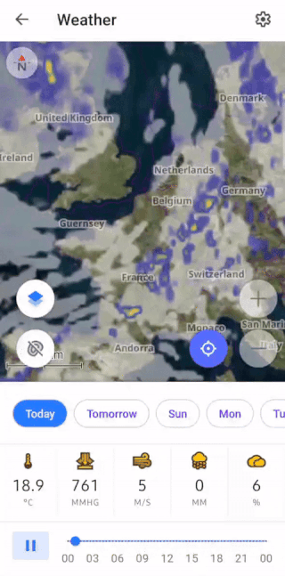
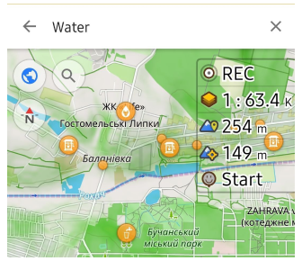

import Tabs from '@theme/Tabs';
import TabItem from '@theme/TabItem';
import AndroidStore from '@site/src/components/buttons/AndroidStore.mdx';
import AppleStore from '@site/src/components/buttons/AppleStore.mdx';
import LinksTelegram from '@site/src/components/_linksTelegram.mdx';
import LinksSocial from '@site/src/components/_linksSocialNetworks.mdx';
import Translate from '@site/src/components/Translate.js';
import InfoIncompleteArticle from '@site/src/components/_infoIncompleteArticle.mdx';
import ProFeature from '@site/src/components/buttons/ProFeature.mdx';
import InfoAndroidOnly from '@site/src/components/_infoAndroidOnly.mdx';

Good news!  

We are excited to announce the release of OsmAnd version 4.8 update for Android devices, which is already available for download on Google Play. This latest update introduces many new features and improvements to enhance your navigational experience.

[🔄   **Update Now!**](https://play.google.com/store/apps/dev?id=8483587772816822023)

To take advantage of these new features and improvements, visit Google Play or your preferred app store to download or update OsmAnd to version 4.8. We strive to make OsmAnd the best navigation tool for Android users, and we cannot wait for you to experience the latest advancements.

Thank you for your continued support of OsmAnd. Happy journey!


<!--truncate-->


**What's new**

<!--

• New terrain colorization option "Altitude"
• Custom color palettes for terrain, tracks, and routes.
• 3D variant for location position icons
• Quick Actions can now be assigned to external keyboards
• Weather: UI refresh, added wind animation
• 3D Track Improvements: new visualization and colorization options
• Added app theme option to follow map mode
• Fixed track stats, sorting & search
• OSM Editing: deleted login / password authorization method
• Switching to system share sheet starting Android 14
-->

- [Altitude](#altitude-color-scheme-for-terrain) terrain colorization option.
- [Color palettes](#color-palettes) for terrain, tracks, and routes:
  - [Custom Color palettes](#custom-color-palettes).
  - [Quick action for Terrain styles](#quick-action-to-change-the-color-scheme-of-the-terrain) for Terrain color schemes.
  - [Color palette legend](#color-palette-legend) for tracks, routes, and terrain.
- [Profile appearance redesign](#profile-appearance-redesign).
- [3D icons](#3d-my-location-icons) for My location. 
- [Add action screen](#quick-actions-tool-update) of the Quick Actions tool.
  - [Show / Hide actions](#show--hide-routes-on-the-map) for Routes on the map.  
  - Quick Actions on the [external keyboard](#quick-actions-to-external-keyboard) allow you to assign actions for personalized use.
- [Weather UI](#weather-tool-improvements) has been updated with layer animations and improved label visibility.
- Improvements for the [3D track view](#3d-track-improvements).
- [Detailed track guidance](#update-attach-to-the-roads) for Attach to the roads.
- Removed login/password authorization method in [OpenStreetMap Editing plugin](#login-to-openstreetmap).
- [More icons](#more-favorite-icons) for Favorites.
- Added [Water category of POIs](#water-category-of-pois).
- Updates for [Compass button](#compass-button-updates).
- [Optional updates](#optional-updates).


## Altitude Color Scheme for Terrain

The new [color scheme Altitude](https://osmand.net/docs/user/plugins/contour-lines#terrain) has been added for Terrain.


## Color Palettes

New color palette schemes have been added.
- For [routes](https://osmand.net/docs/user/navigation/guidance/map-during-navigation#color): *Speed, Slope,* and *Elevation (Altitude)*.
- For [terrain](https://osmand.net/docs/user/plugins/contour-lines#hillshade-slope-and-altitude-layers): *Hillshade, Slope*, and *Altitude*.
- For [weather](https://osmand.net/docs/user/plugins/weather#weather-layers): *All weather layers*.

Color Palettes data is available on [_Maps & Resources_](https://osmand.net/docs/user/personal/maps#local) menu:

_Menu → Maps & Resources → Local → Colors_


## Custom Color Palettes

You can add your custom color palettes to OsmAnd. To do this, create a TXT file with the required name:
- *Routes*: `route_speed_name.txt`, `route_slope_default.txt`, `route_elevation_default.txt`.
- *Terrain*: `height_altitude_name.txt`, `hillshade_color_name.txt`, `slope_name.txt`.
- *Weather*: `weather_name.txt`.

For example:

```
TXT file named *height_altitude_0-200.txt*

# 0 - 90 degree RGBA
0,46,185,0,191
# yellow 
100,255,222,2,227
# red
200,255,1,1,255
# violet
220,130,1,255,255

```
After moving this TXT file to *..Android/data/net.osmand/files/color-palete/height_altitude_0-200.txt*, a new palette will appear in the Color Scheme menu.


<!--
### Palette Editor

_Terrain → Modify (Colour scheme) → All colors → &#8942; → Edit_

<table class="image">
    <tr>
        <td></td>
        <td></td>
    </tr>
</table>  

The palette editor allows you to create and edit custom color schemes to personalize your maps. This is where you can customize colors according to personal preferences or the requirements of a particular route. 
-->

### Quick Action to Change the Color Scheme of the Terrain

In this release, we have added the ability to switch between [terrain](https://osmand.net/docs/user/plugins/contour-lines#terrain) color schemes, similar to switching between layers. This can be done using the Quick Actions tool.  

_Menu → Configure screen → Custom buttons → + → Add button → Add action → Topography → Change Terrain color scheme_


### Color Palettes Legend

The legend provides an easy way to view and understand the different markings on the map. New color palettes have been added to display [**speed** for tracks](https://osmand.net/docs/user/map/tracks-on-map/track-appearance#color), [**line type** for routes](https://osmand.net/docs/user/navigation/guidance/map-during-navigation#color), [**altitude and slope** for terrain](https://osmand.net/docs/user/plugins/contour-lines#color-scheme), and all [**weather layer**](https://osmand.net/docs/user/plugins/weather#weather-layers) color palettes.

<table class="image">
    <tr>
        <td></td>
        <td></td>
        <td></td>
    </tr>
</table>  


## Profile Appearance Redesign

The [appearance of profiles](https://osmand.net/docs/user/personal/profiles#profile-appearance) has been improved to make them more interesting, recognizable, and usable. 

The update includes:
- New icon and color selection components.
- Redesign of the location icon selection map.
- Default [3D icons](#3d-my-location-icons) in [OpenGL (Version 2)](https://osmand.net/docs/user/personal/global-settings/#map-rendering-engine) - Map rendering engine.
- Added Options menu of icon:
   - "View angle": Off, Resting position, Navigation position, Rest & navigation position - displays the cone-shaped area you're currently facing.
   - "Location radius": Off, Resting position, Navigation position, Rest & navigation position - shows the circular area representing your current location accuracy. 


## 3D My Location Icons

A new 3D view has been added for [My Location](https://osmand.net/docs/user/personal/profiles#profile-appearance) icons, which improves their visualization on the map. These changes bring the appearance of the icons in alignment with the 3D tilt of the map. 

3D icons are available only in [OpenGL (Version 2)](https://osmand.net/docs/user/personal/global-settings/#map-rendering-engine) - Map rendering engine.


## Quick Actions Tool Update

The updated **Add Action** screen makes it easier to customize and add [*Quick actions*](https://osmand.net/docs/user/widgets/quick-action), improving access to important features. You can now find groups of actions, use the search function, and apply other actions to customize the *Quick Actions tool*, contributing to a better user experience.

 


### Show / Hide Routes on the map

Added new Quick action: to Show / Hide [Routes on the map](https://osmand.net/docs/user/map/vector-maps#routes). Now you can on or off Routes on the map by one tap.

### Quick Actions to External Keyboard

You can now assign all Quick Actions to [external keyboard buttons](https://osmand.net/docs/user/map/interact-with-map/#settings). This is especially useful if you often work with the application using external input devices and need quick access to basic functions. The ability to customize quick actions in this way makes working with OsmAnd more flexible and efficient.  
 


## Weather Tool Improvements

Layer animations and improved labels make the weather interface more visual and informative. These changes help you better understand current weather conditions and forecasts. Improved label visibility makes navigating weather data much easier.  

**Improvements**:
- **New weather panel** with an updated user interface.

- Additional **Weather source options**.
  - Tap the ⚙ icon and select [GFS](https://en.wikipedia.org/wiki/Global_Forecast_System) or [ECMWF](https://en.wikipedia.org/wiki/European_Centre_for_Medium-Range_Weather_Forecasts).

- **Weather animation**.
  - After making sure the weather layers are selected, tap the *Play* button on the *Weather* screen.
  
- A **Wind animation layer** has been added.




## 3D Track Improvements

Updated 3D track visualizations provide a more detailed view of routes.  In this release, we have added the following improvements to the [3D track appearance](https://osmand.net/docs/user/map/tracks-on-map/track-appearance#3d-track). 

1. **Visualization options.** 
    - If *Visualized by* is set to *Fixed height*,  
        *→* change *Vertical exaggeration* to *Wall height*.

2. **Wall color options.** 
    - You can choose from:  
        *Solid, Downward gradient, Upward gradient, Altitude, Slope,* or *Speed*.


## Update Attach to the roads

Added new option for [_Attach to the roads_](https://osmand.net/docs/user/navigation/setup/gpx-navigation#attach-to-roads) - Detailed track guidance:

_[Navigation settings](https://osmand.net/docs/user/navigation/guidance/navigation-settings) → Other → Detailed track guidance_:

- "Ask every time" – empty state should be always visible in Navigation if Follow track is active.
- "Always" – Attach to the road should be applied automatically for the selected track while in Navigation.


<!--
## GPX Track Acitivity

The new feature of adding **Activity** to a recorded GPX track improves navigation and track management. This increases the convenience of working with track recordings.


-->

## Login to OpenStreetMap

To improve security, the option to authorize via login and password has been removed. As of June 1, 2024, only the new secure OAuth 2.0 method will be supported.  This authorization method provides a higher level of information security to help protect your data and prevent unauthorized access.

The Use username and password button has been removed from: 

- *Login to* screen in the OSM Editing plugin menu.
- Benefits for active OSM contributors. 
- Upload OSM Note dialog.


## More Favorite Icons

A complete list of [icons for Favorites](https://osmand.net/docs/user/personal/favorites#create-and-edit) has been added, which helps to organize and visualize them better. This allows you to search and select an icon for a favorite in a *Сustom POI search* from the icon library, making the use of favorites more convenient and efficient.  


## Water Category of POIs

The new POI [Water (Man made)](https://github.com/osmandapp/OsmAnd/issues/16021) category includes objects with drinking water sources. Searching this [сategories](https://osmand.net/docs/user/search/search-poi#categories-poi-search) will help you easily find water on the map when traveling.  




## Compass Button Updates

The compass button has received updates that improve its functionality. These changes make the compass more accurate and easier to use, and help you navigate better.

[**Compass button**](https://osmand.net/docs/user/map/interact-with-map/#map-orientation-and-compass): 

- **Single tap**. Rotates the map orientation to the North in all orientations. Even if it rotates back in a second, such as in compass mode.
- **Double tap**. Switches map orientations. This previously worked with a single tap.
- **Long tap**. Opens a bottom sheet with a list of available orientations. This function remains unchanged.

**Processed accessibility actions**: 

- **Single tap**. Rotates the map to the North in main mode.  
    *→* This action corresponds to a **Double tap** in *TalkBack*.
- **Long tap**. Opens the bottom sheet with orientations in main mode.  
    *→* This action corresponds to a **Double tap and hold** in *TalkBack*.
- **Double tap** to switch map orientation is not available in Accessibility mode.


## Optional Updates

- Significant speed improvement for [Attach to roads](https://osmand.net/docs/user/navigation/setup/gpx-navigation#attach-to-roads) algorithm.

- Added [Pale style](https://github.com/osmandapp/OsmAnd/issues/20208) for roads rendering.

- *Stair icon* was added to the map at border nodes.

- Added *Energy and Rendering statistics* to the Development plugin.

- Added [Brands](https://github.com/osmandapp/OsmAnd/issues/20256) for POIs categories.

- Fixed bug with [export-import of GPX files](https://github.com/osmandapp/OsmAnd/issues/19212).

- Fixed [incrorrect labeling](https://github.com/osmandapp/OsmAnd/issues/19834) of external temperature sensor data for GPX files.

- Improved colors for [multiple GPX tracks after import](https://github.com/osmandapp/OsmAnd/issues/19995).

- [New share sheet](https://osmand.net/docs/user/map/map-context-menu/#share)- Switch to the system shared sheet when Android 14 starts.

- Fixed an issue with [navigation not stopping after reconnecting in Android Auto](https://github.com/osmandapp/OsmAnd/issues/19651).

- Fixed [incorrect instructions during navigation in Android Auto](https://github.com/osmandapp/OsmAnd/issues/19438).

- Fixed [sorting (statistics and search) of tracks folders in *Configure map → Tracks*](https://github.com/osmandapp/OsmAnd/issues/19634).

- Fixed bug with [3D mode button tilt angle](https://github.com/osmandapp/OsmAnd/issues/19868) on the map.

- Using [localized names](https://github.com/osmandapp/OsmAnd/issues/20020) for routes.

- Fixed [incorrect calculation of uphil](https://github.com/osmandapp/OsmAnd/issues/20074).

- Fixed [wrong elevation data on graph](https://github.com/osmandapp/OsmAnd/issues/19142) for tunnels, bridges in Route details.

- Fixed [bug with copied "Custom button"](https://github.com/osmandapp/OsmAnd/issues/19767) from another profile.

- Fixed [bug with malfunction](https://github.com/osmandapp/OsmAnd/issues/20254) when displaying Quick Action names.

- Fixed [bug with not moving contact icon](https://github.com/osmandapp/OsmAnd/issues/19176) sharing of OsmAnd Telegram tracker.

- Fixed bug with icons sizes on [Samsung DeX](https://www.samsung.com/uk/apps/samsung-dex/).

________________________________________

<LinksSocial/>
<LinksTelegram/>
<AndroidStore/>