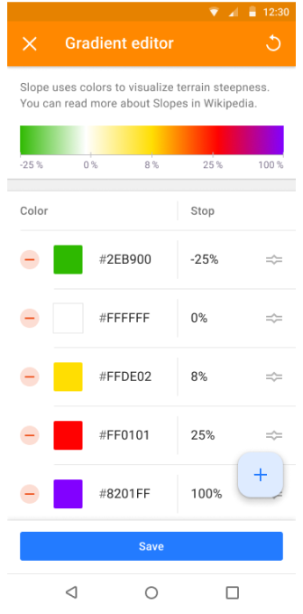

import Tabs from '@theme/Tabs';
import TabItem from '@theme/TabItem';
import AndroidStore from '@site/src/components/buttons/AndroidStore.mdx';
import AppleStore from '@site/src/components/buttons/AppleStore.mdx';
import LinksTelegram from '@site/src/components/_linksTelegram.mdx';
import LinksSocial from '@site/src/components/_linksSocialNetworks.mdx';
import Translate from '@site/src/components/Translate.js';
import InfoIncompleteArticle from '@site/src/components/_infoIncompleteArticle.mdx';
import ProFeature from '@site/src/components/buttons/ProFeature.mdx';
import InfoAndroidOnly from '@site/src/components/_infoAndroidOnly.mdx';

Good news!  

We are excited to announce the release of OsmAnd version 4.8 update for Android devices, which is already available for download on Google Play. This latest update introduces many new features and improvements to enhance your navigational experience.

[🔄   **Update Now!**](https://play.google.com/store/apps/dev?id=8483587772816822023)

To take advantage of these new features and improvements, visit Google Play or your preferred app store to download or update OsmAnd to version 4.8. We strive to make OsmAnd the best navigation tool for Android users, and we cannot wait for you to experience the latest advancements.

Thank you for your continued support of OsmAnd. Happy journey!


<!--truncate-->


**What's new**

<!--

• New terrain colorization option "Altitude"
• Custom color palettes for terrain, tracks, and routes.
• 3D variant for location position icons
• Quick Actions can now be assigned to external keyboards
• Weather: UI refresh, added wind animation
• 3D Track Improvements: new visualization and colorization options
• Added app theme option to follow map mode
• Fixed track stats, sorting & search
• OSM Editing: deleted login / password authorization method
• Switching to system share sheet starting Android 14
-->

- [Altitude](#altitude-color-scheme-for-terrain) terrain colorization option.
- [Custom color palettes](#custom-color-palettes) for terrain, tracks, and routes:
  - [Palette editor](#palette-editor).
  - [Quick action button](#quick-action-for-change-terrain-color-scheme) for Terrain color schemes.
  - [Color palette legend](#color-palette-legend) for tracks, routes, and terrain.
- [3D options](#3d-my-location-icon) for My location icons. 
- [Profile appearance redesign](#profile-appearance-redesign).
- [Add action screen](#update-of-quick-actions-tool) of the Quick Actions tool.
  - Quick Actions on the [external keyboard](#quick-actions-on-external-keyboard) allow you to assign actions for personalized use.
- [Weather UI](#weather-tool-improvements) has been updated with layer animations and improved label visibility.
- Improvements for the [3D track view](#3d-track-improvements).
- [GPX track activity](#gpx-track-acitivity).
- Removed login/password authorization method in [OpenStreetMap Editing plugin](#osm-login).
- [More icons](#more-favorite-icons) for Favorites.
- Added [Water category of POIs](#category-water).
- Updates for [Compass button](#compass-button-updates).
- [Optional updates](#optional-updates).


## Altitude color scheme for Terrain

The new [color scheme Altitude](https://osmand.net/docs/user/plugins/contour-lines#terrain) has been added for Terrain.


## Custom color palettes

New colorizations of color palette schemes have been added for:
- [Route](https://osmand.net/docs/user/navigation/guidance/map-during-navigation#color): Speed, Slope, Elevation (Altitude).
- [Terrain](https://osmand.net/docs/user/plugins/contour-lines#hillshade--slope): Hillshade, Slope, Altitude.
- [Weather](https://osmand.net/docs/user/plugins/weather#weather-layers): All weather layers.

Users can create and add their own color palettes. Simply compose your TXT file with the following names: _Terrain_ - `height_altitude_name.txt`, `hillshade_color_name.txt`, `slope_name.txt`, _Routes_ - `route_speed_name.txt`, `route_slope_default.txt`, `route_elevation_default.txt`, _Weather_ - `weather_name.txt`

*height_altitude_0-200.txt*

```
# 0 - 90 degree RGBA
0,46,185,0,191
# yellow 
100,255,222,2,227
# red
200,255,1,1,255
# violet
220,130,1,255,255

```
After moving the TXT file to _..Android/data/net.osmand/files/color-paletee/height_altitude_0-200.txt_, new palettes will appear in the Colour Scheme menu.


### Palette editor

_Terrain → Modify (Colour scheme) → All colors → &#8942; → Edit_


Here, you can create and modify your own palette.



### Quick action for change Terrain color scheme

Added a switch between styles, similar to the switch between layers:

_Menu → Configure screen → Custom buttons → + → Add button → Add action → Topography → Change Terrain color scheme_


### Color palettes legend

Added new color palettes and legends for [tracks](https://osmand.net/docs/user/map/tracks-on-map/track-appearance#color), [routes](https://osmand.net/docs/user/navigation/guidance/map-during-navigation#color), [terrain](https://osmand.net/docs/user/plugins/contour-lines#color-scheme) to represent speed, altitude, and slopes, [weather](https://osmand.net/docs/user/plugins/weather#weather-layers)  all weather layers:

  

## 3D My location icon

3D icons for [My Location](https://osmand.net/docs/user/personal/profiles#profile-appearance) have been added.


## Profile appearance redesign

Updates of [Profile appearance](https://osmand.net/docs/user/personal/profiles#profile-appearance):
- new Icon and Color selection components
- Redesign card for location icon selection
- Added options to disable Location radius and view angle
- 3D icons default in Opengl


## Update of Quick Actions tool

We updated the "Add Action" screen of the [Quick actions](https://osmand.net/docs/user/widgets/quick-action) tool. Now you can find groups of actions and use the search function.

Additionally, you'll find more actions for configuring this tool.

 


### Quick Actions on external keyboard

Assign actions for a personalized experience. All Quick Actions can now be assigned to external keyboard buttons.

 

## Weather tool improvements

- New weather panel with an updated UI,
- Additional weather source options: click the ⚙ icon and choose between [GFS](https://en.wikipedia.org/wiki/Global_Forecast_System) or [ECMWF](https://en.wikipedia.org/wiki/European_Centre_for_Medium-Range_Weather_Forecasts),
- Weather animation: tap the "Play" button on the "Weather" screen (make sure to choose weather layers first),
- Added Wind animation layer.


## 3D track improvements

For this release, we added the following improvements to the [appearance of 3D track](https://osmand.net/docs/user/map/tracks-on-map/track-appearance#3d-track).

- Visualization options: If "Visualized by" is set to "Fixed height," change "Vertical exaggeration" to "Wall height."

- Wall color options: Choose from Solid, Downward gradient, Upward gradient, Altitude, Slope, or Speed.


## GPX track acitivity

Added the ability to add activity for track recording.


## OSM login

Only new OAuth 2.0 will be supported from June 1st, 2024 onwards.

- Remove the "Use username and password" button from:
  - Main bottom sheet,
  - Benefits for active OSM contributors,
  - Upload OSM Note dialog.


## More Favorite icons

Added a full list of [icons for Favorites](https://github.com/osmandapp/OsmAnd/issues/16223). Find and add an icon from the POI icons library.

[Task](https://github.com/osmandapp/OsmAnd/issues/16223)


## Category "Water"

Category ["Water" (Man made)](https://github.com/osmandapp/OsmAnd/issues/16021) has been added for [Categories](https://osmand.net/docs/user/search/search-poi#categories-poi-search).


## Compass button updates

- [Compass button](https://osmand.net/docs/user/map/interact-with-map/#map-orientation-and-compass):
    - Single tap — should rotate map orientation to the North in all orientations. Even if it will rotate back in a second (for example like in compass mode)
    - Double tap – should switch map orientations (previously works for single taps)
    - Long tap – without changes, should open bottom sheet with the list of available orientations.
- Processed accessibility actions:
    - Single click(rotate map to North) - double click in Talkback
    - Long click(open bottom sheet with orientations) - double click and hold in Talkback
    - Double click to switch map orientation is not available for accessibility

## Optional Updates

- Significant speed improvement for [Attach to roads](https://osmand.net/docs/user/navigation/setup/gpx-navigation#attach-to-roads) algorithm.
- Added [Pale style](https://github.com/osmandapp/OsmAnd/issues/20208) for roads rendering.

- *Stair icon* was added to the map at border nodes.

- Added *Energy and Rendering statistics* to the Development plugin.

- Added [Brands](https://github.com/osmandapp/OsmAnd/issues/20256) for POIs categories.

- Fixed bug with [export-import of GPX files](https://github.com/osmandapp/OsmAnd/issues/19212).
- Fixed [incrorrect labeling](https://github.com/osmandapp/OsmAnd/issues/19834) of external temperature sensor data for GPX files.
- Improved colors for [multiple GPX tracks after import](https://github.com/osmandapp/OsmAnd/issues/19995).
- [New share sheet](https://osmand.net/docs/user/map/map-context-menu/#share)- Switch to the system shared sheet when Android 14 starts.
- Fixed an issue with [navigation not stopping after reconnecting in Android Auto](https://github.com/osmandapp/OsmAnd/issues/19651).
- Fixed [incorrect instructions during navigation in Android Auto](https://github.com/osmandapp/OsmAnd/issues/19438).
- Fixed [sorting (statistics and search) of tracks folders in *Configure map → Tracks*](https://github.com/osmandapp/OsmAnd/issues/19634).
- Fixed bug with [3D mode button tilt angle](https://github.com/osmandapp/OsmAnd/issues/19868) on the map.
- Using [localized names](https://github.com/osmandapp/OsmAnd/issues/20020) for routes.
- Fixed [incorrect calculation of uphil](https://github.com/osmandapp/OsmAnd/issues/20074).