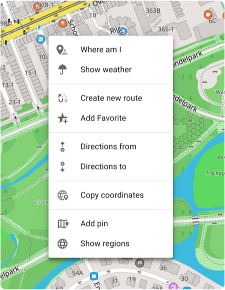

import Tabs from '@theme/Tabs';
import TabItem from '@theme/TabItem';
import AndroidStore from '@site/src/components/buttons/AndroidStore.mdx';
import AppleStore from '@site/src/components/buttons/AppleStore.mdx';
import LinksTelegram from '@site/src/components/_linksTelegram.mdx';
import LinksSocial from '@site/src/components/_linksSocialNetworks.mdx';
import Translate from '@site/src/components/Translate.js';
import InfoIncompleteArticle from '@site/src/components/_infoIncompleteArticle.mdx';
import ProFeature from '@site/src/components/buttons/ProFeature.mdx';

Hello, everyone!

We are glad to introduce version 1.01 of our [map web service](https://osmand.net/map). 

<!--truncate-->

**What's new**

- Default [system language](#system-language) (under development).
- New [context menu](map-context-menu) for map settings.
- New options for [map search](#explore-map-menu).
    - Update for [POIs context menu](#poi-context-menu).
    - POIs [Photo gallery](#photo-gallery).
- Display of [Wikimedia images](#wikimedia-images) on the map (in testing).
- Added ability to provide [URLs for different web sections](#more-urls).
- Updated icons for Favorites (expected in 4.8).
- Added a special banner with information about the OsmAnd mobile version and a link (expected in 4.8).
- Fixed incorrect precipitation data.
- Fixed user data lag when there is a huge amount of data.
- Fixed zooming when enabling favorites or tracks.

## System Language

- The Web version of OsmAnd uses the language from the browser settings.  
- For Chrome, the priority is `chrome://settings/languages`.  
- You can change the system (menu) language manually by selecting  
    *Menu →* ⚙ *→ Turn off language*.

## Map Context menu

In this release a new context menu for the map has been added, to open it right click anywhere on the map. This menu includes the following actions:

- **Where am I**
- **Show weather**
- **Create new route**
- **Add Favorite**
- **Directions from**
- **Directions to**
- **Cope coordinates**
- **Add pin**
- **Show regions**

## Explore map menu

A new feature in OsmAnd Web with map places search by POI categories, which displays photos of a specific point of interest on the map.

- Click on 🔍 to open a tab with popular POIs on the map screen. 
- Then select and click on one of the POIs to open the context menu for it.

- To start searching by category, open the Categories menu and select the required items.

### POI Context Menu

Clicking on a POI opens a new context menu that includes:

- Name (Сategory).
- Direction and distance.
- Description.
- [Online photos](#photo-gallery).

### Photo Gallery

Clicking on the online photos opens the photo gallery. Here you can scroll through all POI photos.

## Wikimedia Images

:::note
This is a test version for developers.
:::

Added the feature to display Wikimedia images on the map.

## More URLs

-  **Weather**&nbsp; – &nbsp;`osmand.net/map/weather`

-  **Account**&nbsp; – &nbsp;`osmand.net/map/account`

-  **Configure Map**&nbsp; – &nbsp;`osmand.net/map/configure/`

-  **Tracks**&nbsp; – &nbsp;`osmand.net/map/mydata/tracks`

-  **Favorites**&nbsp; – &nbsp;`osmand.net/map/mydata/favorites`

-  **Navigation**&nbsp; – &nbsp;`osmand.net/map/navigate`

-  **Settings**&nbsp; – &nbsp;`osmand.net/map/settings`

-  **Plan a Route**&nbsp; - &nbsp;`osmand.net/map/plan`

-  For the current [**Explore page**](#explore-map-menu)&nbsp; - &nbsp;`osmand.net/map/search`

***Example***:  
    `https://osmand.net/map/mydata/favorites/#12/40.7452/-74.0326`

## Optional Updates

- Added a special [banner](https://github.com/osmandapp/OsmAnd/issues/18825) with information about the OsmAnd mobile version and a link.
- Fixed [incorrect precipitation data](https://github.com/osmandapp/OsmAnd-Issues/issues/2578).
- Fixed user data lag when there is a [huge amount of data](https://github.com/osmandapp/web/issues/384).
- Fixed [zooming](https://github.com/osmandapp/web/issues/246) when enabling favorites or tracks.

