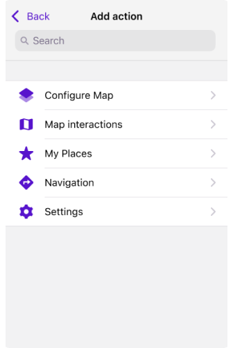

import Tabs from '@theme/Tabs';
import TabItem from '@theme/TabItem';
import AndroidStore from '@site/src/components/buttons/AndroidStore.mdx';
import AppleStore from '@site/src/components/buttons/AppleStore.mdx';
import LinksTelegram from '@site/src/components/_linksTelegram.mdx';
import LinksSocial from '@site/src/components/_linksSocialNetworks.mdx';
import Translate from '@site/src/components/Translate.js';
import InfoIncompleteArticle from '@site/src/components/_infoIncompleteArticle.mdx';
import ProFeature from '@site/src/components/buttons/ProFeature.mdx';


Hello everyone!  

We are excited to announce the release of OsmAnd version 4.8 update for iOS devices. This latest update introduces many new features and improvements to enhance your navigational experience.

[🔄   **Update Now!**](https://itunes.apple.com/us/app/osmand-maps-travel-navigate/id934850257)

To take advantage of the new features and improvements, visit the AppStore to download or update OsmAnd to version 4.8. This version includes new widgets, an improved user interface, and numerous performance upgrades to make OsmAnd better than ever.

Thank you for your continued support of OsmAnd. Have a safe journey!


<!--truncate-->

**What's new**

- New [Speedometer widget](#speedometer-widget) compatible with [CarPlay](#speedometer-for-carplay).
- Added [Turn-by-turn instructions](#turn-by-turn-instructions) to the route details.
- The Route detail menu has been updated with the [road side indicator](#road-side-indicator) information.
- The new [Add action screen](#quick-actions-tool-update) of the Quick Actions tool has been updated.
- Updated the ability to customize the map screen by adding multiple [Quick Action buttons](#custom-buttons).
- Improvements new visualization and coloring options for the [3D track view](#3d-track-improvements).
- Added improved [multiselect mode for Tracks](#multiselect-mode-for-tracks).
- [3D options](#3d-my-location-icons) for My location icons.
- Added features for working with custom [Color palette files](#color-palettes) in this release.
- [Weather UI](#weather-tool-improvements) has been updated with layer animations and improved label visibility.
- Added [smooth transitions](#smooth-transitions) when zooming in 3D mode.
- [Location position on screen](#location-position-on-screen) setting has been moved to the Configure screen menu.
- Added a separate [Speed limit navigation alert](#separate-speed-limit-alert) in the navigation settings menu.
- Removed login/password authorization method in [OpenStreetMap Editing plugin](#login-to-openstreetmap).
- [Optional updates](#optional-updates).


## Speedometer Widget

For this release, a [new speedometer widget](https://osmand.net/docs/user/widgets/info-widgets/#speedometer) has been added. In the widget settings, you can choose from three speedometer sizes, set the speed limit tolerance, and enable warnings.

 

### Speedometer for CarPlay

The [Speedometer widget](https://osmand.net/docs/user/navigation/car-play#speedometer) has also been added for CarPlay. The Speedometer widget is profile-dependent, so if you change the settings for one profile, they will not be applied to another.

 


## Turn-by-turn Instructions

[Turn-by-turn information](https://osmand.net/docs/user/navigation/setup/route-details/#turn-by-turn-information) provides detailed instructions for navigating your route. These instructions include information about your movements along the route.

 

## Road Side Indicator

Added Road side indicator for [Route Details](https://osmand.net/docs/user/navigation/setup/route-details#road-side-indicator).  
The angle between the Destination (*Bearing from the last point*) and the last segment (*Bearing to the last 2 points of the route*) is measured and divided into 3 sectors of 120 degrees. 
* `-60 °`&nbsp; &nbsp; to &nbsp; &nbsp;`+60 °`&nbsp; &nbsp; = straight
* `-180 °`&nbsp; &nbsp; to &nbsp; &nbsp;`-60 °`&nbsp; &nbsp; = left
* `60 °`&nbsp; &nbsp; to &nbsp; &nbsp;`180 °`&nbsp; &nbsp; = right


## Quick Actions Tool Update

The updated **Add Action** screen makes it easier to customize and add [*Quick actions*](https://osmand.net/docs/user/widgets/quick-action), improving access to important features. You can now find groups of actions, use the search function, and apply other actions to customize the *Quick Actions tool*, contributing to a better user experience.

 


## Custom Buttons

In this update, we have introduced **Custom buttons** in *Configure screen*, a unique type of [Quick action](https://osmand.net/docs/user/widgets/quick-action#custom-buttons) tool. Now users can create custom action buttons for their device screen.

_Menu → Configure screen → Buttons → Custom buttons → + → Add button_

 


## 3D Track Improvements

We have improved the [appearance of the 3D track](https://osmand.net/docs/user/map/tracks/appearance#3d-track) and added more options for wall colors. Now you can customize wall colors based on _Altitude, Slope, Speed, Heart Rate, Bicycle Cadence, Bicycle Power_, or *Temperature*.


## Multiselect Mode for Tracks

[This menu item](https://osmand.net/docs/user/personal/tracks/manage-tracks#three-dot-menu) allows you [to select the folders and routes](https://osmand.net/docs/user/personal/tracks/manage-tracks#selection-mode) required for further management.

_Menu → My Places → Tracks → &#8230; → Select_

 


## 3D My Location Icons

A new 3D view has been added for [My Location](https://osmand.net/docs/user/personal/profiles#profile-appearance) icons, which improves their visualization on the map. These changes bring the appearance of the icons in alignment with the 3D tilt of the map.   


## Color Palettes

In this release, new color palette schemes have been added.
- For [routes](https://osmand.net/docs/user/navigation/guidance/map-during-navigation#color): *Speed, Slope,* and *Elevation (Altitude)*.
- For [terrain](https://osmand.net/docs/user/plugins/topography#hillshade-slope-and-altitude-layers): *Hillshade, Slope*, and *Altitude*.
- For [weather](https://osmand.net/docs/user/plugins/weather#weather-layers): *All weather layers*.  

You can add your own color palette files to OsmAnd using the *import/export tool*. To do this, create a TXT file with the required name:
- *Routes*: `route_speed_name.txt`, `route_slope_default.txt`, `route_elevation_default.txt`.
- *Terrain*: `height_altitude_name.txt`, `hillshade_color_name.txt`, `slope_name.txt`.
- *Weather*: `weather_name.txt`.

For example:

```
TXT file named *height_altitude_0-200.txt*

# 0 - 90 degree RGBA
0,46,185,0,191
# yellow 
100,255,222,2,227
# red
200,255,1,1,255
# violet
220,130,1,255,255

```
After moving this TXT file to *..Android/data/net.osmand/files/color-palete/height_altitude_0-200.txt*, a new palette will appear in the Color Scheme menu.

 

Color palettes data is available in the [_Maps & Resources_](https://osmand.net/docs/user/personal/maps-resources#local) menu.

_Menu → Maps & Resources → Local → Colors_


## Weather Tool Improvements

Layer animations and improved labels make the [weather interface](https://osmand.net/docs/user/plugins/weather) more visual and informative. These changes help you better understand current weather conditions and forecasts. Improved label visibility makes navigating weather data much easier.  

**Improvements**:
- **New weather panel** with an updated user interface.

<!--
Additional **Weather source options**.
  - Tap the ⚙ icon and select [GFS](https://en.wikipedia.org/wiki/Global_Forecast_System) or [ECMWF](https://en.wikipedia.org/wiki/European_Centre_for_Medium-Range_Weather_Forecasts).
-->

- **Weather animation**.
  - After making sure the weather layers are selected, tap the *Play* button on the *Weather* screen.
  
- A **Wind animation layer** has been added.


## Smooth Transitions

Smooth transitions have been added for the map when it is [zoomed in 3D mode](https://github.com/osmandapp/OsmAnd-iOS/issues/3802).


## Location Position on Screen

The [Location position on screen](https://osmand.net/docs/user/widgets/configure-screen/#display-position-location-position-on-screen) setting has been moved to the *Configure Screen* menu.

_Menu → Configure screen → Other → Location position on screen_

 


## Separate Speed Limit Alert

The [**Speed limit** screen alert](https://osmand.net/docs/user/navigation/guidance/navigation-settings/#screen-alerts) has been separated from the *Traffic Warnings* screen alert.


## Login to OpenStreetMap

To improve security, [the option to authorize](https://osmand.net/docs/user/plugins/osm-editing#authorization) with login and password has been removed. As of June 1, 2024, only [the new secure OAuth 2.0 method](https://github.com/osmandapp/OsmAnd-iOS/issues/3736) will be supported.  This authorization method provides a higher level of information security to help protect your data and prevent unauthorized access.

The *Use username and password* button has been removed from: 

- *Login to* screen in the OSM Editing plugin menu.
- Benefits for active OSM contributors. 


## Optional Updates

- [Context menu for tracks](https://github.com/osmandapp/OsmAnd-iOS/issues/3488) in Configure map was added.

- Added [grouping of name-tag](https://osmand.net/docs/user/map/map-context-menu#alternative-names) for Routes and POI's.

- Added changing of ["Wheel circumference"](https://github.com/osmandapp/OsmAnd-iOS/issues/3503) in BLE [sensor settings](https://osmand.net/docs/user/plugins/external-sensors#sensors-settings).

- Fixed:

  - Broken [Hazmat parameters](https://github.com/osmandapp/OsmAnd-iOS/issues/3761).

  - Bug with [dublicates of Custom Plugins data](https://github.com/osmandapp/OsmAnd-iOS/issues/3739).

  - [Names for bearing widgets](https://github.com/osmandapp/OsmAnd-iOS/issues/3563).

  - [Radius ruler visibility](https://github.com/osmandapp/OsmAnd-iOS/issues/3656) in all widget panels.

  - [The Next Turn and Distance](https://github.com/osmandapp/OsmAnd-iOS/issues/3738) to Destination widgets.

  - Bad visibility of text on [Next turn widget](https://github.com/osmandapp/OsmAnd-iOS/issues/3734) - CarPlay.

  - [Zoom search](https://github.com/osmandapp/OsmAnd-iOS/issues/3569).

  - [Missed subway station icons](https://github.com/osmandapp/OsmAnd-iOS/issues/3711).

  - The [crash while downloading](https://github.com/osmandapp/OsmAnd-iOS/issues/3561) in the background.

  - [Favorite points sizes](https://github.com/osmandapp/OsmAnd-iOS/issues/3641) on Mac OS.

  - [Bad visibility of POI icons](https://github.com/osmandapp/OsmAnd-iOS/issues/3733) on CarPlay.


_________________________________________________
<LinksSocial/>
<LinksTelegram/>
<AppleStore/>